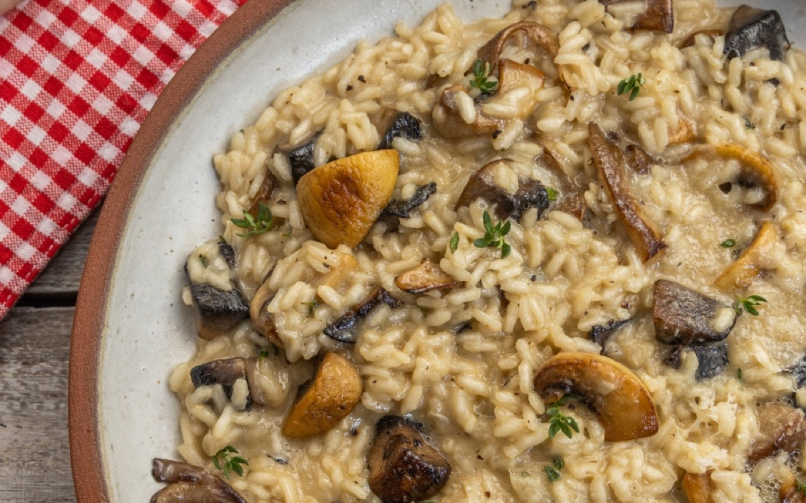
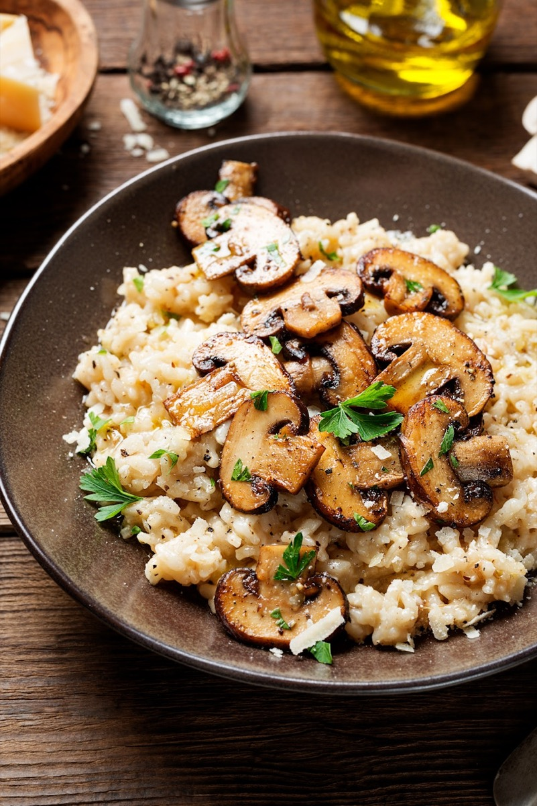
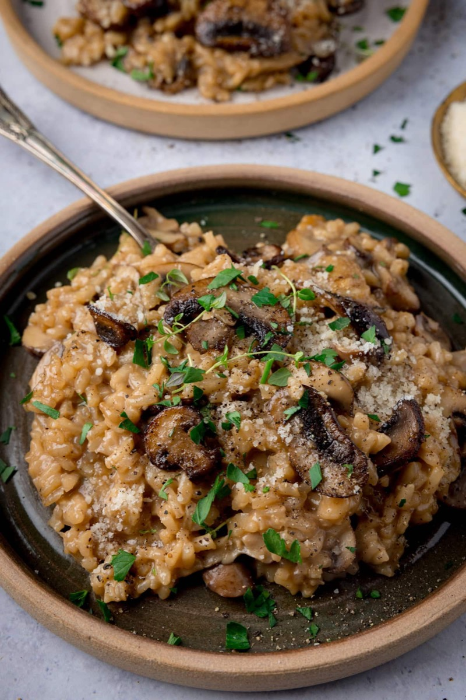
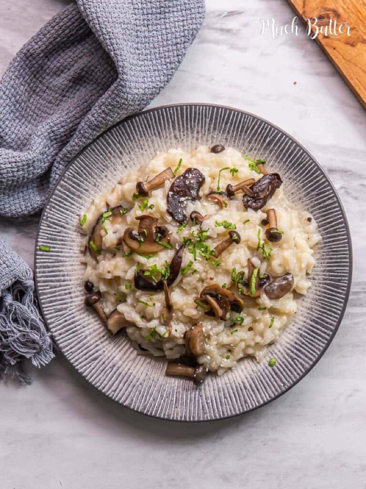

# Mushroom Risotto

<table>
  <tr>
    <td>
      
    </td>
    <td>
      
    </td>
  </tr>
  <tr>
    <td>
      
    </td>
    <td>
      
    </td>
  </tr>
</table>

## Background

Risotto is a northern Italian rice technique that gradually releases starch into a creamy sauce. Mushrooms add
deep savory flavor without masking the rice.

## Ingredients

- 320 g Arborio or Carnaroli rice
- 350 g mushrooms, sliced
- 1 small onion, chopped
- 2 tablespoons olive oil
- 30 g butter, divided
- 120 ml dry white wine
- 1.2 l hot stock
- 60 g Parmigiano-Reggiano

## How to cook

1. Brown mushrooms in oil and set aside. Soften onion in half the butter; toast rice for 2 minutes.
2. Add wine and let it evaporate. Add hot stock one ladle at a time, stirring often, until rice is al dente.
3. Fold in mushrooms. Off heat, beat in remaining butter and cheese; rest for 2 minutes.
