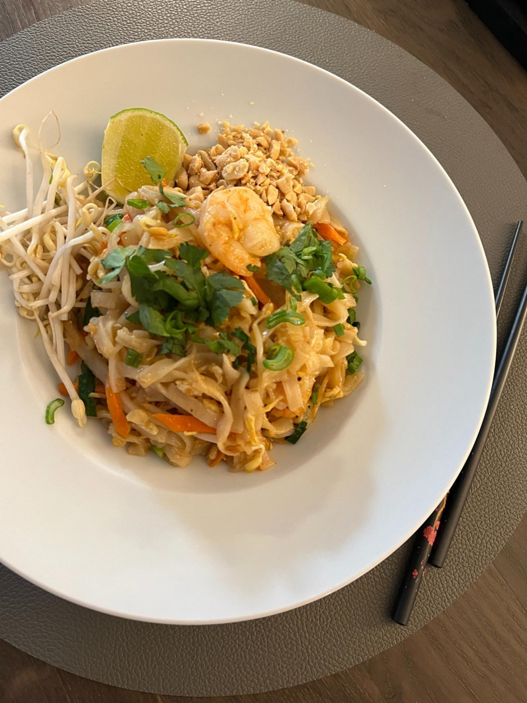
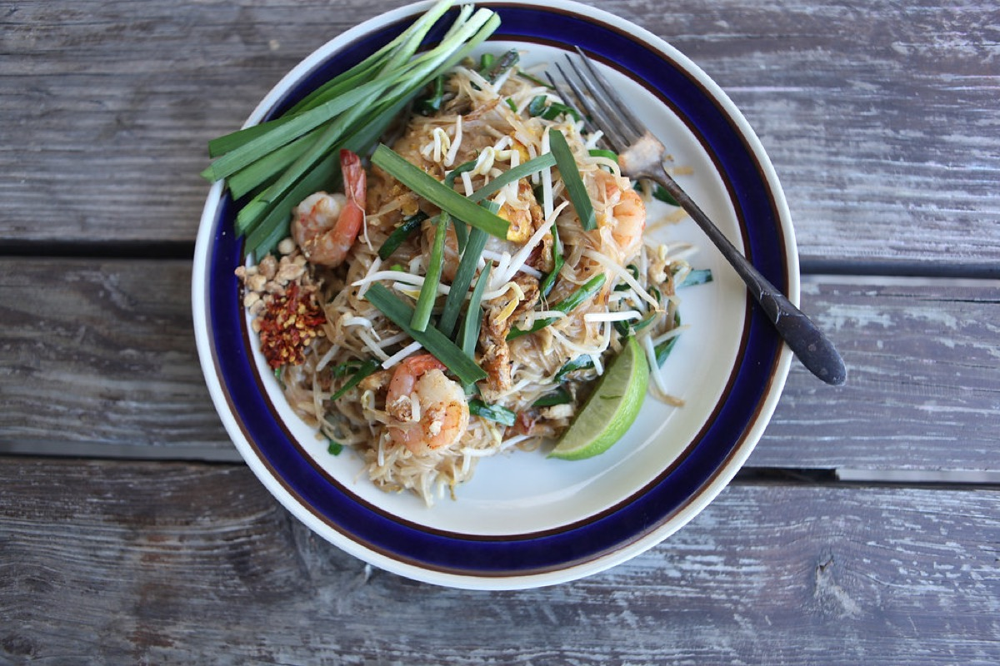
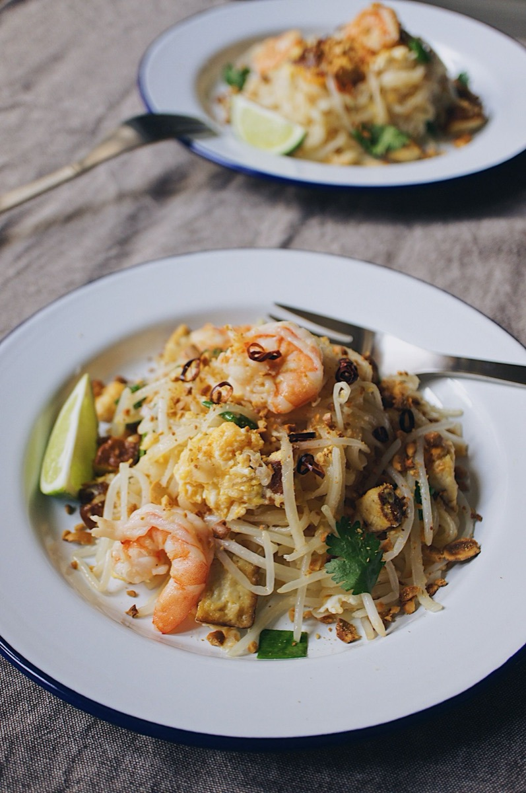
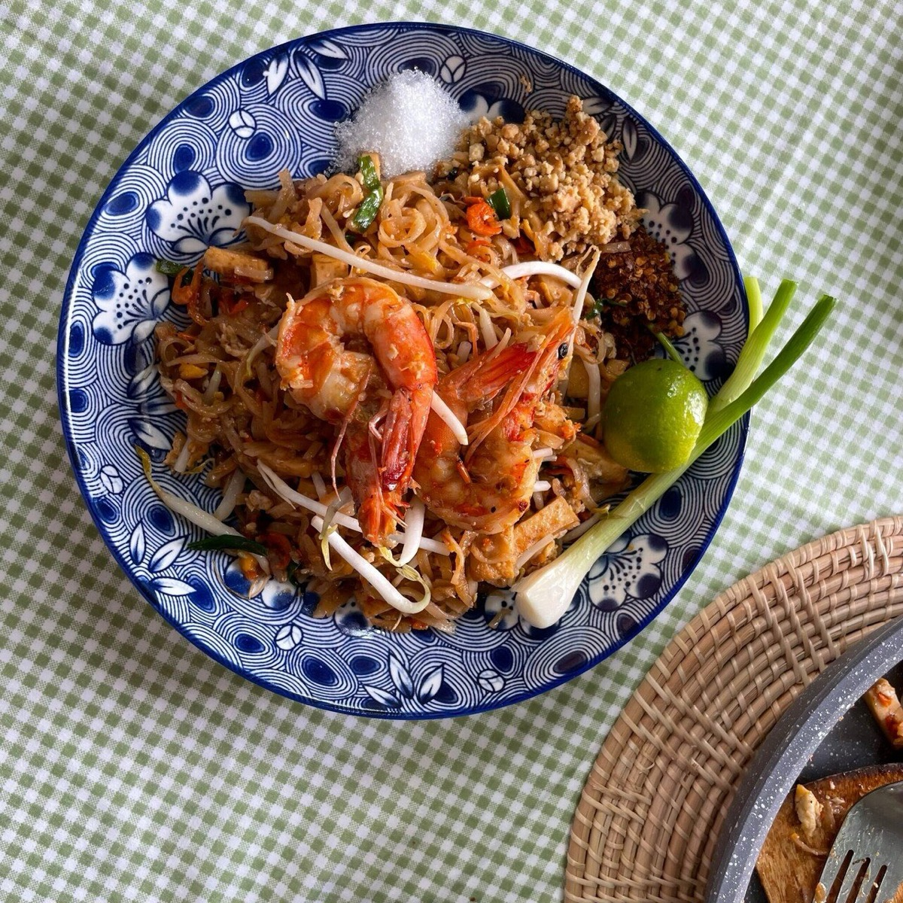

# Pad Thai

<table>
  <tr>
    <td>
      
    </td>
    <td>
      
    </td>
  </tr>
  <tr>
    <td>
      
    </td>
    <td>
      
    </td>
  </tr>
</table>

## Background

Pad Thai is a Thai stir-fried noodle dish promoted nationally during the twentieth century, though its
techniques and ingredients reflect older regional influences. Its sauce balances sour tamarind, salty fish
sauce, and sugar.

## Ingredients

- 250 g flat dried rice noodles
- 3 tablespoons tamarind concentrate
- 3 tablespoons fish sauce
- 2 tablespoons palm or brown sugar
- 3 tablespoons neutral oil
- 300 g shrimp or firm tofu
- 2 eggs
- 200 g bean sprouts
- 3 scallions, cut into lengths
- 50 g roasted peanuts, chopped
- Lime wedges

## How to cook

1. Soak noodles in warm water until flexible but firm. Mix tamarind, fish sauce, and sugar.
2. Stir-fry shrimp or tofu in oil; move aside and scramble eggs in the pan.
3. Add drained noodles and sauce. Toss over high heat until noodles are tender, adding water by tablespoons.
4. Fold in sprouts and scallions. Serve with peanuts and lime.
