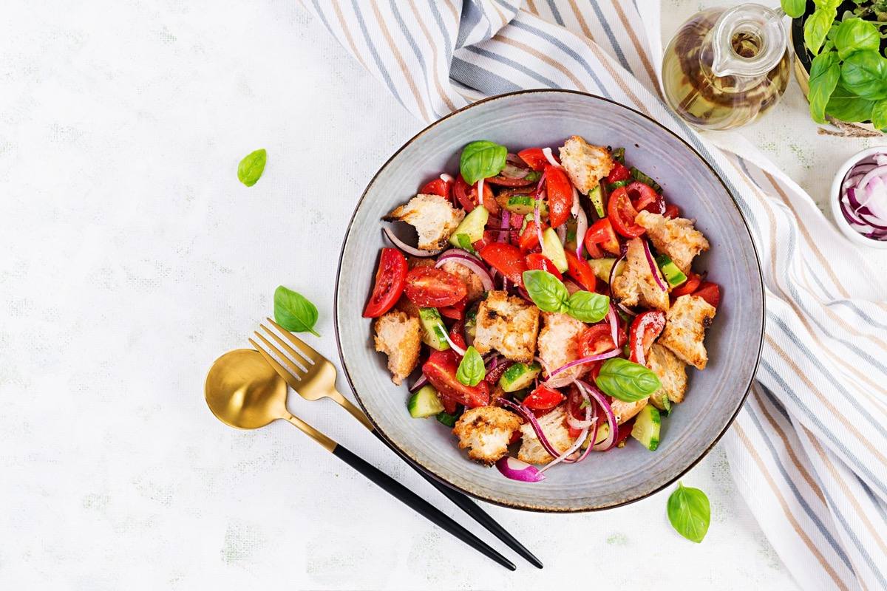
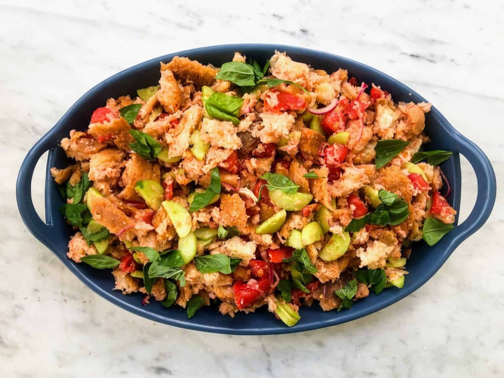
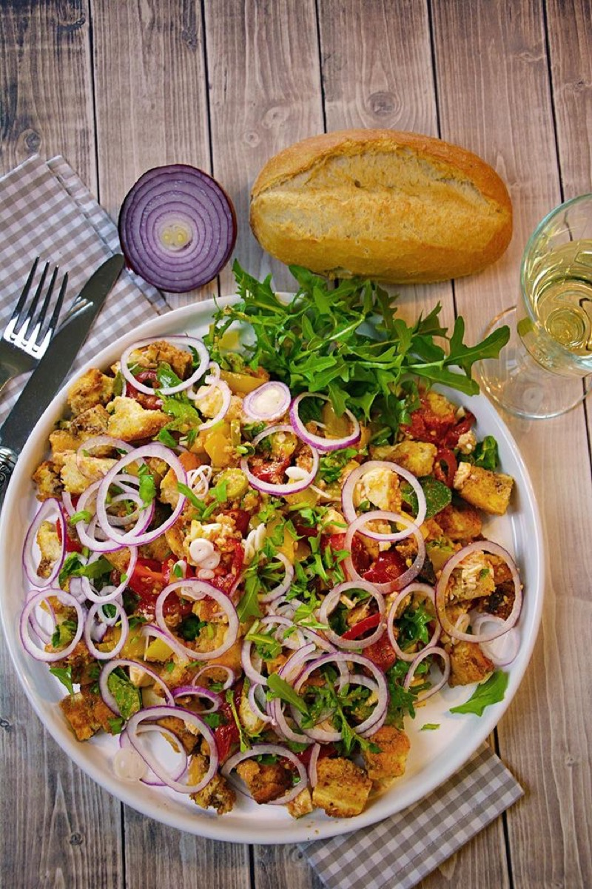
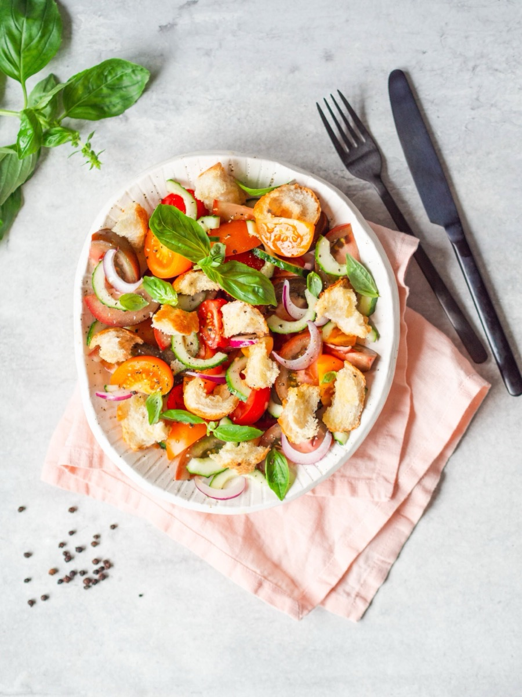

# Panzanella

<table>
  <tr>
    <td>
      
    </td>
    <td>
      
    </td>
  </tr>
  <tr>
    <td>
      
    </td>
    <td>
      
    </td>
  </tr>
</table>

## Background

Panzanella is a Tuscan salad that revives stale bread with ripe tomatoes, onion, vinegar, and olive oil. It is
a summer dish designed around good produce and bread sturdy enough to absorb the juices.

## Ingredients

- 300 g stale country bread, cubed
- 600 g ripe tomatoes, chopped
- 1 cucumber, sliced
- 1/2 red onion, thinly sliced
- 3 tablespoons red wine vinegar
- 5 tablespoons olive oil
- Basil, salt, and pepper

## How to cook

1. If very hard, dampen bread briefly with water and squeeze gently.
2. Toss bread with tomatoes, cucumber, onion, vinegar, oil, salt, and pepper.
3. Rest for 30 minutes, fold in basil, and adjust seasoning before serving.
