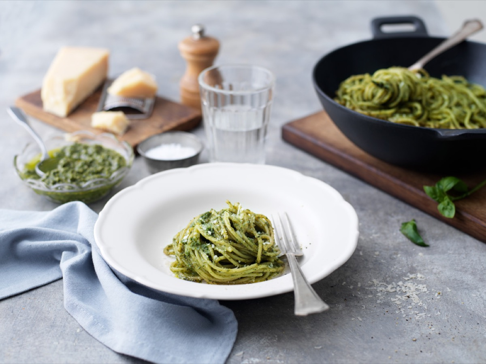
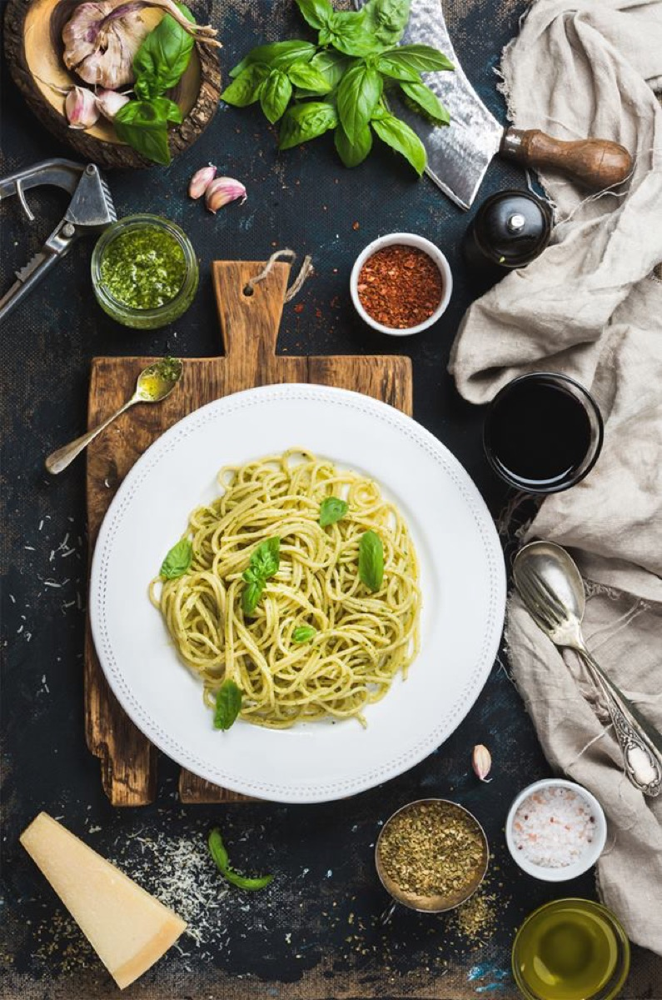
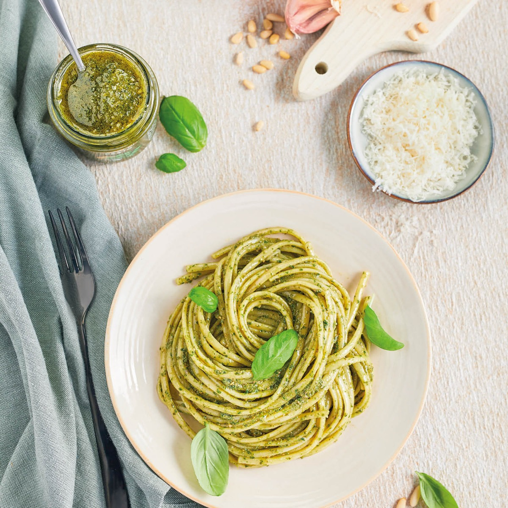
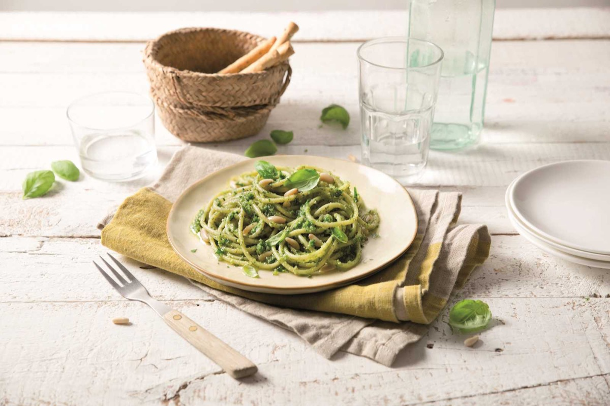

# Pasta al Pesto

<table>
  <tr>
    <td>
      
    </td>
    <td>
      
    </td>
  </tr>
  <tr>
    <td>
      
    </td>
    <td>
      
    </td>
  </tr>
</table>

## Background

Pesto alla Genovese comes from Liguria. Traditionally pounded in a mortar, it combines basil, garlic, pine
nuts, cheese, and olive oil into an uncooked sauce.

## Ingredients

- 400 g trofie, linguine, or spaghetti
- 50 g fresh basil leaves
- 30 g pine nuts
- 1 small garlic clove
- 60 g Parmigiano-Reggiano, grated
- 20 g Pecorino, grated
- 100 ml extra-virgin olive oil
- Salt

## How to cook

1. Crush garlic and pine nuts, then work in basil and a pinch of salt. Mix in cheeses and oil. Alternatively,
   pulse briefly in a food processor without heating the sauce.
2. Boil pasta until al dente and reserve cooking water.
3. Thin pesto with a little warm cooking water. Toss with drained pasta off heat and serve immediately.
