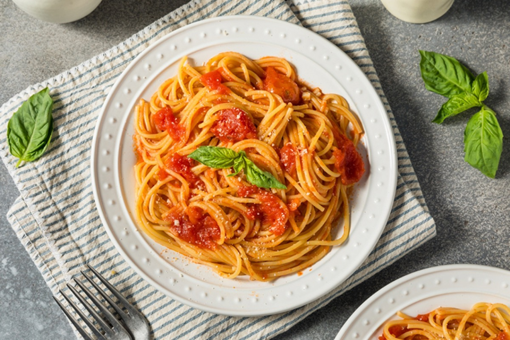
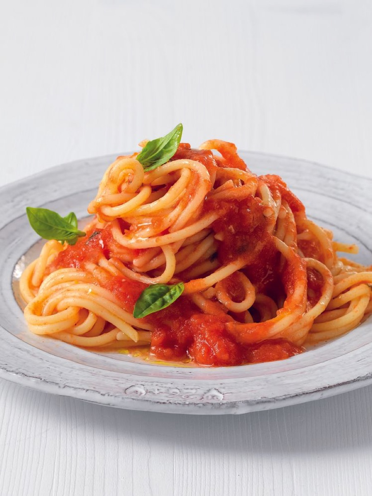
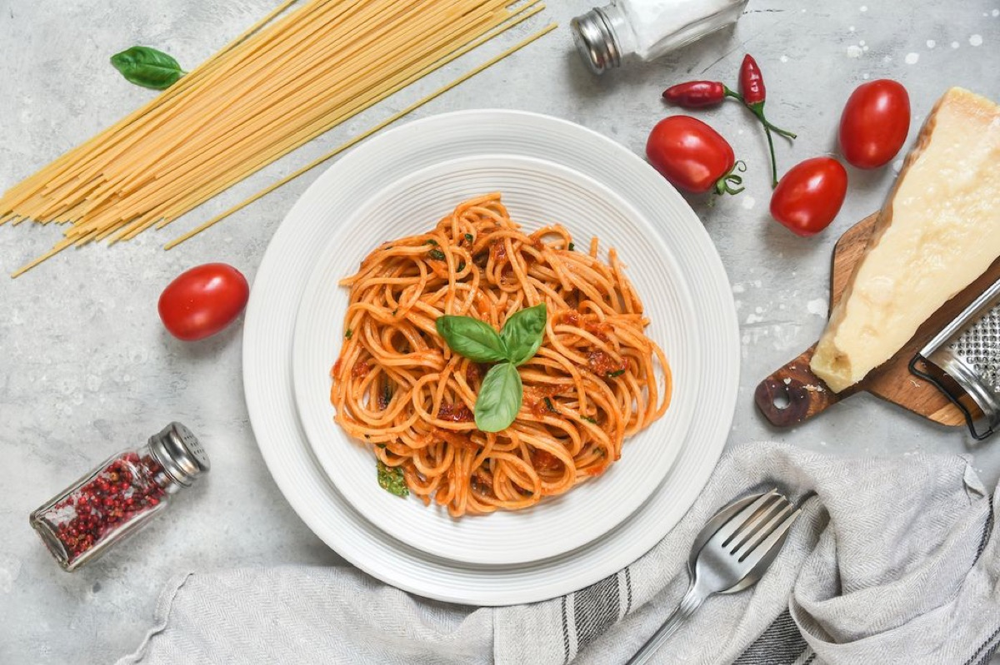
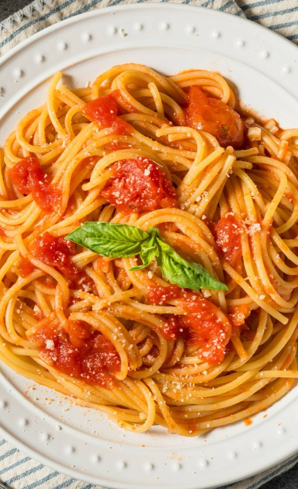

# Pasta al Pomodoro

<table>
  <tr>
    <td>
      
    </td>
    <td>
      
    </td>
  </tr>
  <tr>
    <td>
      
    </td>
    <td>
      
    </td>
  </tr>
</table>

## Background

Pasta al pomodoro is a foundational Italian dish that highlights tomato, olive oil, and basil. Tomatoes entered
Italian cooking after reaching Europe from the Americas and became central to southern Italian pasta sauces.

## Ingredients

- 400 g spaghetti
- 800 g canned whole peeled tomatoes, crushed
- 3 tablespoons extra-virgin olive oil
- 2 garlic cloves, lightly crushed
- 8 basil leaves
- Salt
- Parmigiano-Reggiano, optional

## How to cook

1. Warm oil and garlic until fragrant. Add tomatoes and salt; simmer uncovered for 20 minutes. Add basil.
2. Boil pasta until al dente, reserving cooking water.
3. Toss pasta with sauce for 1 minute, adding water if needed. Remove garlic and finish with oil and optional
   cheese.
