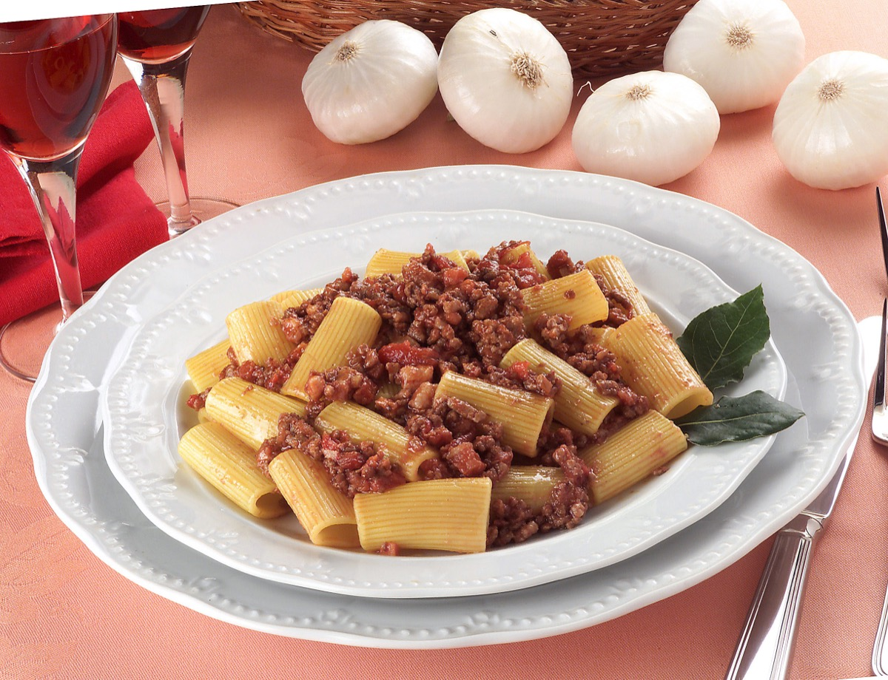
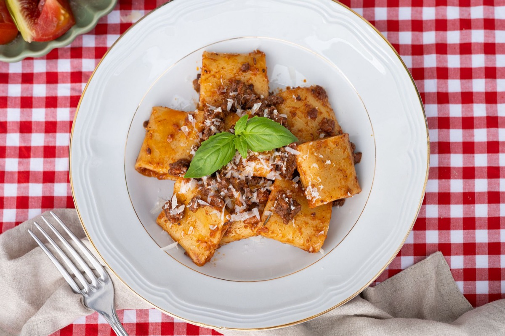
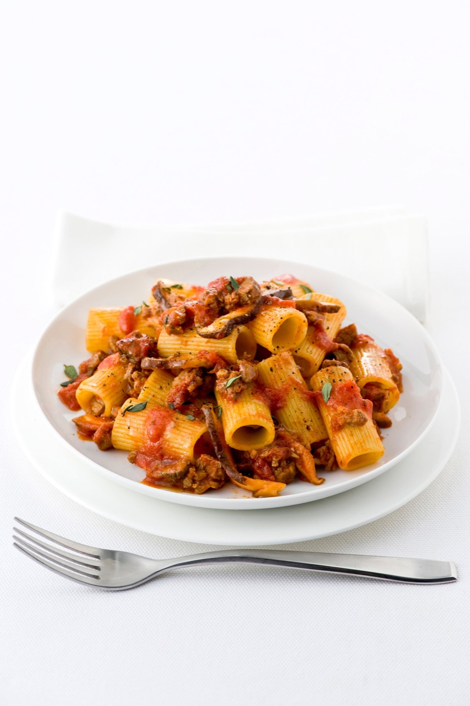
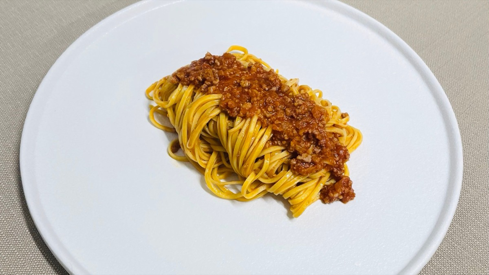

# Pasta al Ragù

<table>
  <tr>
    <td>
      
    </td>
    <td>
      
    </td>
  </tr>
  <tr>
    <td>
      
    </td>
    <td>
      
    </td>
  </tr>
</table>

## Background

Italian ragù is a slowly cooked meat sauce, not one single recipe. This version follows the spirit of ragù
alla Bolognese: a restrained amount of tomato, aromatic vegetables, meat, wine, and milk.

## Ingredients

- 400 g tagliatelle
- 2 tablespoons olive oil
- 1 onion, 1 carrot, and 1 celery stalk, finely diced
- 450 g ground beef
- 120 ml dry wine
- 2 tablespoons tomato paste
- 300 ml stock
- 120 ml whole milk
- Salt, pepper, and Parmigiano-Reggiano

## How to cook

1. Soften onion, carrot, and celery in oil. Add beef and cook until no longer pink.
2. Add wine and reduce. Stir in tomato paste and stock; simmer gently for 60 to 90 minutes.
3. Add milk and simmer for 15 minutes. Season.
4. Toss with al dente tagliatelle and a little cooking water. Serve with Parmigiano.
