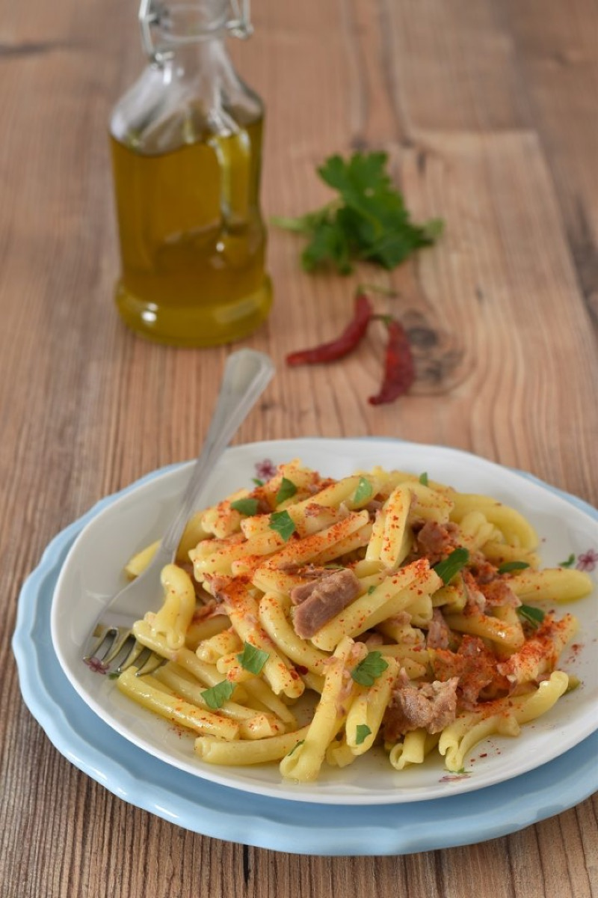
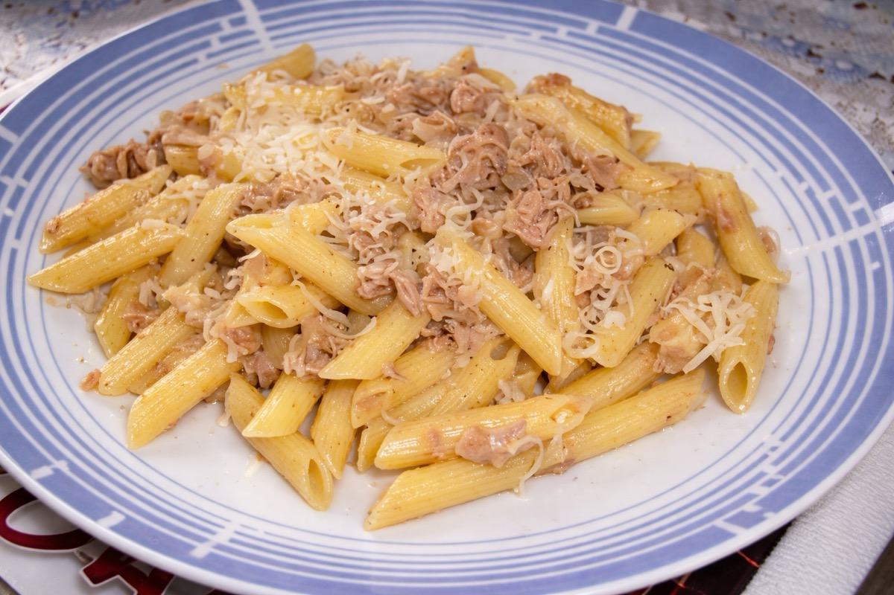
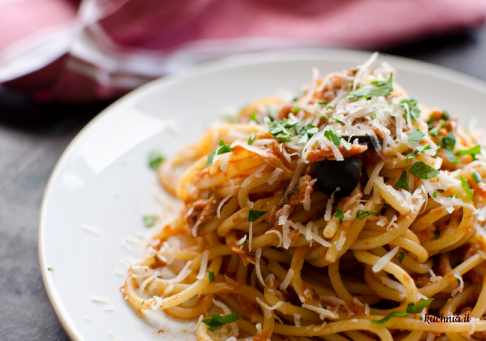
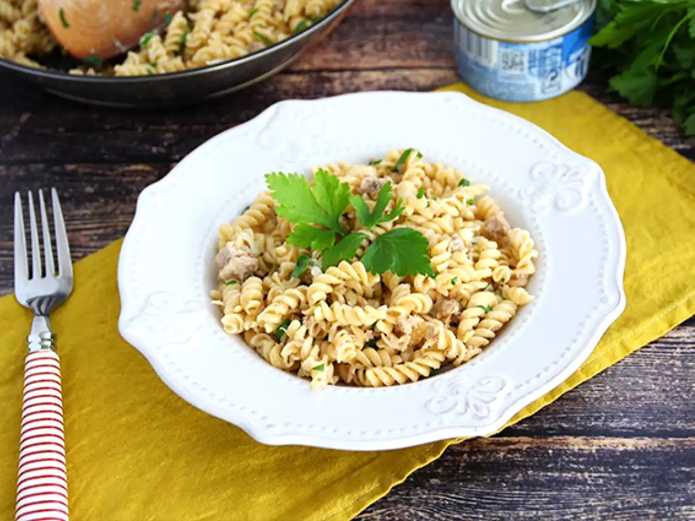

# Pasta al Tonno

<table>
  <tr>
    <td>
      
    </td>
    <td>
      
    </td>
  </tr>
  <tr>
    <td>
      
    </td>
    <td>
      
    </td>
  </tr>
</table>

## Background

Pasta with canned tuna is an Italian pantry meal, especially useful when fresh shopping is limited. Tomato,
capers, and parsley give the simple sauce brightness and depth.

## Ingredients

- 400 g spaghetti
- 3 tablespoons olive oil
- 2 garlic cloves, sliced
- 400 g canned tomatoes
- 300 g tuna in olive oil, drained
- 2 tablespoons capers, rinsed
- 2 tablespoons chopped parsley
- Salt and chile flakes

## How to cook

1. Warm oil with garlic and chile. Add tomatoes and simmer for 15 minutes.
2. Fold in tuna and capers without breaking the fish too finely; warm gently.
3. Toss with al dente pasta and a splash of cooking water. Finish with parsley and olive oil.
