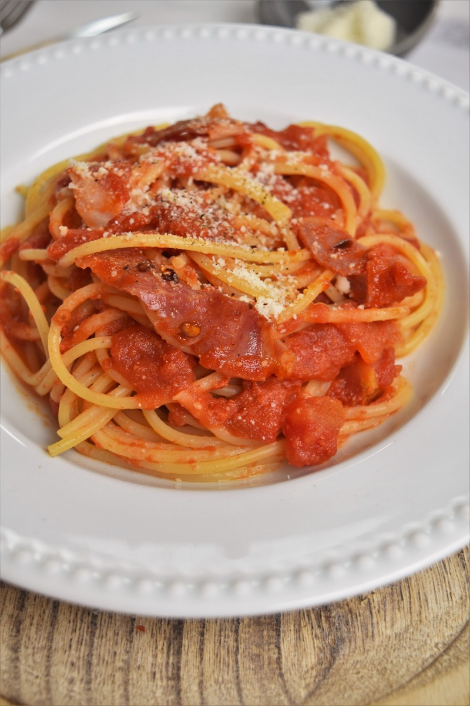
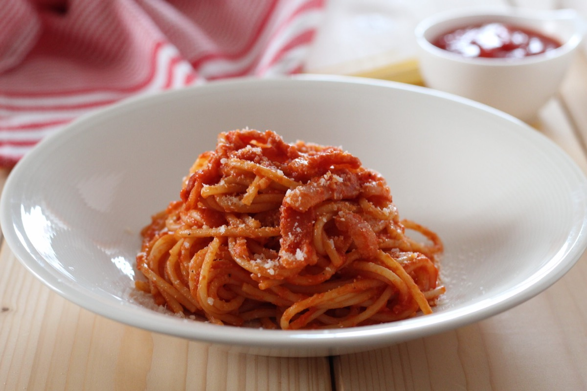
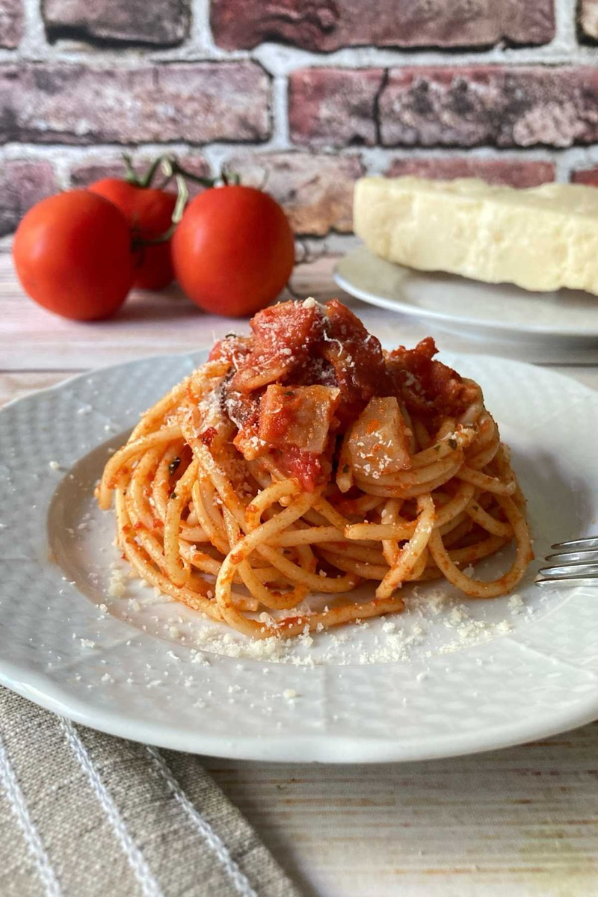
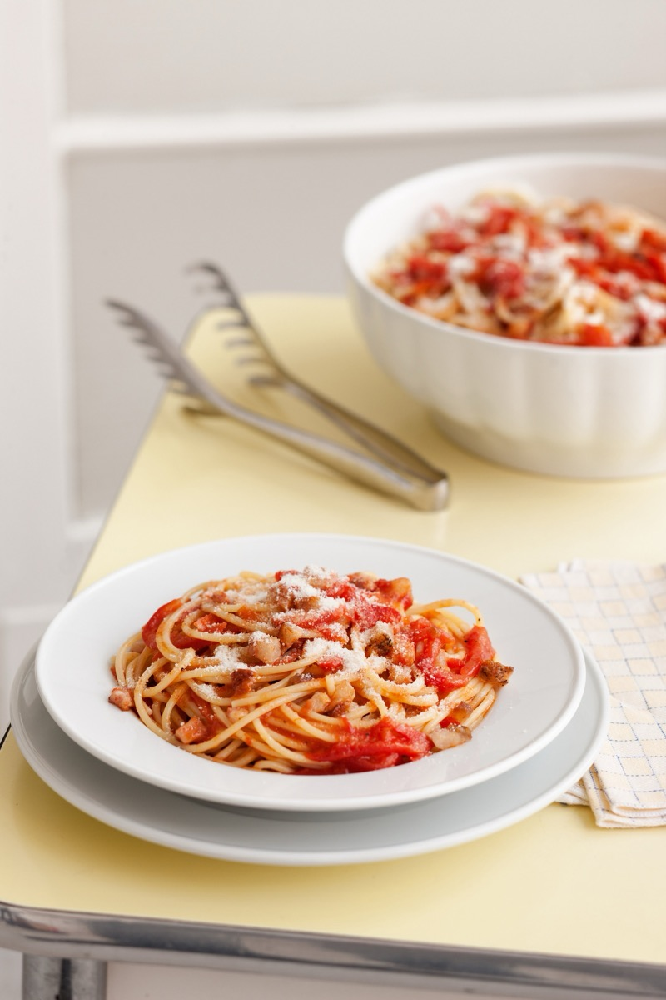

# Pasta all'Amatriciana

<table>
  <tr>
    <td>
      
    </td>
    <td>
      
    </td>
  </tr>
  <tr>
    <td>
      
    </td>
    <td>
      
    </td>
  </tr>
</table>

## Background

Amatriciana comes from Amatrice in central Italy and developed from gricia, a sauce of cured pork and cheese.
Tomato was added later; the canonical combination is guanciale, tomato, Pecorino Romano, and chile.

## Ingredients

- 400 g bucatini or spaghetti
- 150 g guanciale, cut into short strips
- 1 small dried chile or 1/2 teaspoon chile flakes
- 400 g canned peeled tomatoes, crushed
- 80 g Pecorino Romano, finely grated
- Salt

## How to cook

1. Put guanciale in a cold skillet and cook over medium-low heat until the fat renders and the meat is crisp.
   Add chile, then remove and reserve a spoonful of guanciale.
2. Add tomatoes and simmer for 10 to 15 minutes.
3. Boil pasta in lightly salted water until just al dente. Reserve cooking water, drain, and toss with the
   sauce.
4. Remove from heat and mix in most of the Pecorino, loosening with cooking water as needed. Garnish with the
   reserved guanciale and cheese.
