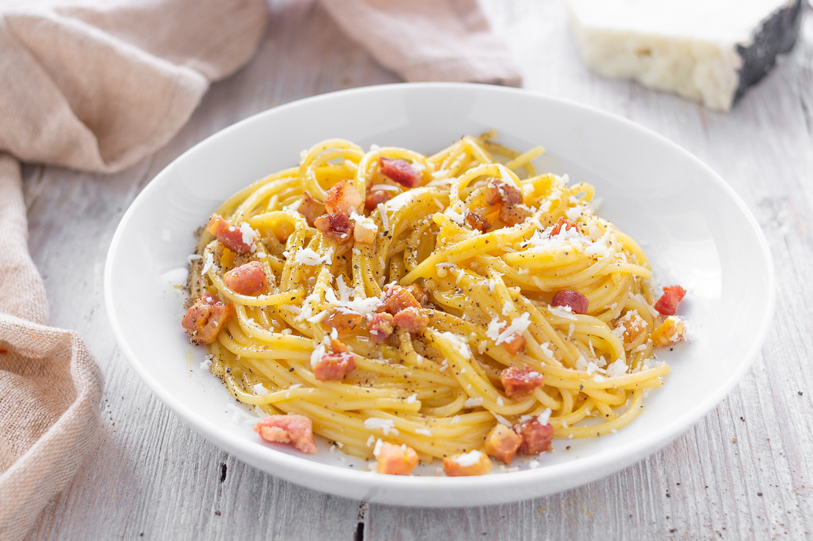
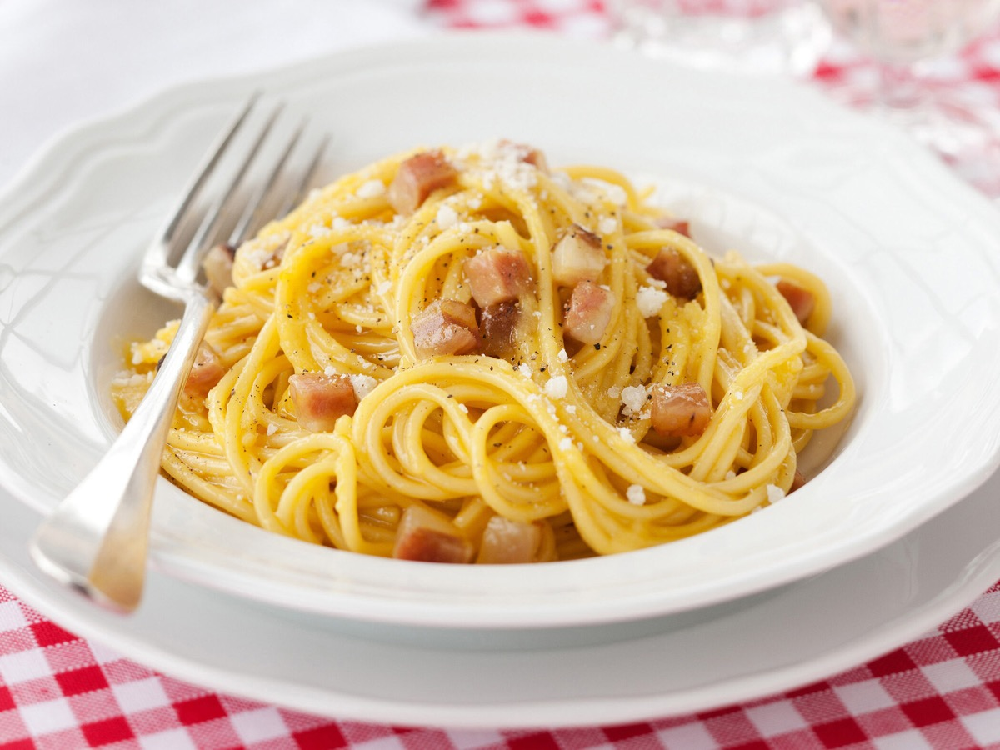
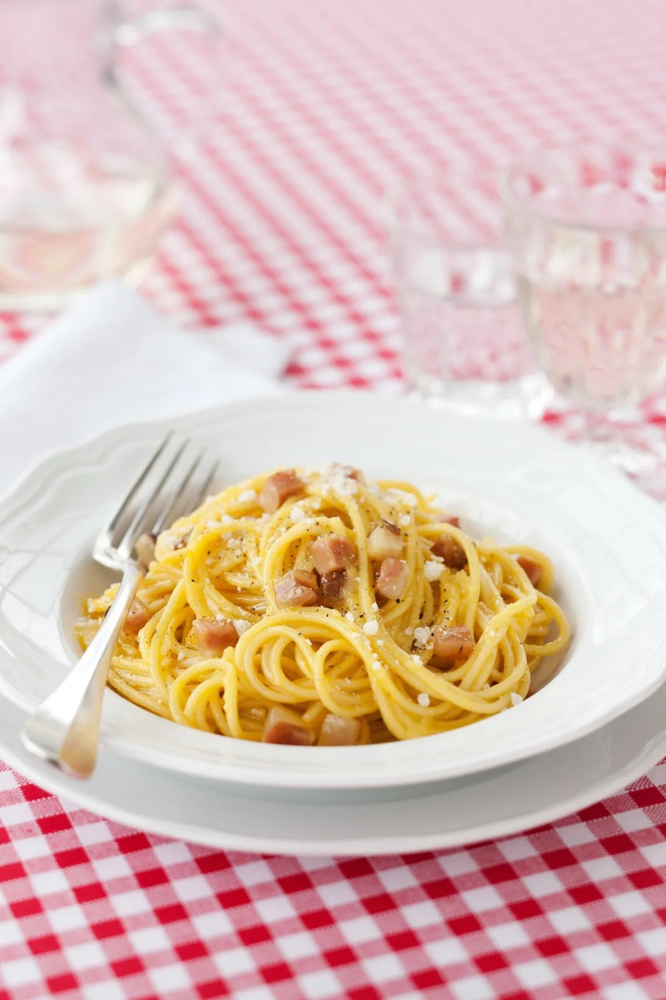
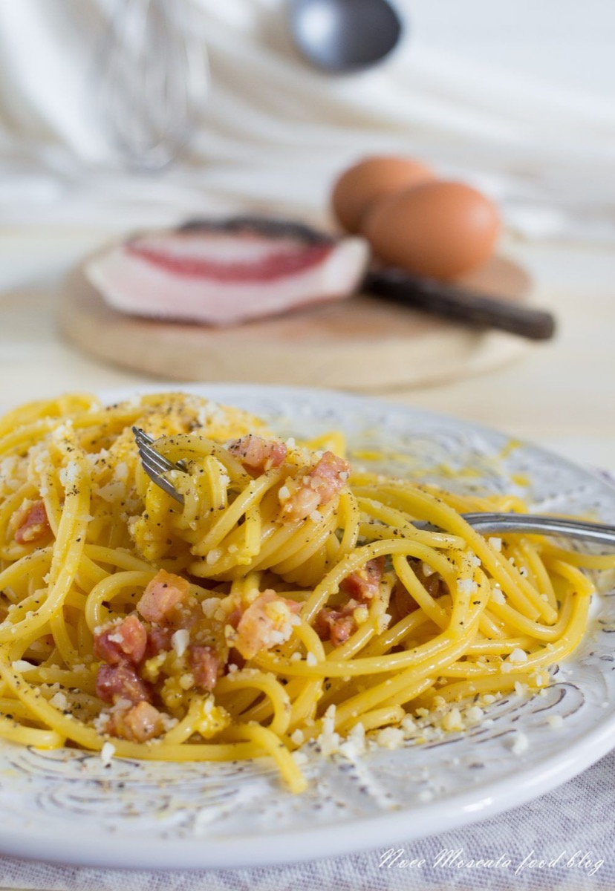

# Pasta alla Carbonara

<table>
  <tr>
    <td>
      
    </td>
    <td>
      
    </td>
  </tr>
  <tr>
    <td>
      
    </td>
    <td>
      
    </td>
  </tr>
</table>

## Background

Carbonara is a Roman pasta whose modern form became prominent in the mid-twentieth century. Eggs, Pecorino
Romano, guanciale, and black pepper make the sauce; cream is unnecessary.

## Ingredients

- 400 g spaghetti
- 150 g guanciale, diced
- 3 large eggs plus 1 yolk
- 100 g Pecorino Romano, finely grated
- 1 teaspoon coarsely ground black pepper
- Salt

## How to cook

1. Render guanciale over medium-low heat until crisp. Remove the pan from heat.
2. Whisk eggs, yolk, Pecorino, and pepper into a thick paste.
3. Boil pasta until al dente. Reserve 250 ml cooking water, drain, and toss with guanciale and its fat.
4. Off heat, stir in the egg mixture, adding cooking water gradually until glossy. Serve immediately.
