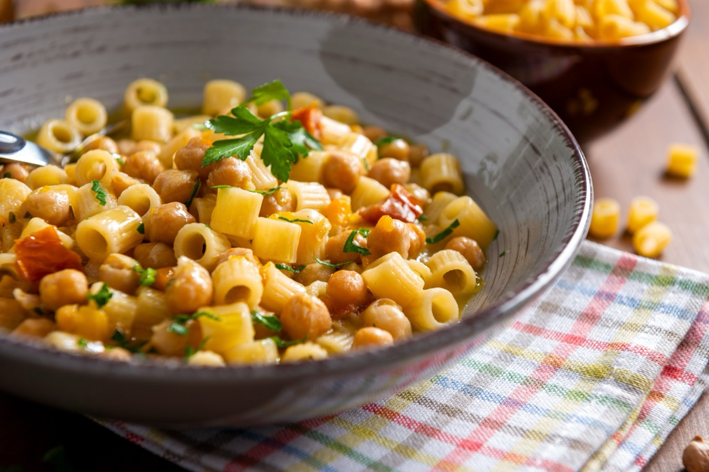
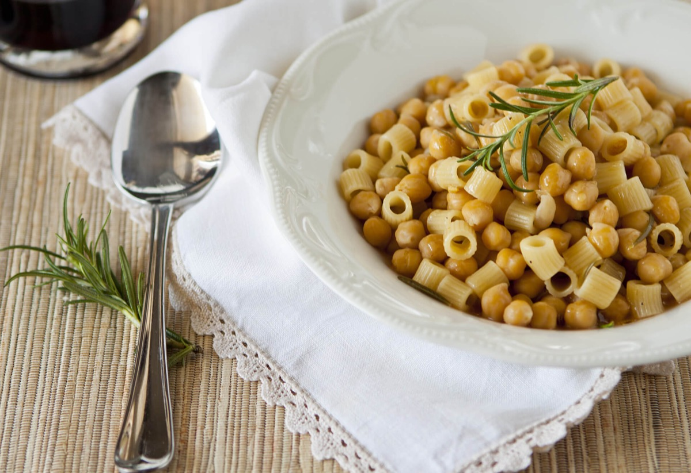
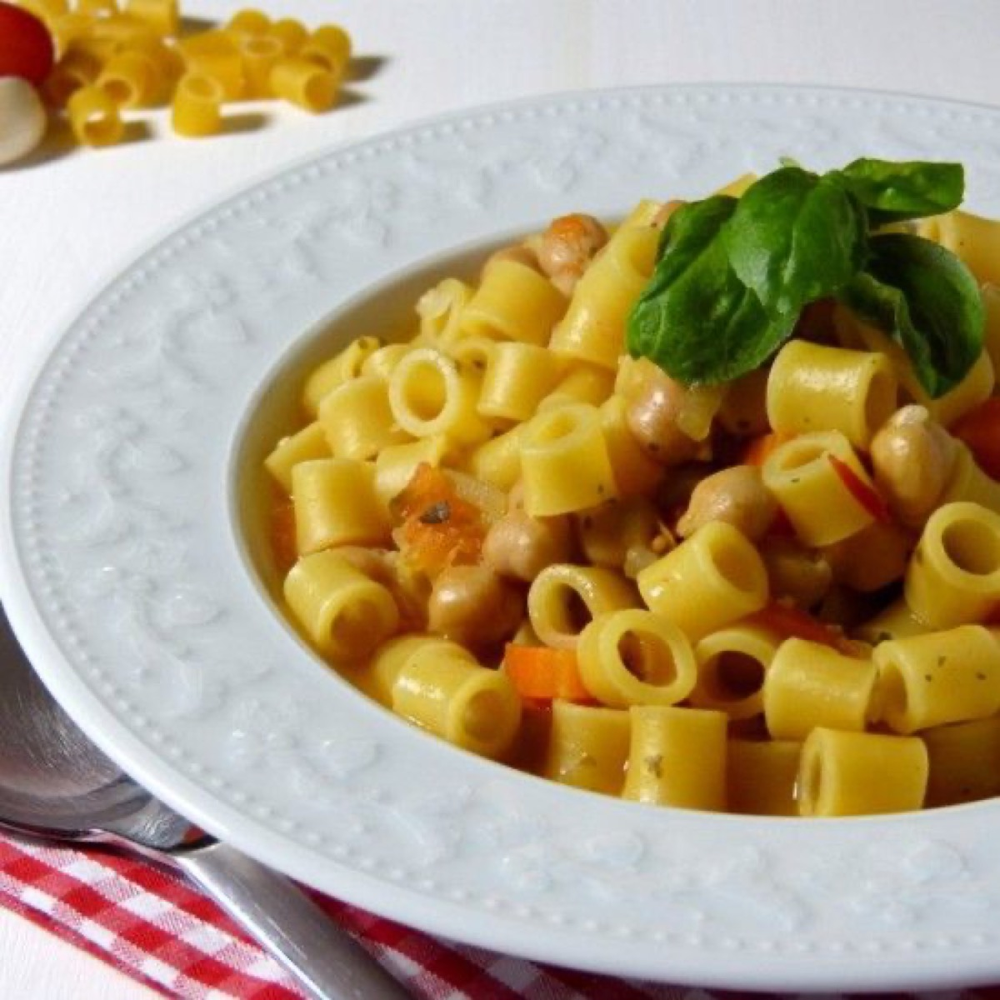
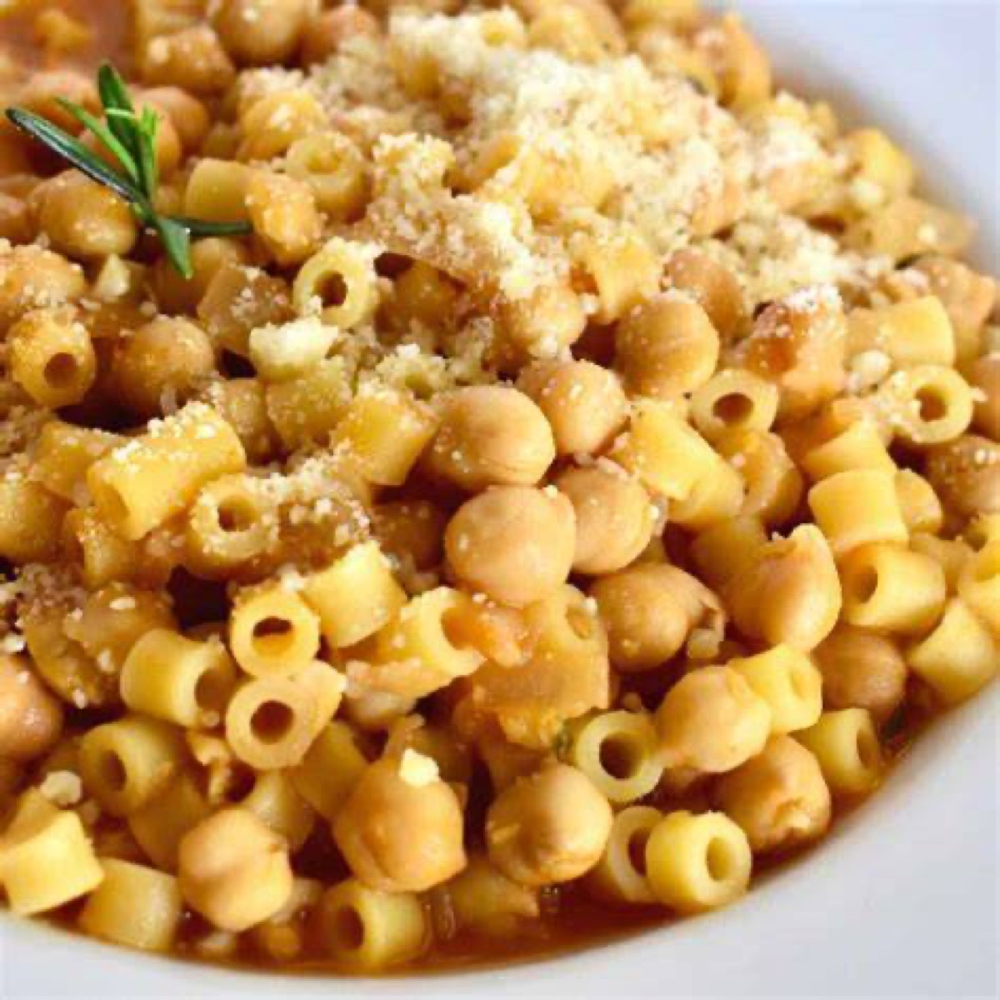

# Pasta e Ceci

<table>
  <tr>
    <td>
      
    </td>
    <td>
      
    </td>
  </tr>
  <tr>
    <td>
      
    </td>
    <td>
      
    </td>
  </tr>
</table>

## Background

Pasta e ceci is a rustic Italian pasta-and-chickpea dish with regional versions from Rome to the south. It can
be brothy or thick; this easy version lands between soup and pasta.

## Ingredients

- 2 tablespoons olive oil
- 1 onion, finely chopped
- 2 garlic cloves, minced
- 1 tablespoon tomato paste
- 2 cans chickpeas, drained
- 1 l vegetable stock
- 250 g small pasta
- Rosemary, salt, and pepper

## How to cook

1. Soften onion and garlic in oil. Stir in tomato paste and rosemary.
2. Add chickpeas and stock; mash about one quarter of the chickpeas for body.
3. Bring to a simmer, add pasta, and cook until tender, stirring often. Add water as needed and season.
