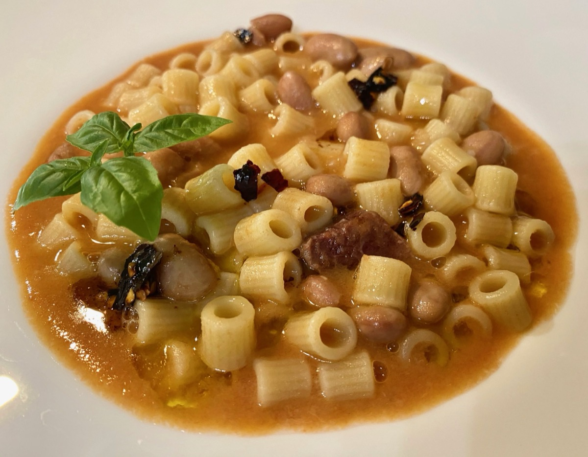
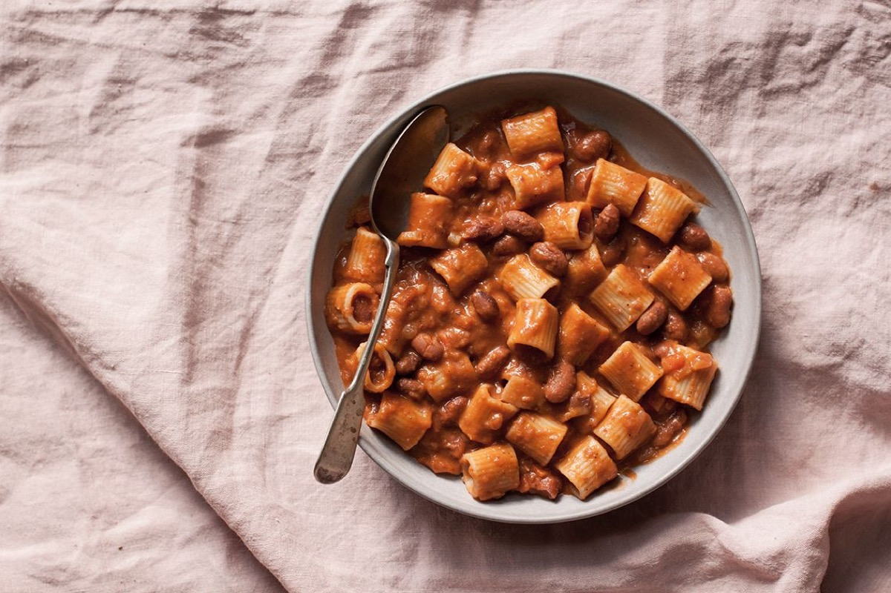
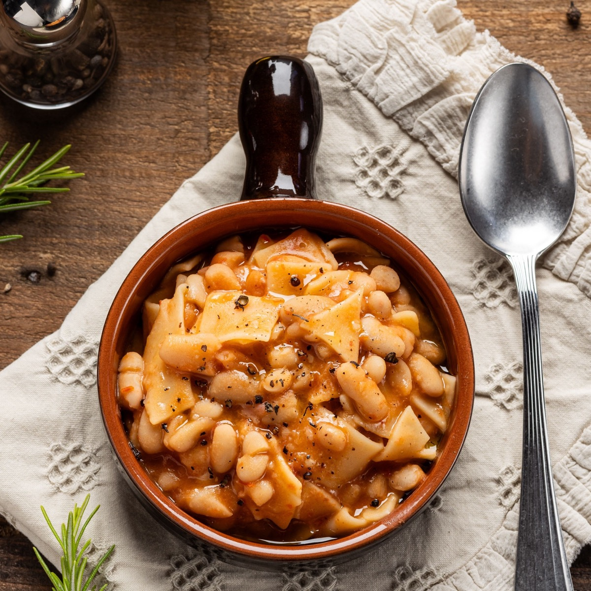
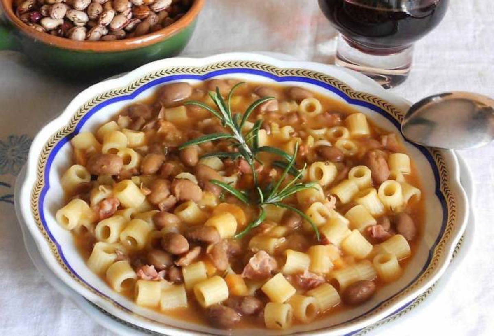

# Pasta e Fagioli

<table>
  <tr>
    <td>
      
    </td>
    <td>
      
    </td>
  </tr>
  <tr>
    <td>
      
    </td>
    <td>
      
    </td>
  </tr>
</table>

## Background

Pasta e fagioli means "pasta and beans" and belongs to Italy's tradition of nourishing cucina povera. Regional
and family versions range from a thick stew to a loose soup.

## Ingredients

- 2 tablespoons olive oil
- 1 onion, 1 carrot, and 1 celery stalk, diced
- 2 garlic cloves, minced
- 400 g canned tomatoes
- 2 cans cannellini beans, drained
- 1 l stock
- 200 g ditalini
- Rosemary, salt, and pepper

## How to cook

1. Soften the diced vegetables and garlic in oil. Add tomatoes, beans, stock, and rosemary.
2. Simmer for 15 minutes; mash some beans against the pot.
3. Add pasta and cook until tender, adding water if needed. Season and finish with olive oil.
