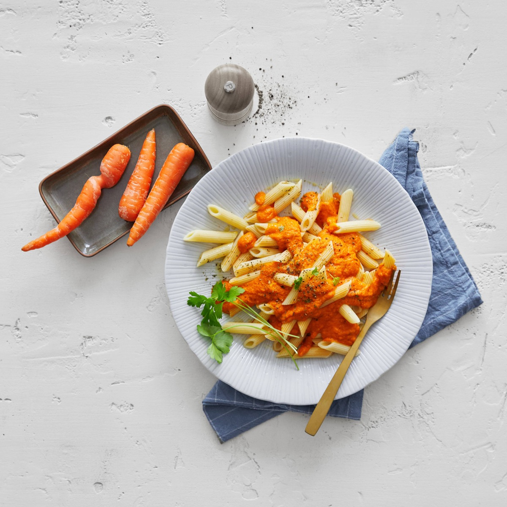
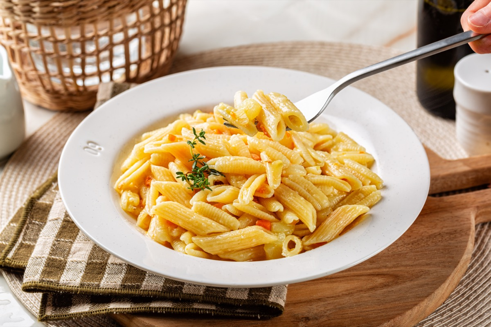
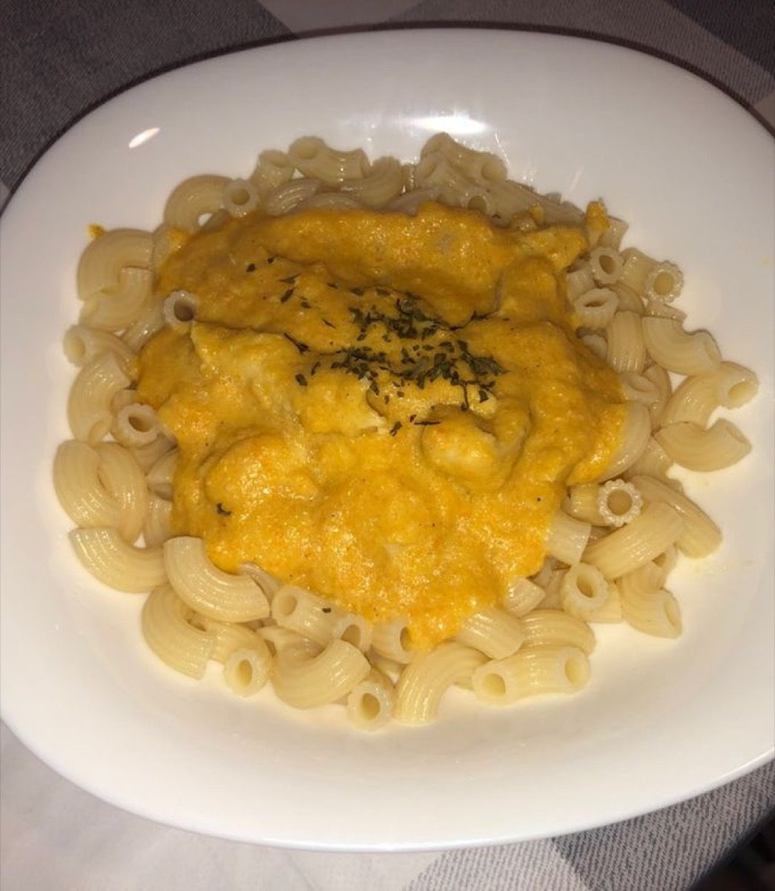
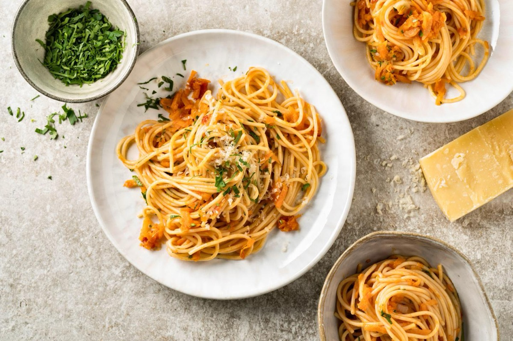

# Pasta with Carrot Sauce

<table>
  <tr>
    <td>
      
    </td>
    <td>
      
    </td>
  </tr>
  <tr>
    <td>
      
    </td>
    <td>
      
    </td>
  </tr>
</table>

## Background

Sugo di carote is a mild, economical Italian-style vegetable sauce. Slowly cooked carrots become naturally
sweet, while onion, tomato, and cheese balance the purée.

## Ingredients

- 400 g short pasta
- 500 g carrots, sliced
- 1 small onion, chopped
- 2 tablespoons olive oil
- 200 g canned tomatoes
- 250 ml vegetable stock
- 40 g Parmigiano-Reggiano
- Salt and black pepper

## How to cook

1. Soften onion in oil. Add carrots, tomatoes, stock, salt, and pepper; cover and simmer until very tender.
2. Blend until smooth, adding water if necessary, then return to a low simmer.
3. Toss with al dente pasta and cooking water. Finish with Parmigiano.
