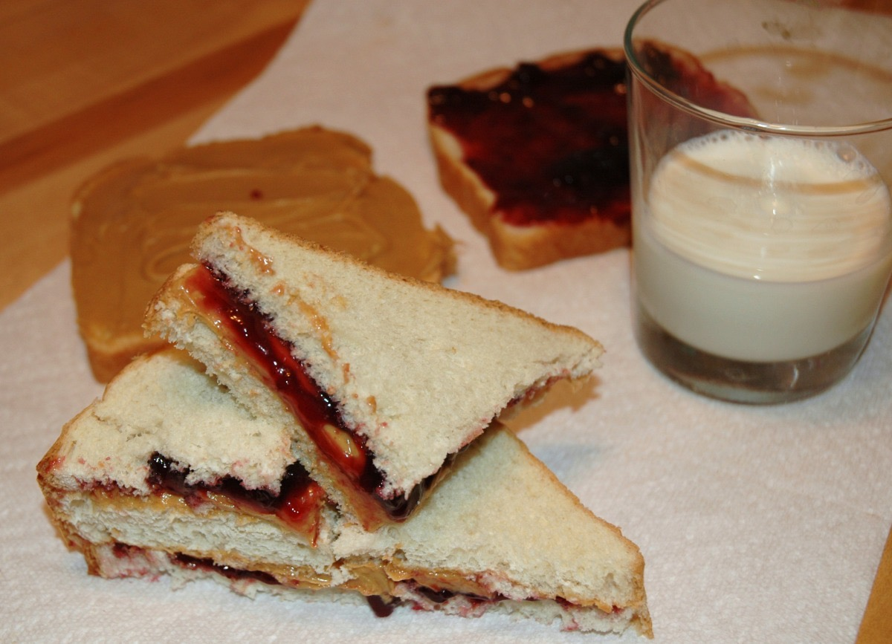
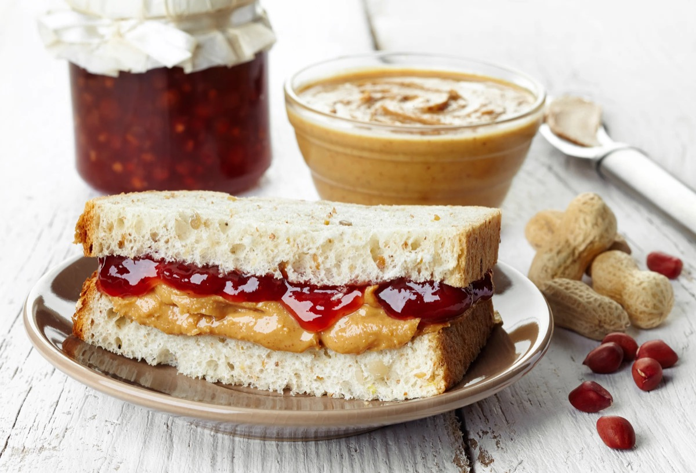
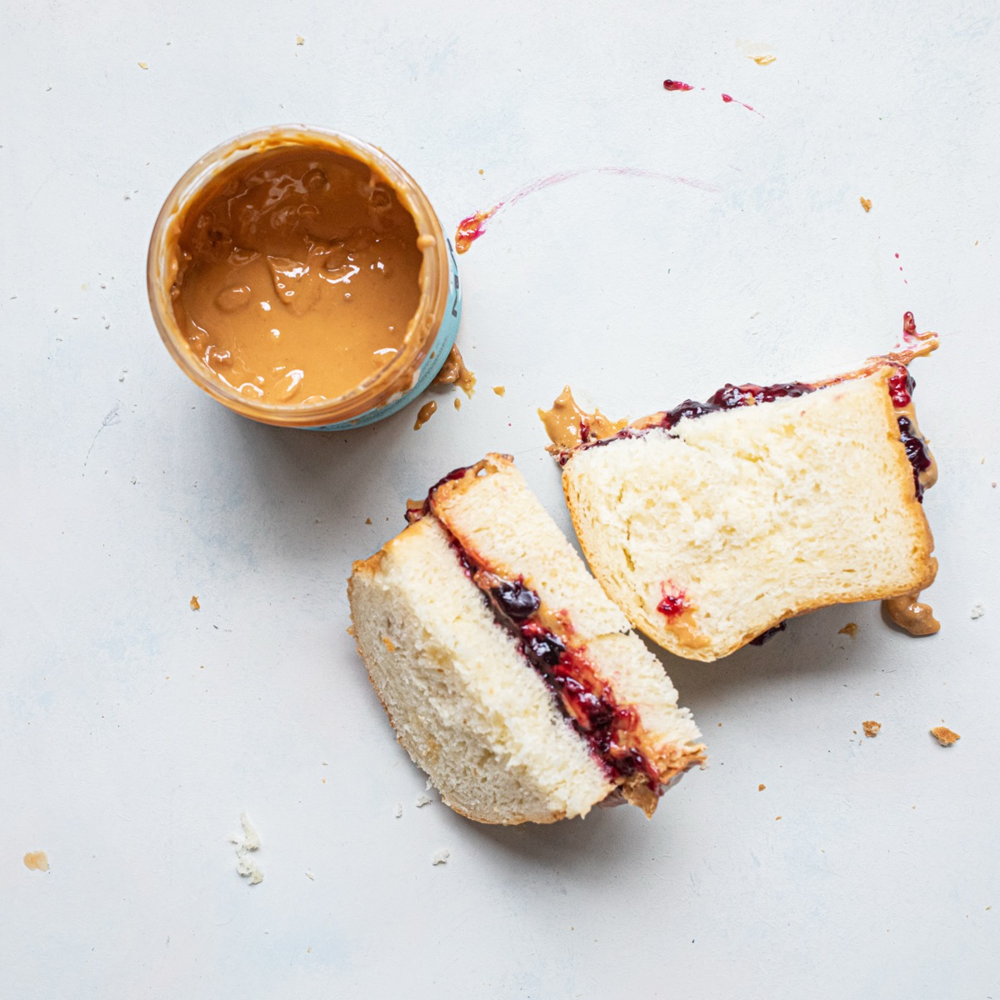

# Peanut Butter and Jelly Sandwich

<table>
  <tr>
    <td>
      
    </td>
    <td>
      
    </td>
  </tr>
  <tr>
    <td>
      
    </td>
    <td>
      
    </td>
  </tr>
</table>

## Background

The peanut butter and jelly sandwich became an American staple in the early twentieth century as commercial
peanut butter and sliced bread became widely available. Its inexpensive, portable ingredients made it
especially popular with families.

## Ingredients

- 8 slices sandwich bread
- 120 g smooth or crunchy peanut butter
- 80 g grape jelly or another fruit preserve

## How to cook

1. Lay out the bread. Spread peanut butter to the edges of four slices; this layer helps keep jelly from
   soaking into the bread.
2. Spread jelly over the peanut butter, or spread it on the other four slices for a more even sandwich.
3. Close the sandwiches, cut as desired, and serve. For packed lunches, wrap tightly and keep cool if the bread
   or preserves require refrigeration.
