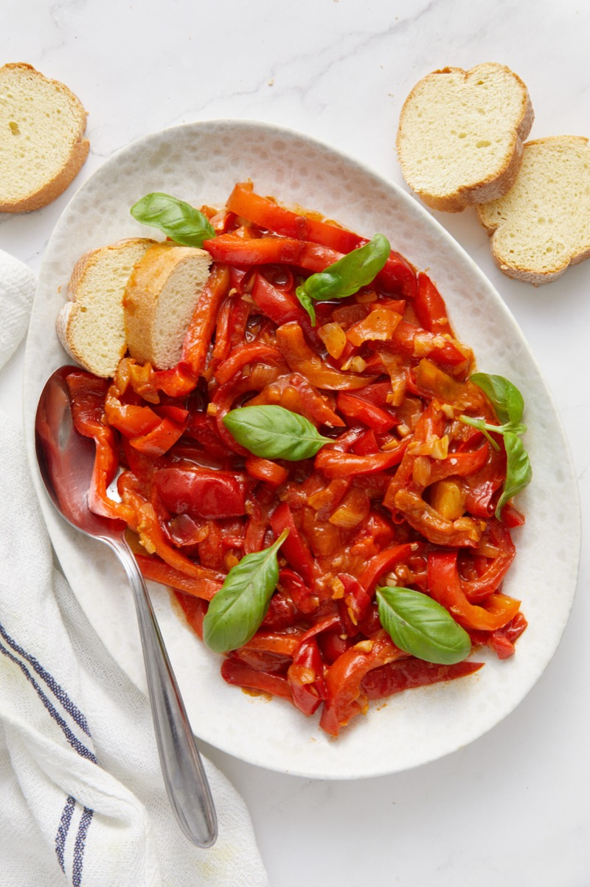
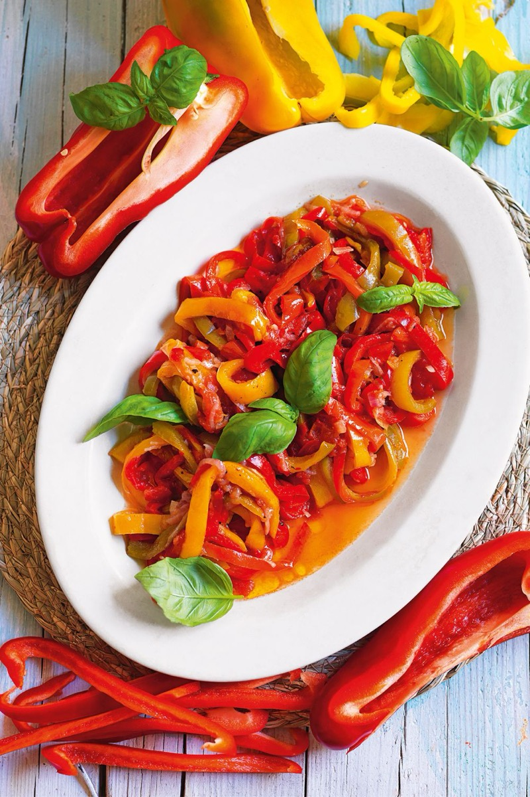
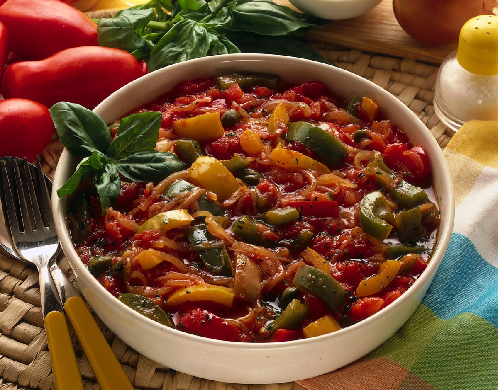
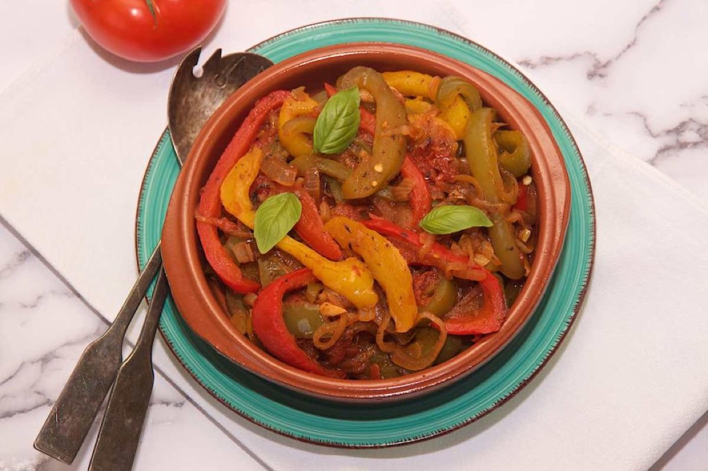

# Peperonata

<table>
  <tr>
    <td>
      
    </td>
    <td>
      
    </td>
  </tr>
  <tr>
    <td>
      
    </td>
    <td>
      
    </td>
  </tr>
</table>

## Background

Peperonata is an Italian stew of sweet peppers, onion, and tomato. Served warm or at room temperature, it can
be a side dish, antipasto, or topping for bread and polenta.

## Ingredients

- 4 bell peppers, sliced
- 1 large onion, sliced
- 3 tablespoons olive oil
- 2 garlic cloves, sliced
- 400 g canned tomatoes
- 1 tablespoon red wine vinegar
- Salt and basil

## How to cook

1. Soften onion in oil. Add peppers and garlic; cook for 10 minutes.
2. Add tomatoes and salt. Cover and simmer for 20 minutes, then uncover and reduce until silky.
3. Stir in vinegar and basil; serve warm or at room temperature.
