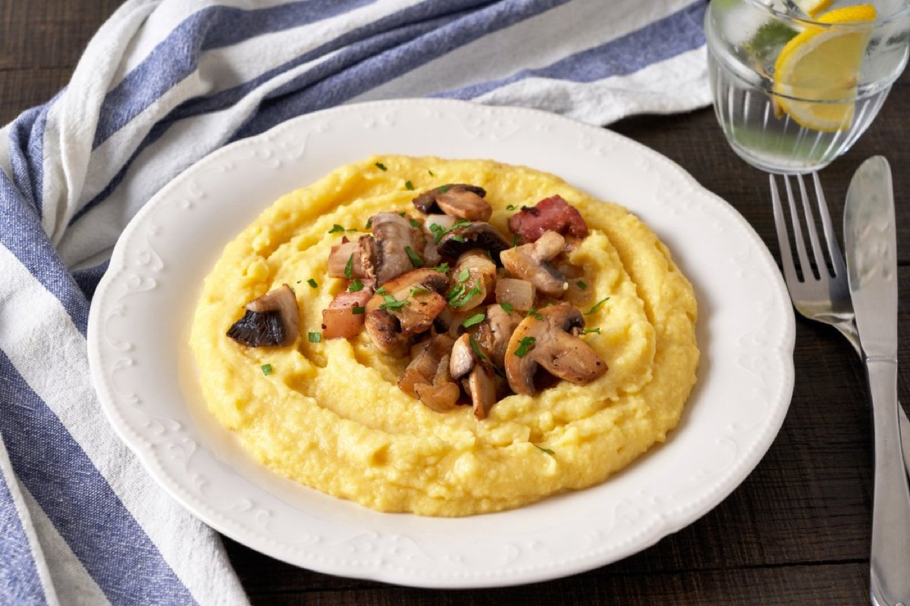
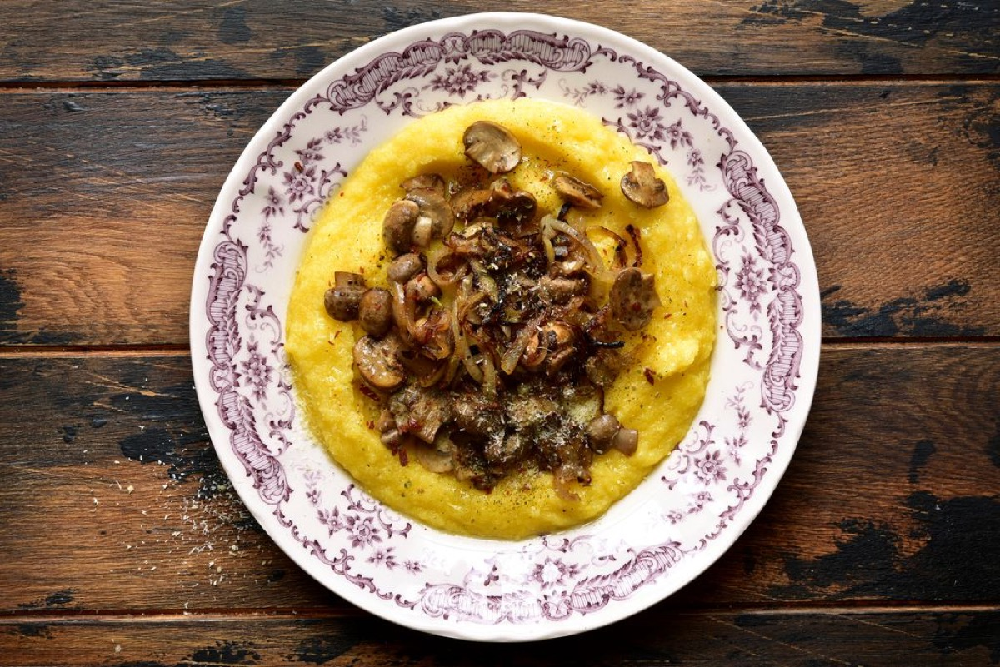
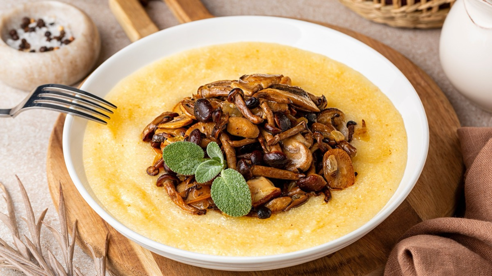
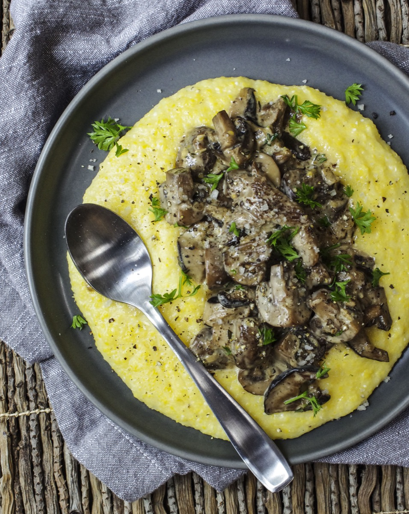

# Polenta with Mushrooms

<table>
  <tr>
    <td>
      
    </td>
    <td>
      
    </td>
  </tr>
  <tr>
    <td>
      
    </td>
    <td>
      
    </td>
  </tr>
</table>

## Background

Polenta, a cornmeal staple of northern Italy, provides a warm base for sautéed mushrooms. Instant polenta
makes this traditional combination practical on a weeknight.

## Ingredients

- 250 g instant polenta
- 1 l water or stock
- 50 g butter
- 60 g Parmigiano-Reggiano
- 450 g mushrooms, sliced
- 2 tablespoons olive oil
- 2 garlic cloves and chopped parsley
- Salt and pepper

## How to cook

1. Brown mushrooms in oil over high heat. Add garlic, salt, pepper, and parsley.
2. Cook polenta in salted liquid according to package directions, whisking to prevent lumps.
3. Stir butter and cheese into polenta. Spoon mushrooms over each serving.
