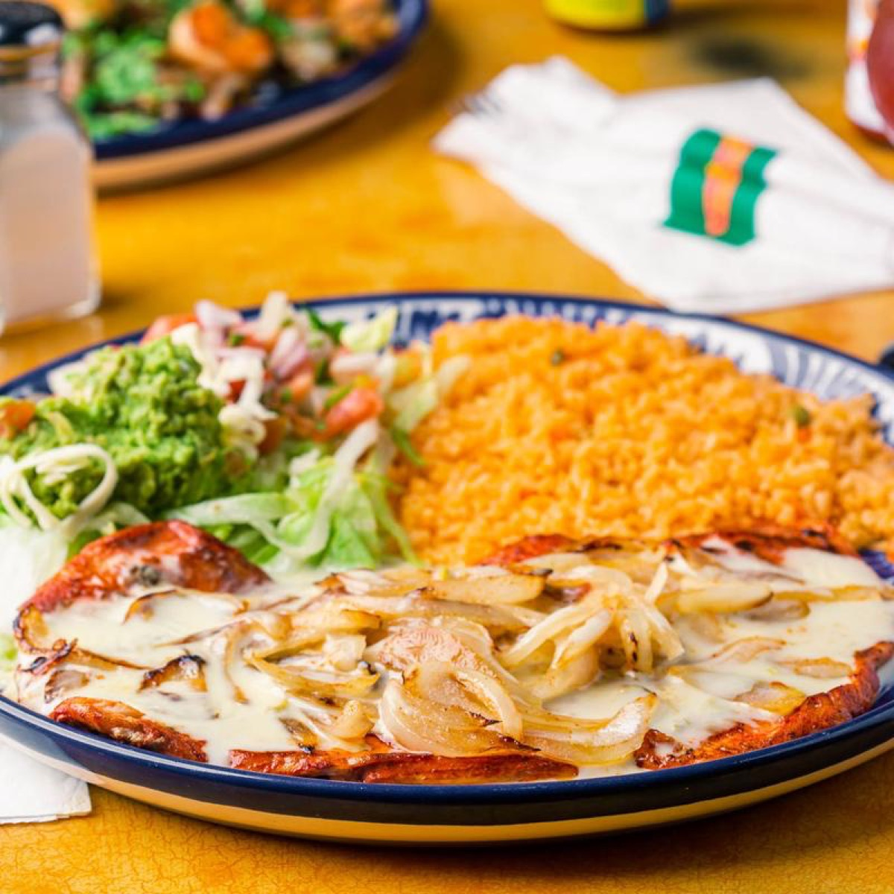
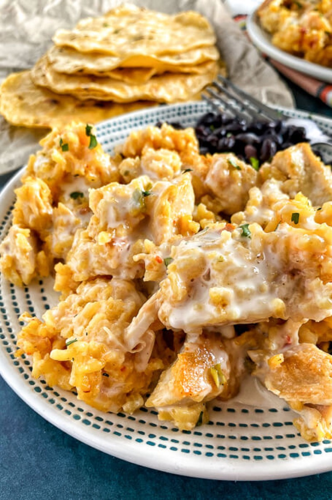
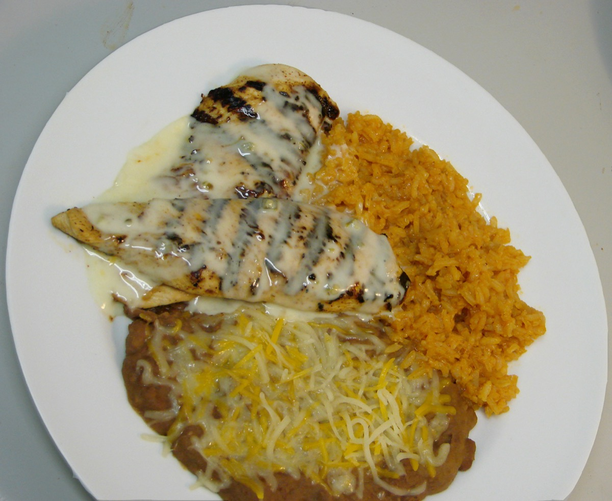
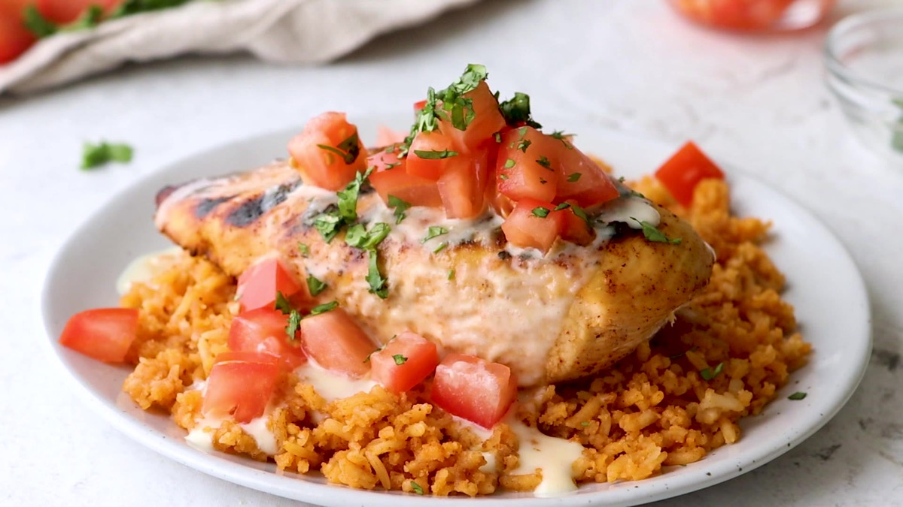

# Pollo Loco-Style Chicken

<table>
  <tr>
    <td>
      
    </td>
    <td>
      
    </td>
  </tr>
  <tr>
    <td>
      
    </td>
    <td>
      
    </td>
  </tr>
</table>

## Background

This recipe is inspired by the citrus-marinated, flame-grilled chicken associated with El Pollo Loco, a
restaurant chain founded in Mexico. It is a homemade interpretation, not the restaurant's proprietary formula.

## Ingredients

- 8 bone-in, skin-on chicken thighs
- 120 ml orange juice
- 60 ml lime juice
- 3 tablespoons neutral oil
- 4 garlic cloves, minced
- 2 teaspoons ground cumin
- 2 teaspoons dried oregano
- 1 teaspoon paprika
- 2 teaspoons salt
- 1/2 teaspoon black pepper

## How to cook

1. Combine all ingredients except chicken. Marinate the chicken under refrigeration for 4 to 12 hours.
2. Heat a grill for two-zone cooking. Remove chicken from marinade and discard the marinade.
3. Grill skin-side down over medium heat until browned, then move to indirect heat. Cover and cook, turning
   occasionally, until the thickest pieces reach 74°C, about 25 to 35 minutes.
4. Rest for 5 minutes before serving.
