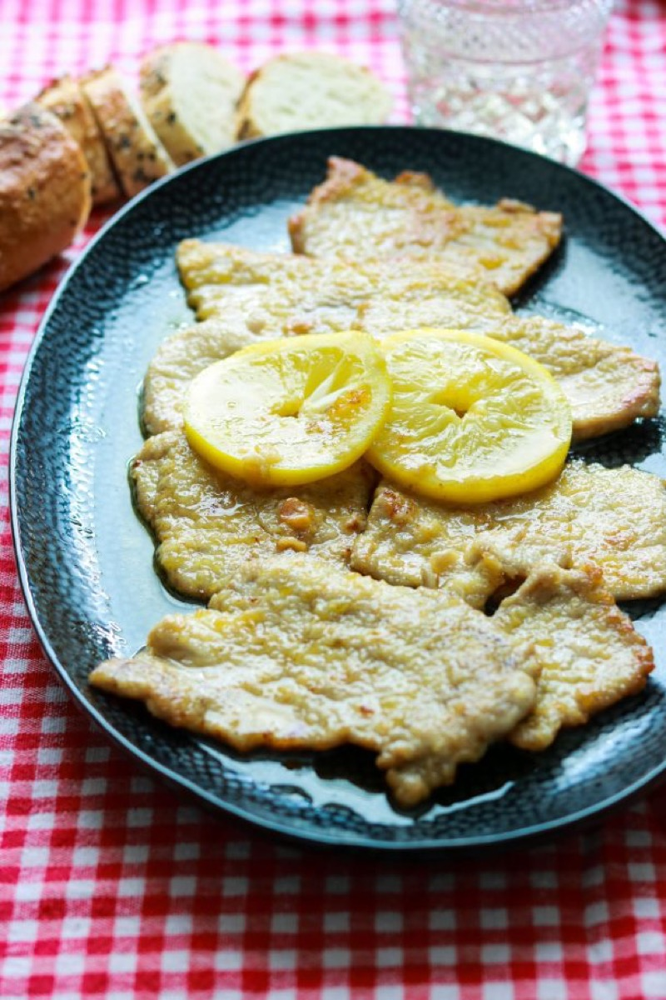
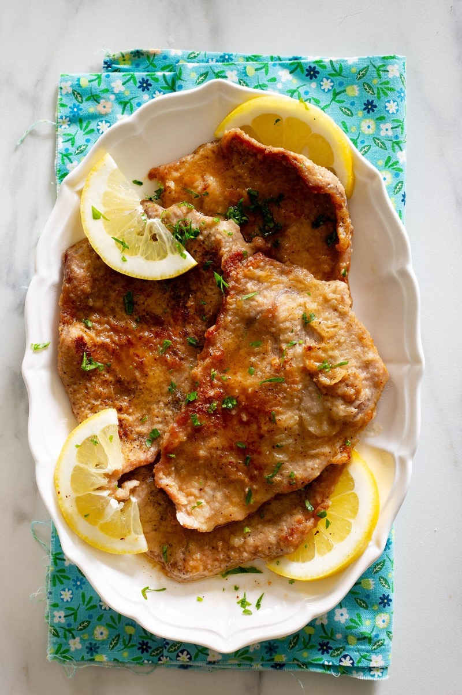
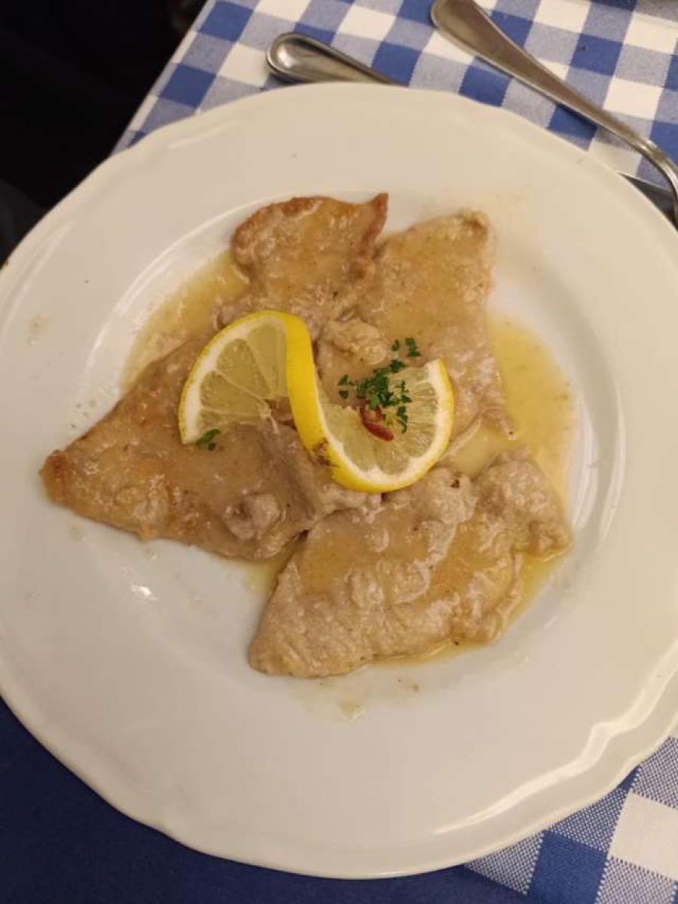

# Pork Scaloppine with Lemon

<table>
  <tr>
    <td>
      
    </td>
    <td>
      
    </td>
  </tr>
  <tr>
    <td>
      
    </td>
    <td>
      
    </td>
  </tr>
</table>

## Background

Scaloppine are thin Italian slices of meat cooked quickly and finished with a pan sauce. Pork loin makes an
inexpensive, tender version when pounded evenly.

## Ingredients

- 600 g pork loin, cut into 8 thin slices
- Salt, pepper, and 60 g flour
- 2 tablespoons olive oil
- 40 g butter
- 120 ml chicken stock
- 3 tablespoons lemon juice
- Chopped parsley

## How to cook

1. Pound pork to 5 mm, season, and dust with flour.
2. Sauté in oil for about 2 minutes per side, until it reaches 63°C; remove.
3. Reduce stock and lemon in the pan. Swirl in butter, return pork briefly, and add parsley.
