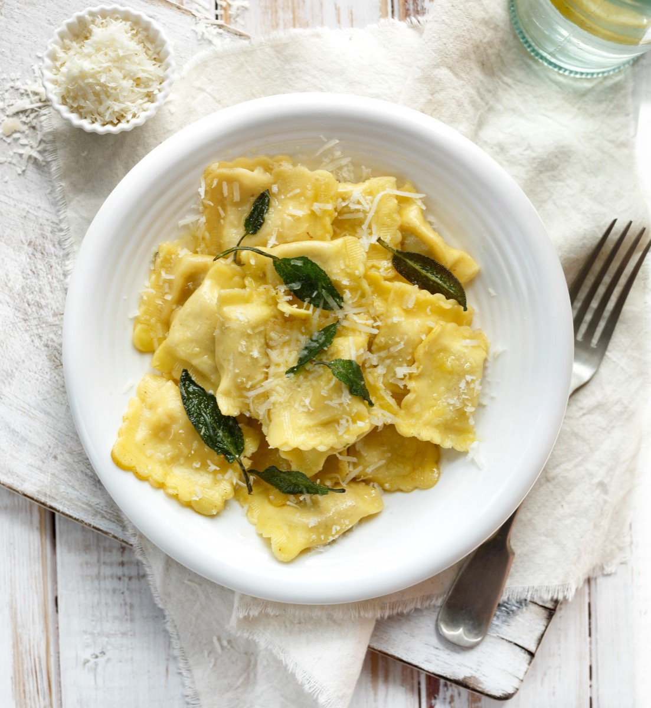
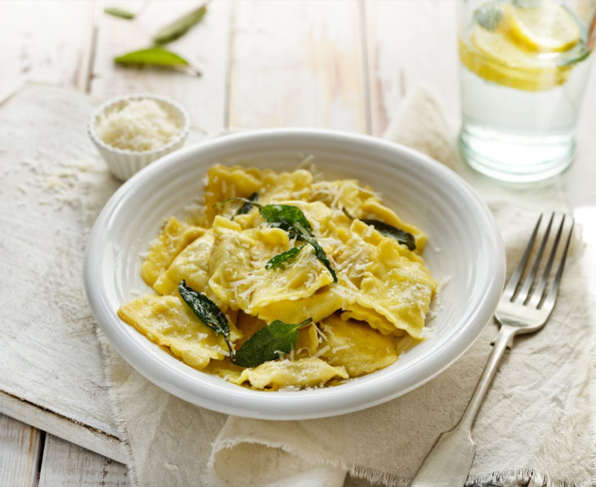
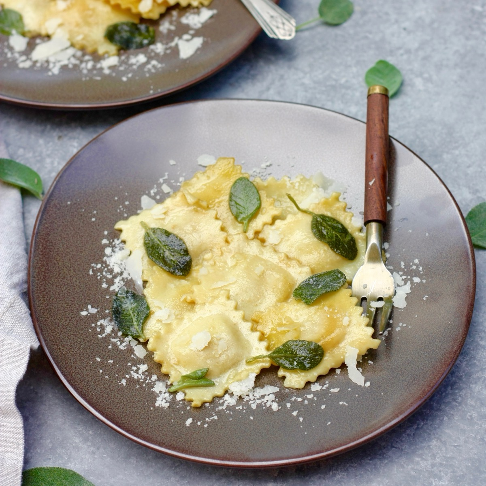
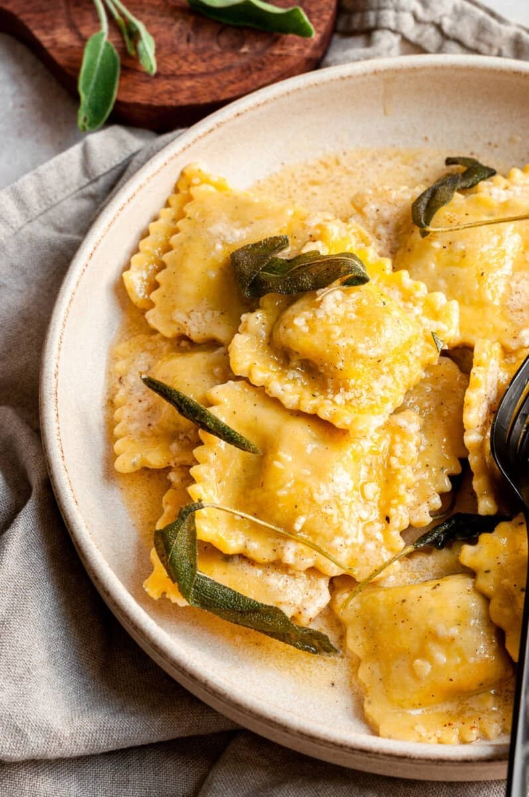

# Ravioli with Butter and Sage

<table>
  <tr>
    <td>
      
    </td>
    <td>
      
    </td>
  </tr>
  <tr>
    <td>
      
    </td>
    <td>
      
    </td>
  </tr>
</table>

## Background

Burro e salvia is a classic northern Italian dressing for filled pasta. Browned butter and crisp sage
contribute aroma without overwhelming a squash, cheese, or meat filling.

## Ingredients

- 500 g fresh ravioli
- 100 g unsalted butter
- 16 fresh sage leaves
- 50 g Parmigiano-Reggiano
- Salt and black pepper

## How to cook

1. Melt butter with sage over medium heat until it smells nutty and the milk solids turn amber; do not burn it.
2. Boil ravioli in salted water until tender. Reserve a little water and transfer ravioli to the butter.
3. Swirl gently with a splash of water. Finish with Parmigiano and pepper.
