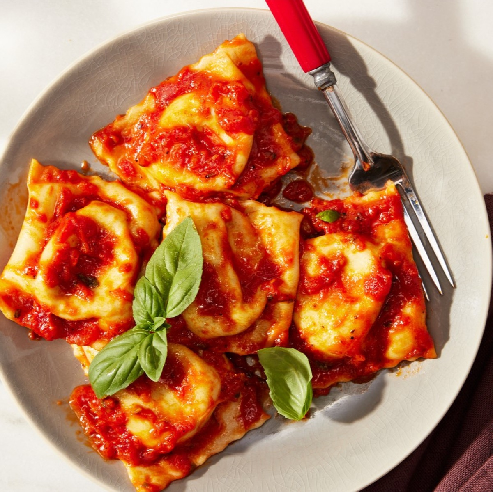
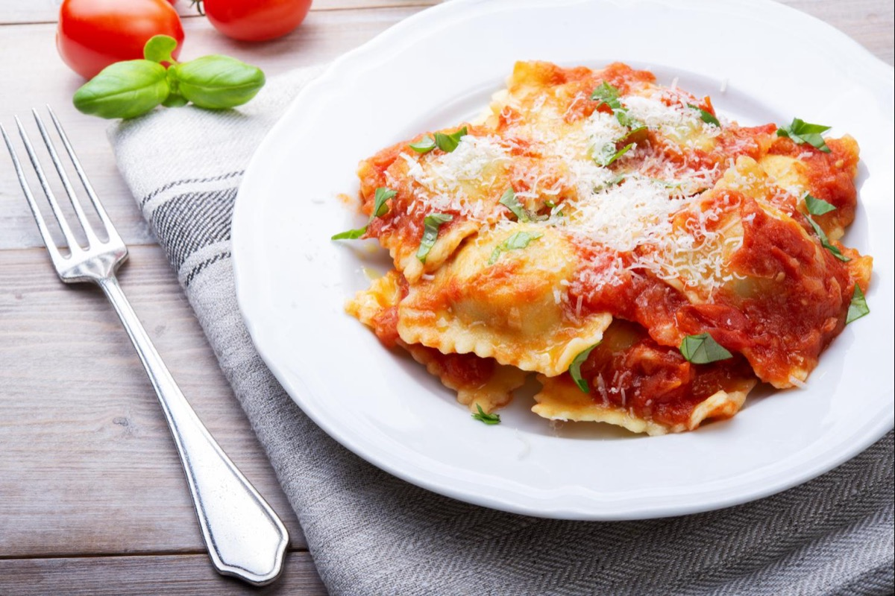
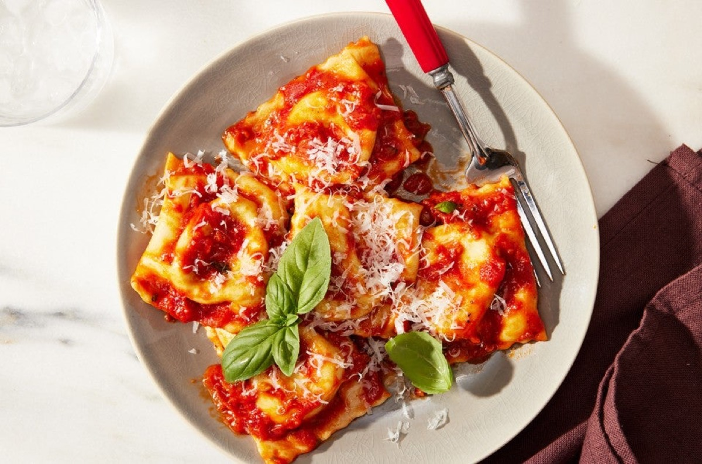
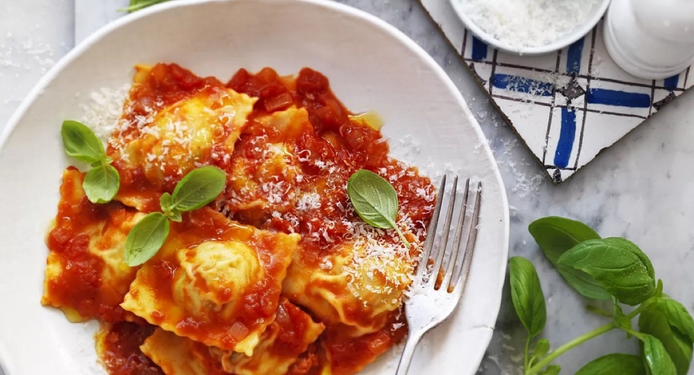

# Ravioli with Pomodoro Sauce

<table>
  <tr>
    <td>
      
    </td>
    <td>
      
    </td>
  </tr>
  <tr>
    <td>
      
    </td>
    <td>
      
    </td>
  </tr>
</table>

## Background

Tomato sauce is a bright, familiar partner for filled pasta. Keeping the sauce simple allows the filling and
delicate pasta sheets to remain prominent.

## Ingredients

- 500 g fresh cheese ravioli
- 500 ml simple tomato sauce
- 8 basil leaves
- 2 tablespoons extra-virgin olive oil
- 40 g Parmigiano-Reggiano
- Salt

## How to cook

1. Warm tomato sauce with basil and olive oil over low heat.
2. Boil ravioli in salted water until tender, usually 3 to 5 minutes.
3. Transfer with a slotted spoon to the sauce and turn gently to coat. Serve with Parmigiano.
