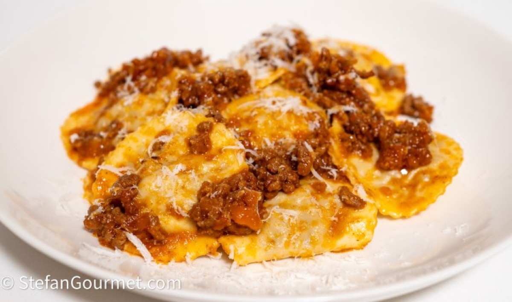
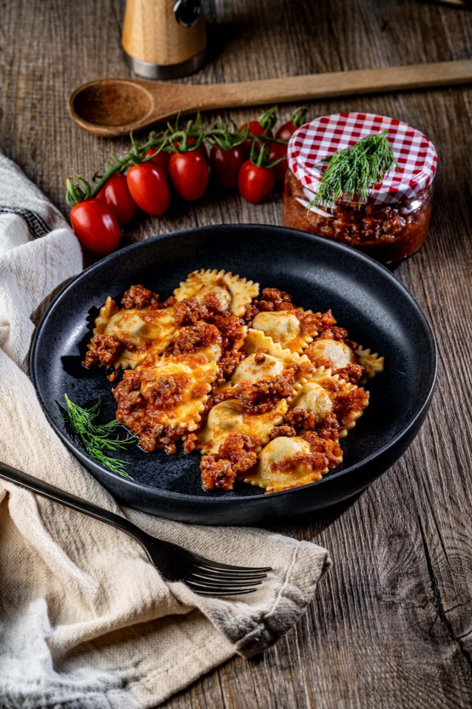
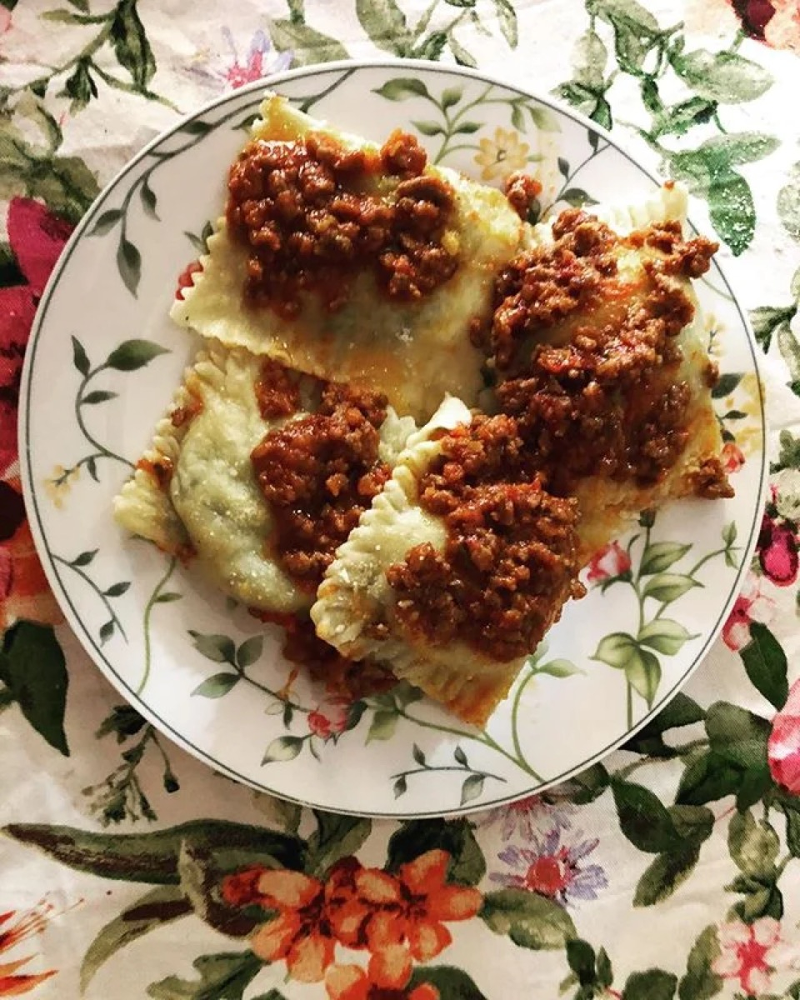
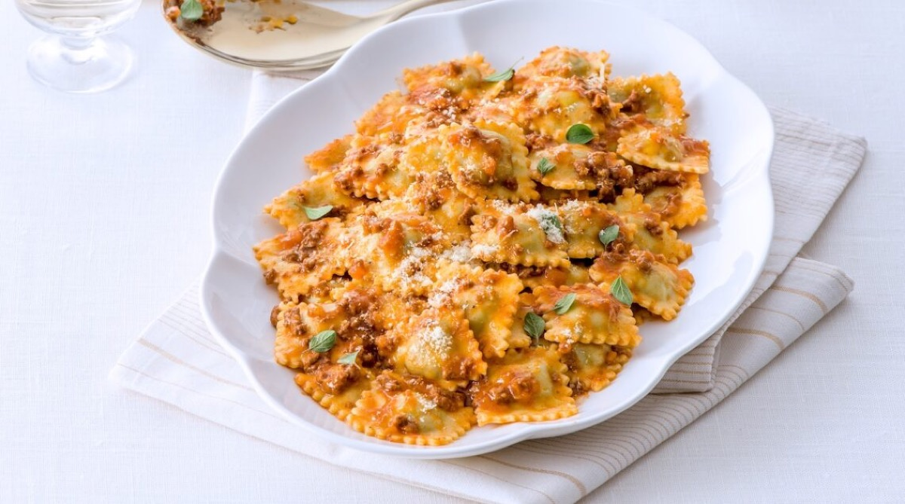

# Ravioli with Ragù

<table>
  <tr>
    <td>
      
    </td>
    <td>
      
    </td>
  </tr>
  <tr>
    <td>
      
    </td>
    <td>
      
    </td>
  </tr>
</table>

## Background

Filled pasta served with meat ragù is a rich northern and central Italian combination. A restrained coating
preserves the flavor of the ravioli instead of burying it.

## Ingredients

- 500 g fresh cheese or meat ravioli
- 500 ml prepared Italian ragù
- 40 g Parmigiano-Reggiano
- Salt

## How to cook

1. Warm the ragù gently in a wide skillet.
2. Boil ravioli in salted water according to their size, usually 3 to 5 minutes, until tender.
3. Lift ravioli into the skillet with a slotted spoon. Toss very gently with ragù and a little cooking water.
4. Serve with Parmigiano-Reggiano.
