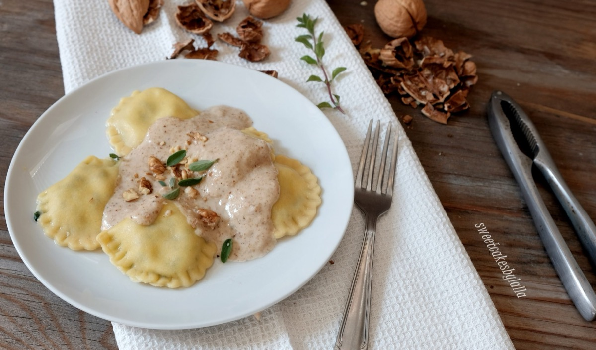
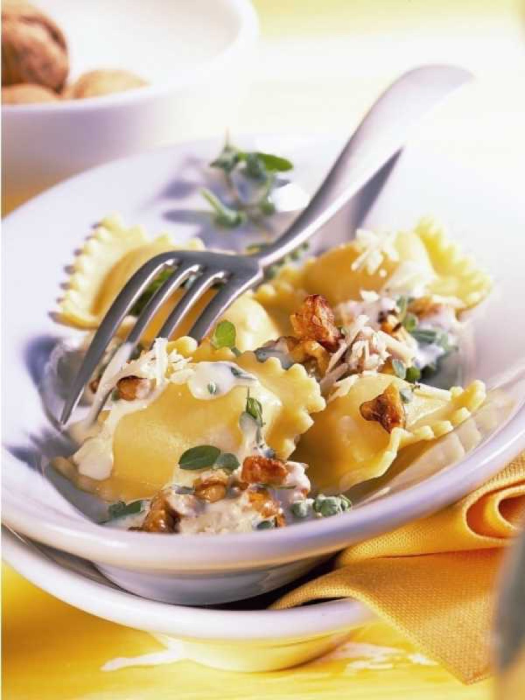
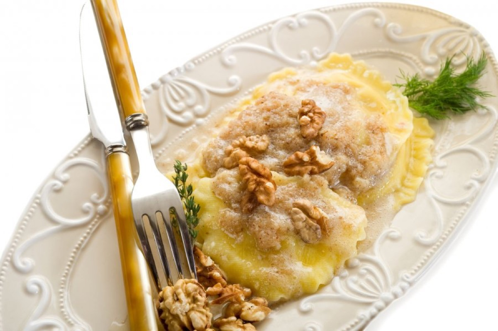
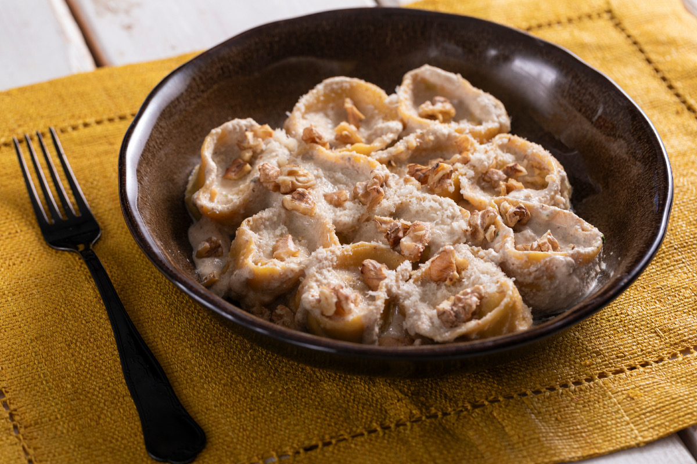

# Ravioli with Walnut Sauce

<table>
  <tr>
    <td>
      
    </td>
    <td>
      
    </td>
  </tr>
  <tr>
    <td>
      
    </td>
    <td>
      
    </td>
  </tr>
</table>

## Background

Salsa di noci is a Ligurian walnut sauce traditionally paired with filled pasta such as pansoti. Bread and milk
give it a creamy texture without requiring a heavy cream sauce.

## Ingredients

- 500 g fresh cheese or herb ravioli
- 120 g walnuts
- 40 g day-old bread, crust removed
- 120 ml milk
- 1 small garlic clove
- 40 g Parmigiano-Reggiano
- 3 tablespoons olive oil
- Salt and marjoram

## How to cook

1. Soak bread in milk. Blend walnuts, squeezed bread, garlic, cheese, oil, salt, and marjoram to a coarse
   cream.
2. Boil ravioli until tender and reserve cooking water.
3. Loosen the uncooked walnut sauce with warm cooking water. Toss gently with ravioli off heat.
