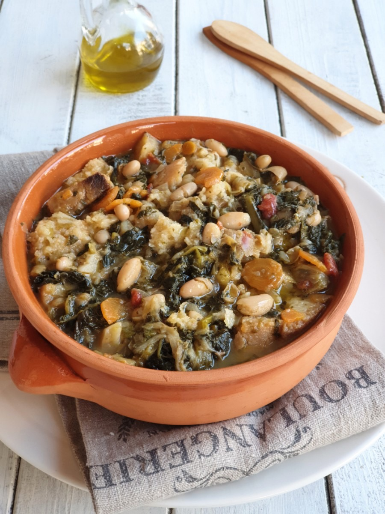
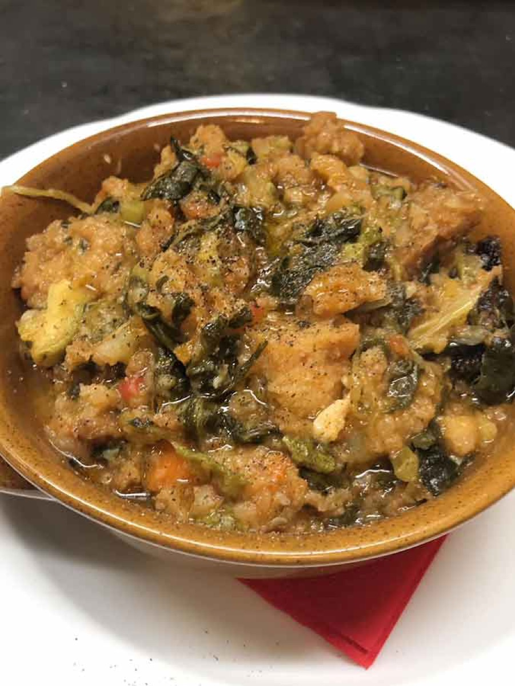
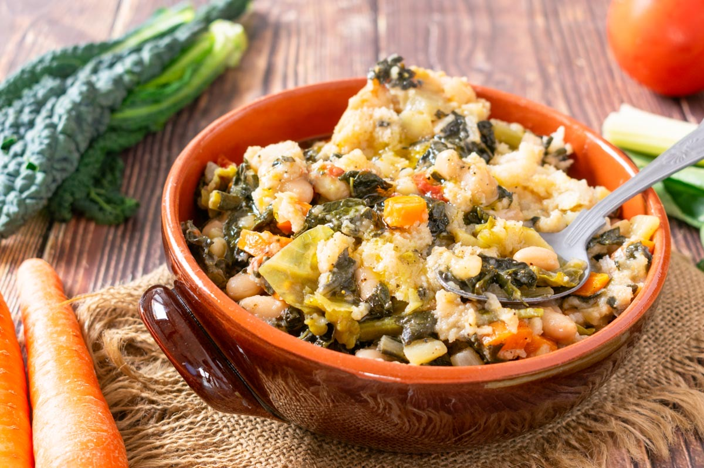
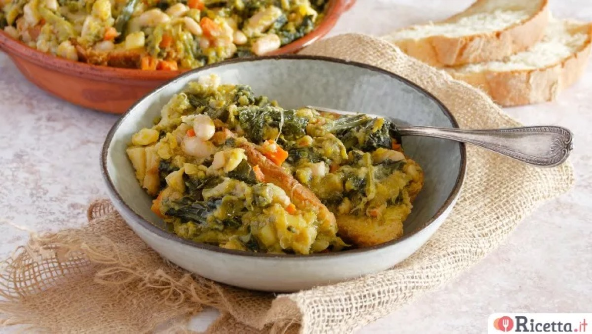

# Ribollita

<table>
  <tr>
    <td>
      
    </td>
    <td>
      
    </td>
  </tr>
  <tr>
    <td>
      
    </td>
    <td>
      
    </td>
  </tr>
</table>

## Background

Ribollita is a Tuscan bread-and-vegetable soup whose name means "reboiled." Traditionally, yesterday's soup was
reheated with stale bread, turning modest ingredients into a substantial meal.

## Ingredients

- 3 tablespoons olive oil
- 1 onion, 1 carrot, and 1 celery stalk, diced
- 300 g kale or cavolo nero, chopped
- 1 can cannellini beans, with liquid
- 400 g canned tomatoes
- 750 ml vegetable stock
- 250 g stale country bread, torn
- Salt and pepper

## How to cook

1. Soften onion, carrot, and celery in oil. Add kale, beans, tomatoes, and stock.
2. Simmer for 30 minutes and season. Stir in bread and rest for 10 minutes.
3. Reheat gently until thick, then serve with abundant olive oil.
