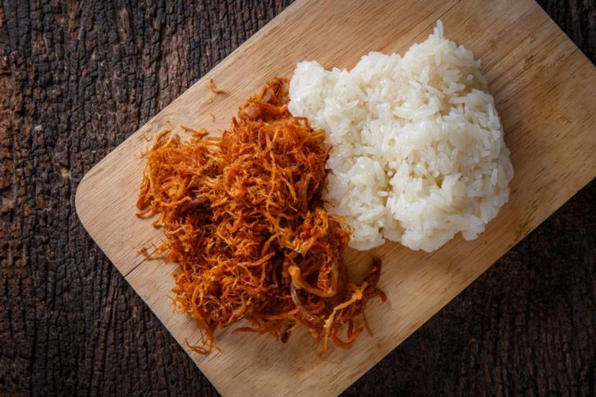
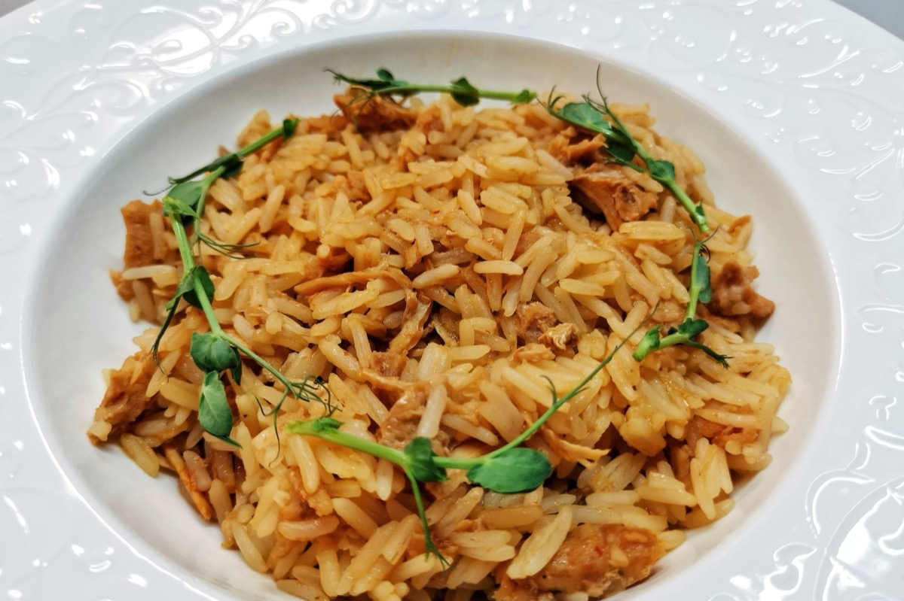
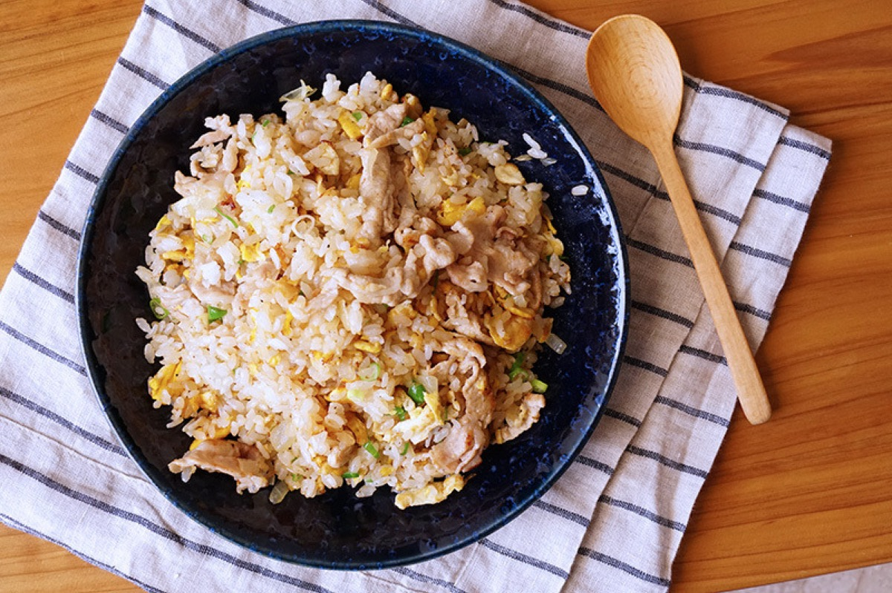
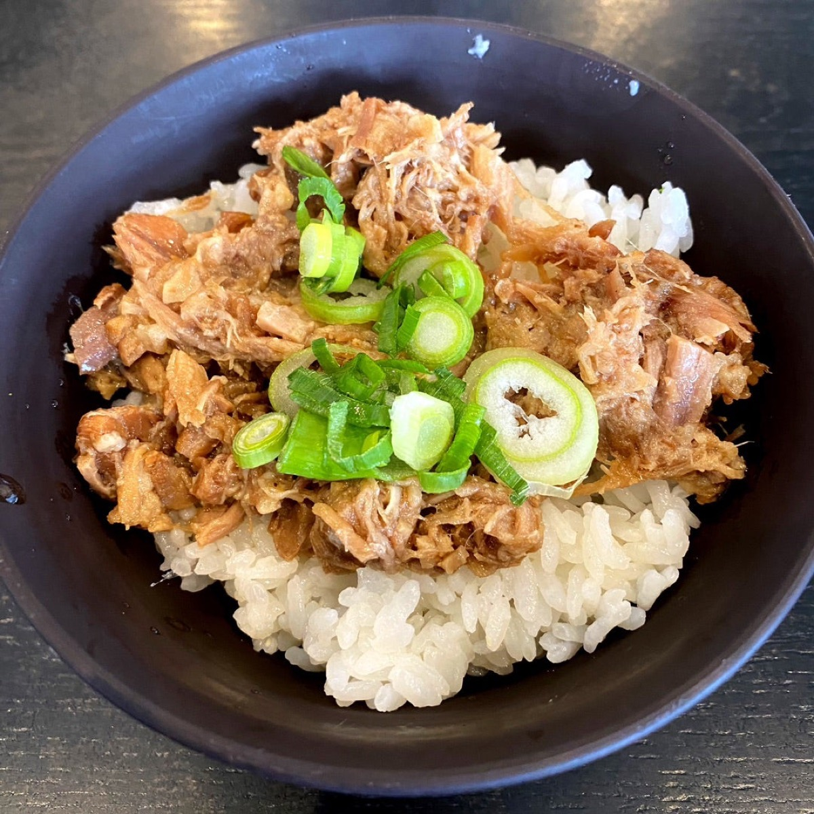

# Rice with Shredded Pork

<table>
  <tr>
    <td>
      
    </td>
    <td>
      
    </td>
  </tr>
  <tr>
    <td>
      
    </td>
    <td>
      
    </td>
  </tr>
</table>

## Background

Rice topped with savory shredded pork is a practical home meal found in many forms across East and Southeast
Asia. This version uses a soy-based braise and can make good use of previously cooked pork shoulder.

## Ingredients

- 600 g cooked jasmine rice
- 500 g cooked pork shoulder, shredded
- 2 tablespoons neutral oil
- 2 garlic cloves, minced
- 3 tablespoons soy sauce
- 1 tablespoon rice vinegar
- 1 tablespoon brown sugar
- 150 ml stock or water
- 1 teaspoon sesame oil
- Scallions and cucumber

## How to cook

1. Cook garlic briefly in oil. Add pork, soy sauce, vinegar, sugar, and stock.
2. Simmer uncovered for 10 to 15 minutes until the pork is hot and the sauce clings to it. Add sesame oil.
3. Spoon over rice and garnish with scallions and cucumber.
