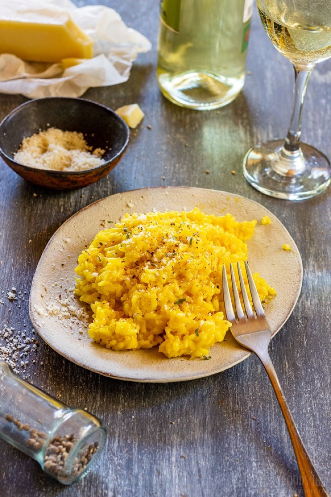
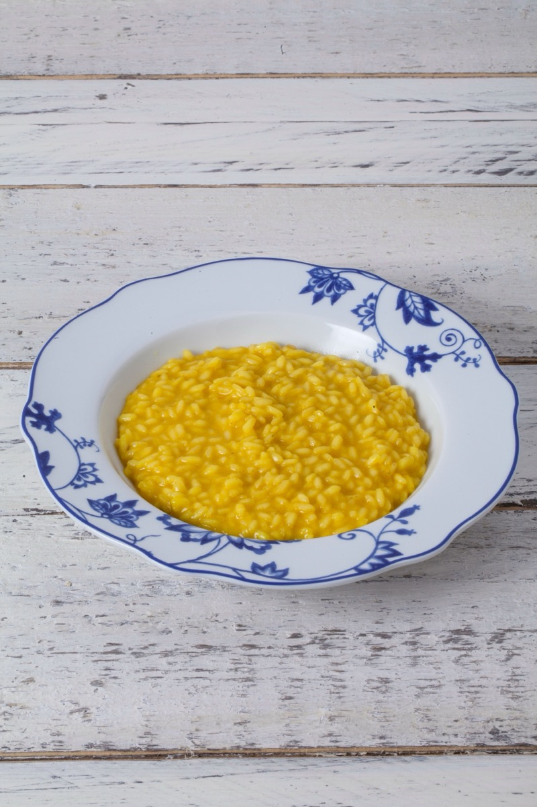
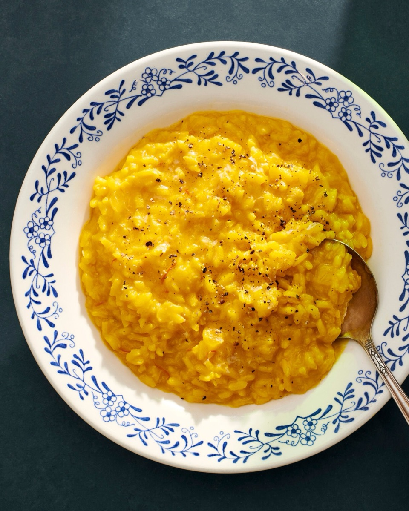
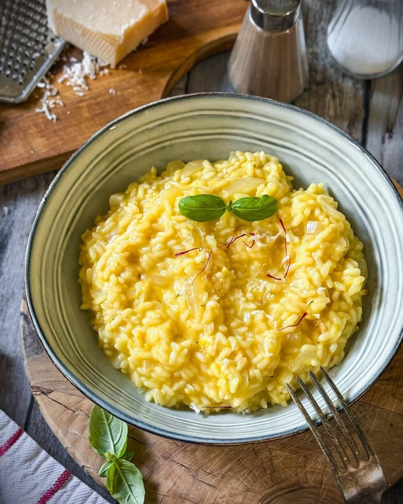

# Risotto alla Milanese

<table>
  <tr>
    <td>
      
    </td>
    <td>
      
    </td>
  </tr>
  <tr>
    <td>
      
    </td>
    <td>
      
    </td>
  </tr>
</table>

## Background

This golden risotto is a specialty of Milan. Saffron gives it color and fragrance, and it traditionally
accompanies ossobuco but also stands alone as a first course.

## Ingredients

- 320 g Carnaroli or Arborio rice
- 1 small onion, minced
- 40 g butter, divided
- 120 ml dry white wine
- 1.2 l hot stock
- 1 generous pinch saffron threads
- 60 g Parmigiano-Reggiano

## How to cook

1. Steep saffron in 120 ml hot stock. Soften onion in half the butter and toast rice for 2 minutes.
2. Add wine and reduce. Add stock gradually, stirring often; add saffron stock halfway through.
3. When al dente, remove from heat and vigorously mix in remaining butter and cheese.
