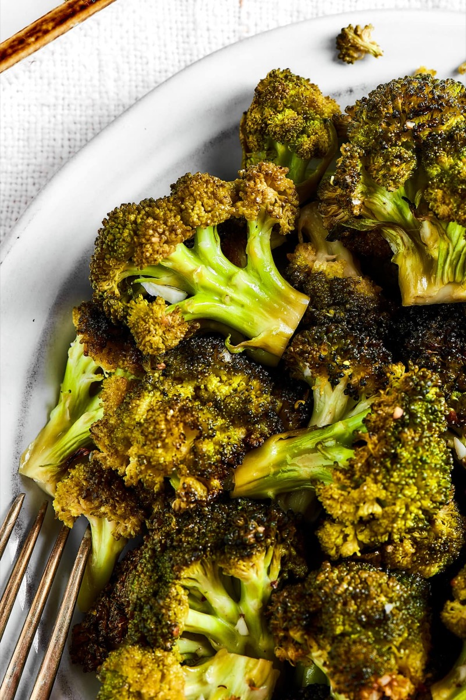
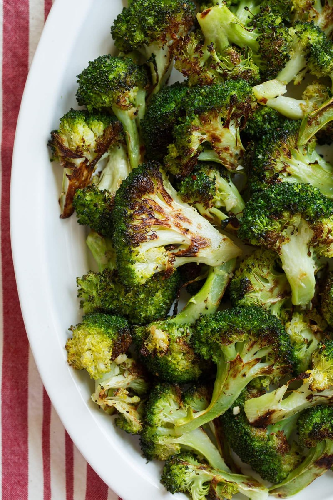
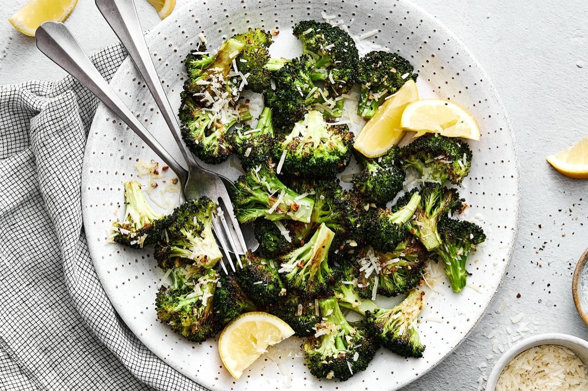

# Roasted Broccoli

<table>
  <tr>
    <td>
      
    </td>
    <td>
      
    </td>
  </tr>
  <tr>
    <td>
      
    </td>
    <td>
      
    </td>
  </tr>
</table>

## Background

High-heat oven roasting is a modern, simple way to concentrate broccoli's sweetness while crisping its edges.
The stems are equally edible when peeled and cut to match the florets.

## Ingredients

- 900 g broccoli
- 3 tablespoons olive oil
- 1 teaspoon salt
- 1/2 teaspoon black pepper
- 2 garlic cloves, thinly sliced
- 1 lemon
- 30 g grated Parmesan, optional

## How to cook

1. Heat the oven to 220°C. Cut broccoli into even florets; peel thick stems and slice them.
2. Dry thoroughly, toss with oil, salt, and pepper, and spread cut-side down on a large sheet pan.
3. Roast for 15 minutes. Add garlic, turn, and roast 5 to 8 minutes more.
4. Finish with lemon juice and optional Parmesan.
