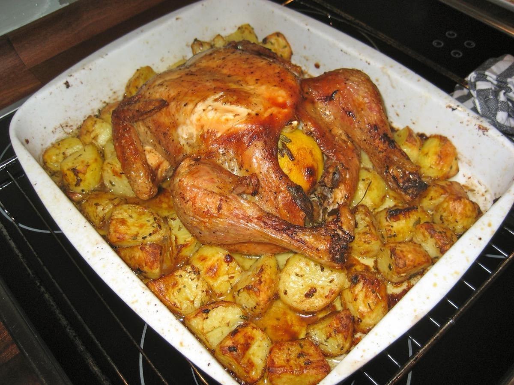
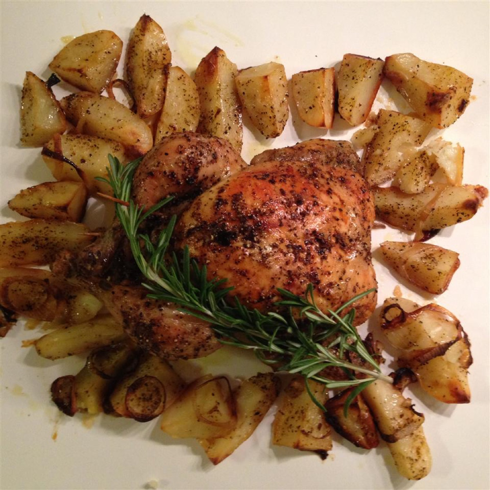
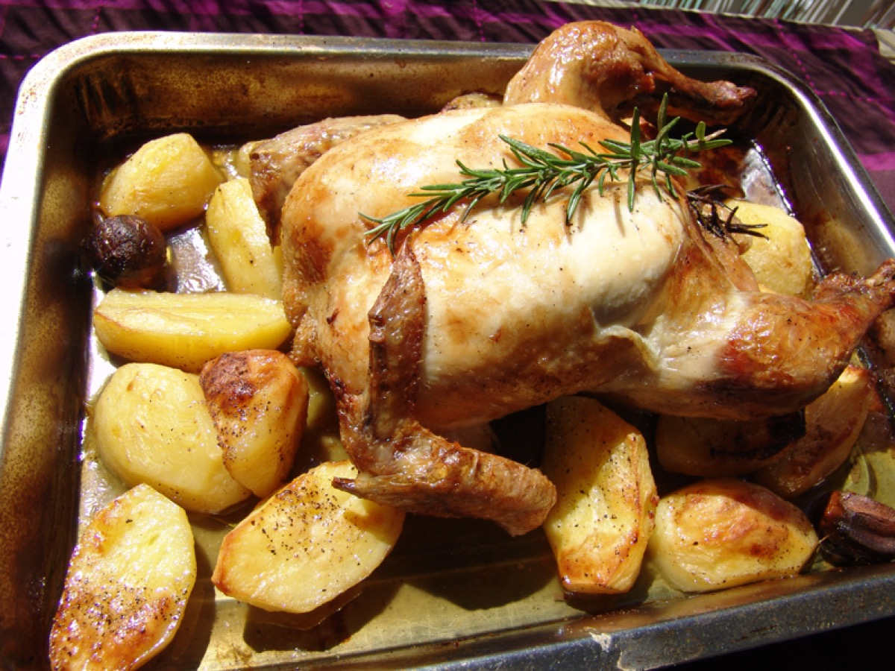
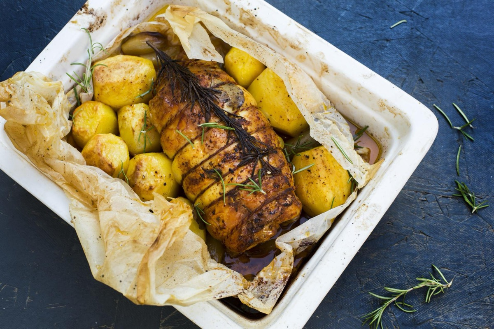

# Oven Chicken with Rosemary and Potatoes

<table>
  <tr>
    <td>
      
    </td>
    <td>
      
    </td>
  </tr>
  <tr>
    <td>
      
    </td>
    <td>
      
    </td>
  </tr>
</table>

## Background

Roast chicken with potatoes, rosemary, garlic, and olive oil is a familiar Italian home-cooking combination.
The potatoes absorb the seasoned pan juices while the high oven heat crisps the chicken skin.

## Ingredients

- 8 bone-in, skin-on chicken thighs
- 900 g Yukon Gold potatoes, cut into 4 cm pieces
- 4 tablespoons extra-virgin olive oil
- 4 garlic cloves, lightly crushed
- 2 tablespoons chopped fresh rosemary
- 1 lemon, zested and quartered
- 2 teaspoons salt
- 1/2 teaspoon black pepper

## How to cook

1. Heat the oven to 220°C. Toss potatoes with half the oil, garlic, half the rosemary, salt, and pepper. Roast
   in a large pan for 20 minutes.
2. Coat chicken with remaining oil, rosemary, lemon zest, salt, and pepper. Turn potatoes and place chicken on
   top, skin-side up.
3. Roast for 35 to 45 minutes, until potatoes are tender and chicken reaches 74°C. Broil briefly for crisper
   skin.
4. Rest for 5 minutes and serve with roasted lemon wedges.
