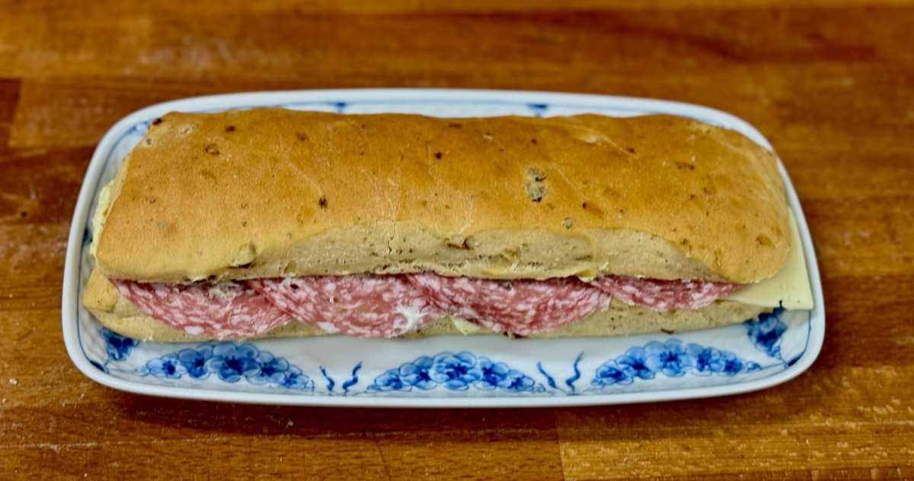
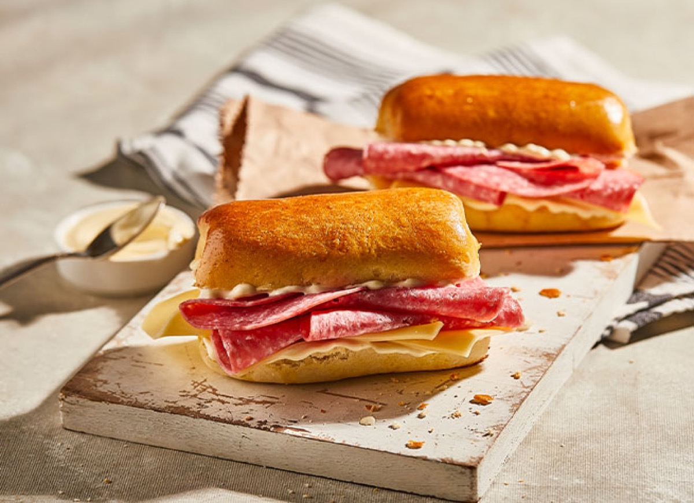
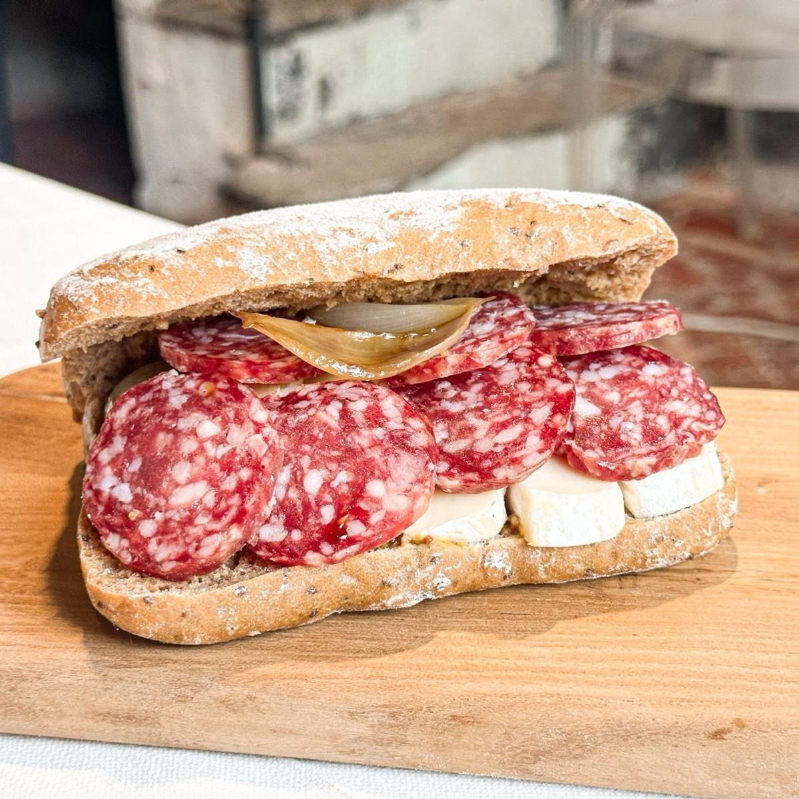
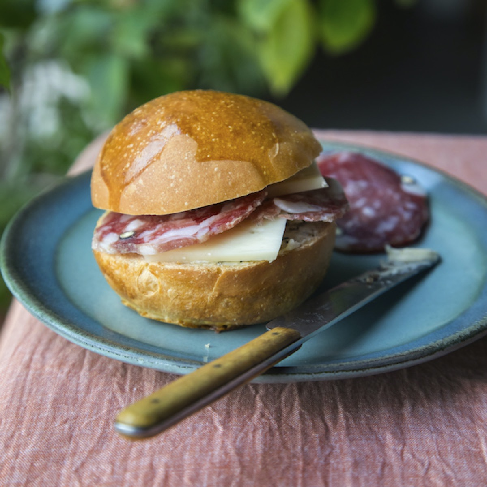

# Salami and Cheese Panino

<table>
  <tr>
    <td>
      
    </td>
    <td>
      
    </td>
  </tr>
  <tr>
    <td>
      
    </td>
    <td>
      
    </td>
  </tr>
</table>

## Background

In Italian, panino simply means a small bread roll or sandwich; panini is plural. Salame and a firm, flavorful
cheese make a classic portable filling that needs little embellishment.

## Ingredients

- 4 ciabatta rolls
- 200 g sliced Italian salame
- 160 g sliced provolone
- 2 tablespoons olive oil
- 1 roasted red pepper, sliced
- A handful of arugula

## How to cook

1. Split the rolls and brush the cut sides with olive oil.
2. Layer salame, provolone, roasted pepper, and arugula in each roll.
3. Serve at room temperature, or press in a hot sandwich grill for 3 to 5 minutes until crisp and melted.
