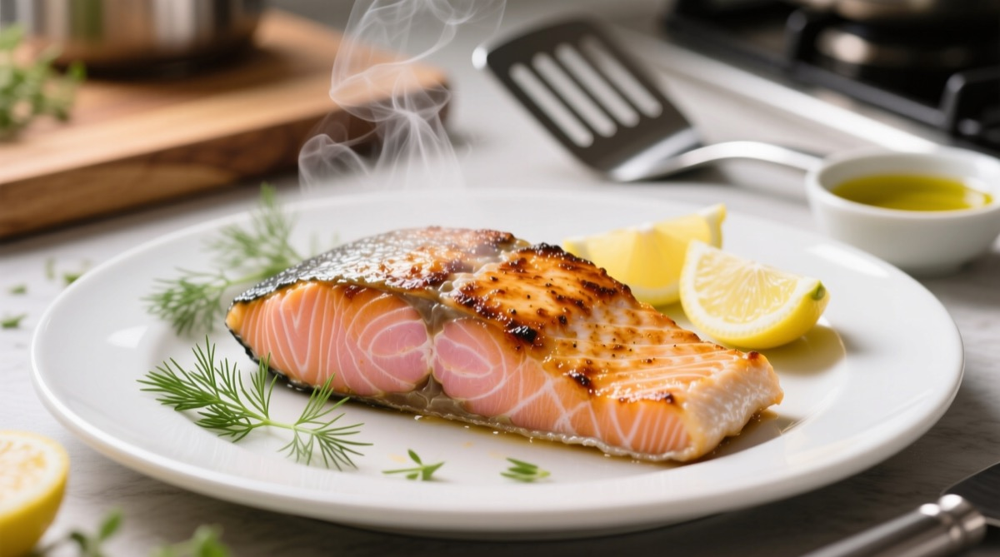
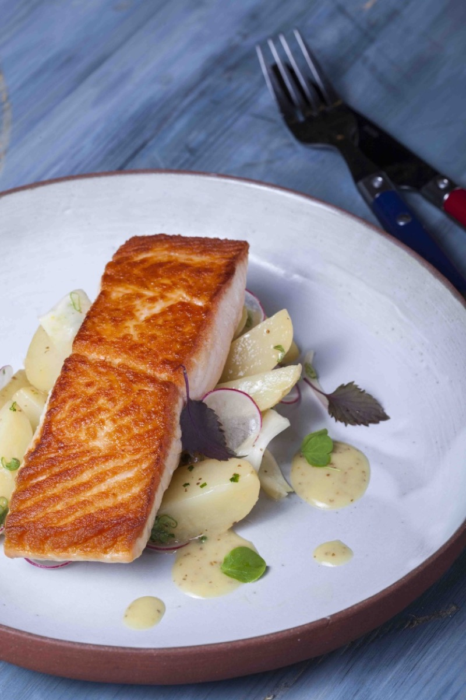
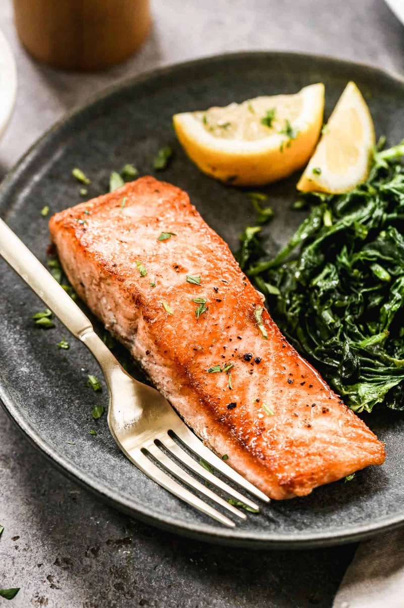
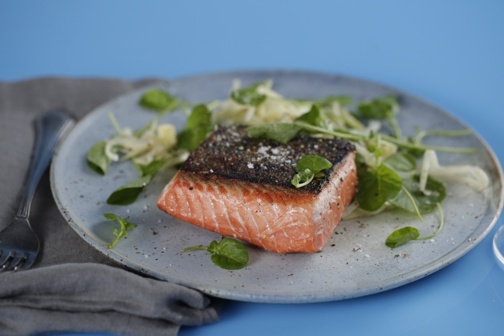

# Seared Salmon

<table>
  <tr>
    <td>
      
    </td>
    <td>
      
    </td>
  </tr>
  <tr>
    <td>
      
    </td>
    <td>
      
    </td>
  </tr>
</table>

## Background

Pan searing gives salmon a crisp exterior while preserving a moist center. Beginning skin-side down and
pressing the fillet briefly prevents curling and renders the skin evenly.

## Ingredients

- 4 skin-on salmon fillets, about 170 g each
- 1 teaspoon salt
- 1/2 teaspoon black pepper
- 1 tablespoon neutral oil
- 1 tablespoon butter
- 1 lemon, cut into wedges

## How to cook

1. Pat salmon very dry and season. Heat oil in a heavy skillet over medium-high heat.
2. Add salmon skin-side down and press gently for 20 seconds. Cook without moving for 4 to 6 minutes.
3. Turn, add butter, and cook for 1 to 3 minutes, to the desired doneness.
4. Rest briefly and serve with lemon.
