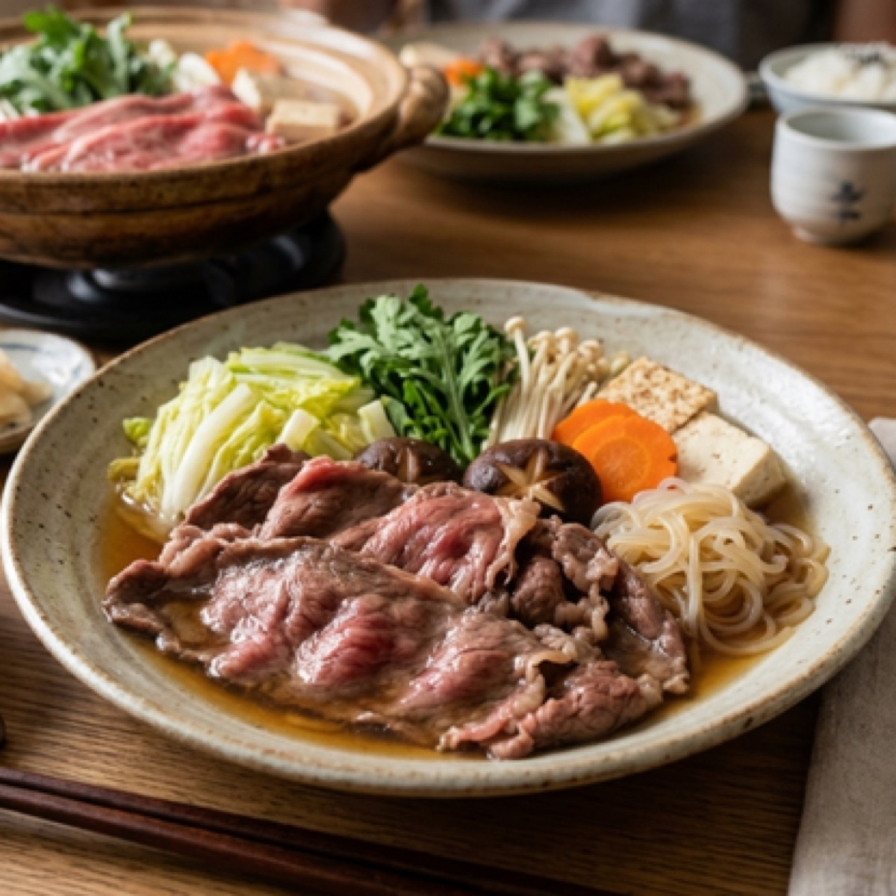
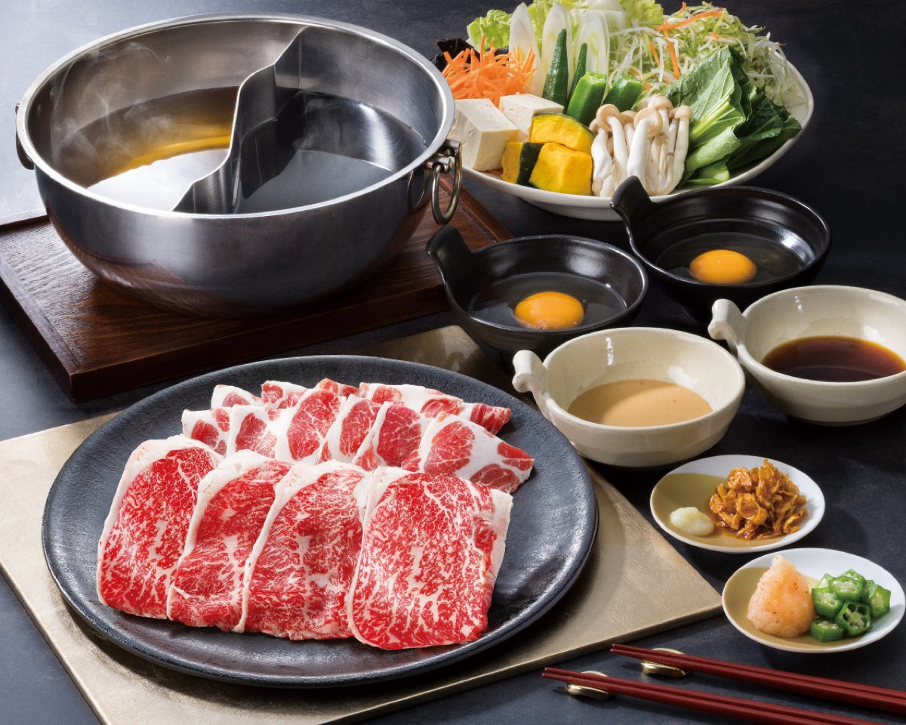
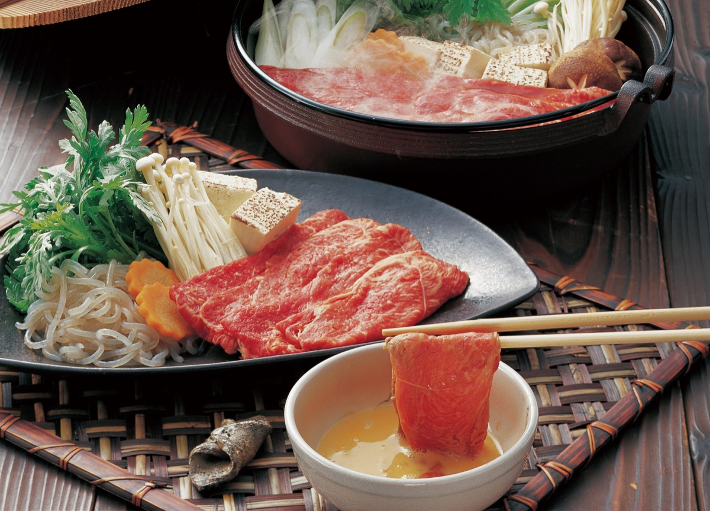

# Shabu-Shabu

<table>
  <tr>
    <td>
      
    </td>
    <td>
      
    </td>
  </tr>
  <tr>
    <td>
      
    </td>
    <td>
      
    </td>
  </tr>
</table>

## Background

Shabu-shabu is a Japanese communal hot pot named for the swishing motion used to cook thin meat in broth. It
became popular in Japan in the twentieth century and is served with ponzu and sesame dipping sauces.

## Ingredients

- 1.5 l water
- 15 g kombu
- 600 g very thinly sliced beef
- 300 g napa cabbage
- 200 g mushrooms
- 250 g firm tofu
- 2 scallions
- 200 g udon noodles
- Ponzu and sesame dipping sauce

## How to cook

1. Soak kombu in water for 30 minutes, heat until almost simmering, then remove it.
2. Arrange beef separately from the cut vegetables and tofu. Bring broth to a gentle simmer at the table.
3. Swish beef until just cooked; simmer vegetables and tofu until tender. Use separate utensils for raw beef.
4. Cook udon in the enriched broth at the end and serve with dipping sauces.
