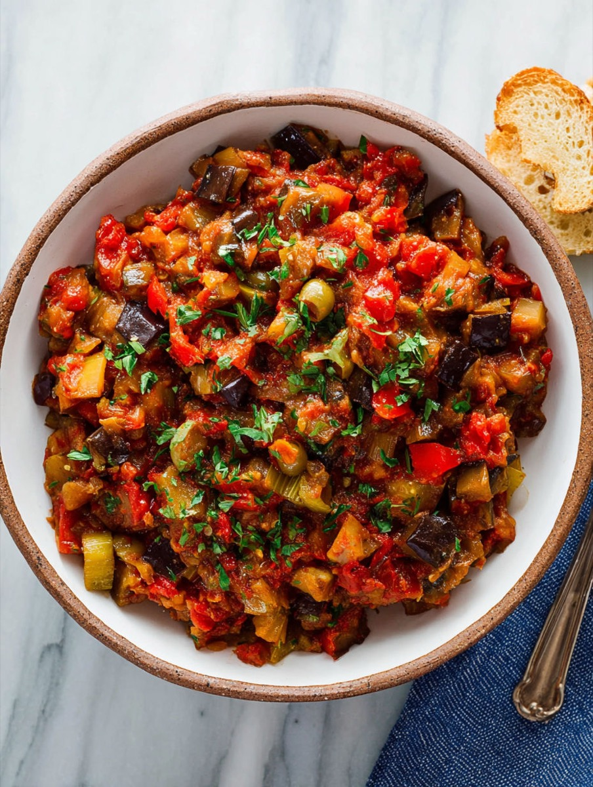
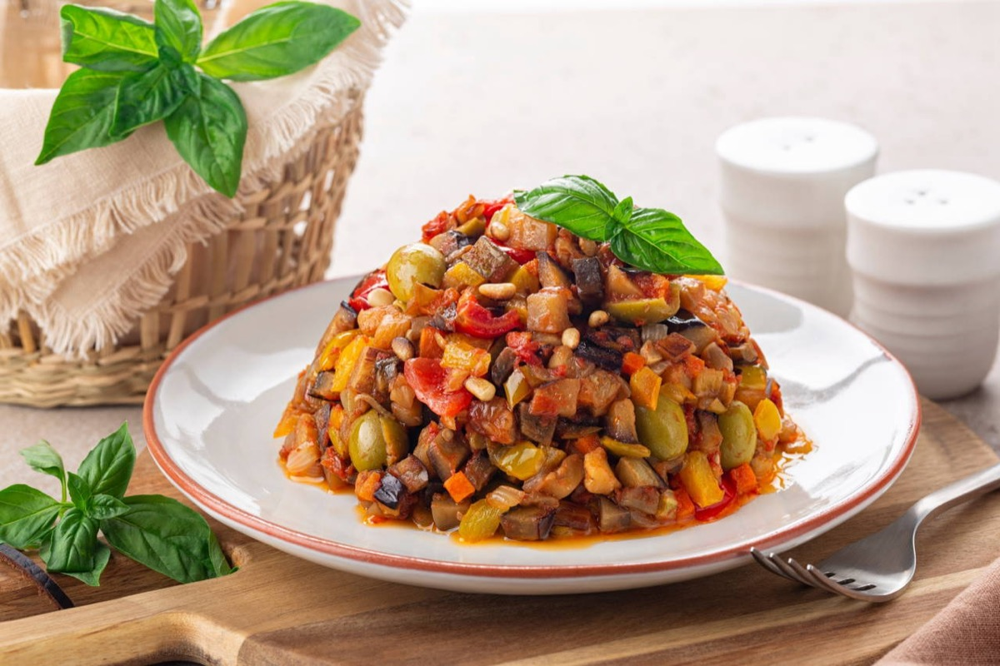
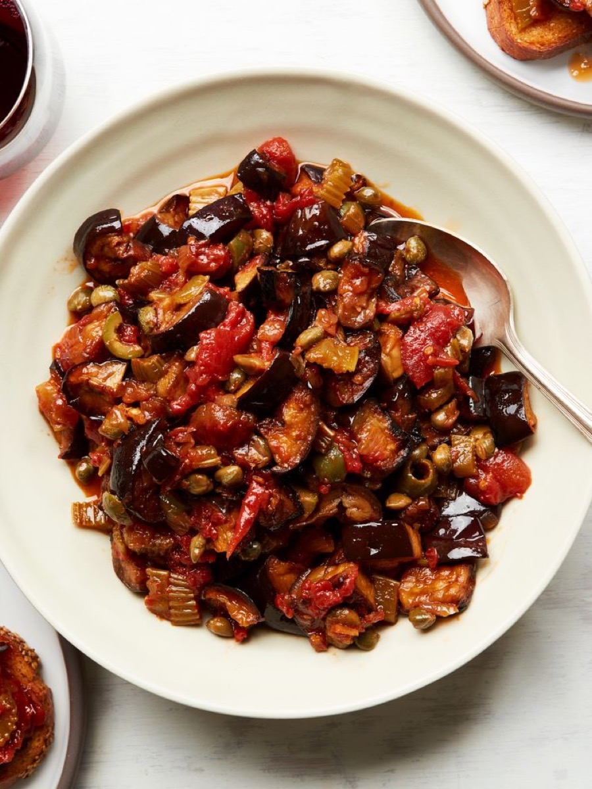

# Sicilian Caponata

<table>
  <tr>
    <td>
      
    </td>
    <td>
      
    </td>
  </tr>
  <tr>
    <td>
      
    </td>
    <td>
      
    </td>
  </tr>
</table>

## Background

Caponata is a Sicilian sweet-and-sour eggplant dish. Vinegar and sugar provide the characteristic agrodolce
balance, while celery, tomato, olives, and capers add contrast.

## Ingredients

- 2 eggplants, diced
- 5 tablespoons olive oil
- 1 onion and 2 celery stalks, diced
- 400 g canned tomatoes
- 80 g green olives
- 2 tablespoons capers
- 3 tablespoons red wine vinegar
- 1 tablespoon sugar
- Salt

## How to cook

1. Brown eggplant in batches in oil; remove. Soften onion and celery.
2. Add tomatoes, olives, and capers; simmer for 10 minutes. Return eggplant.
3. Stir in vinegar and sugar and simmer for 10 minutes. Cool to room temperature.
