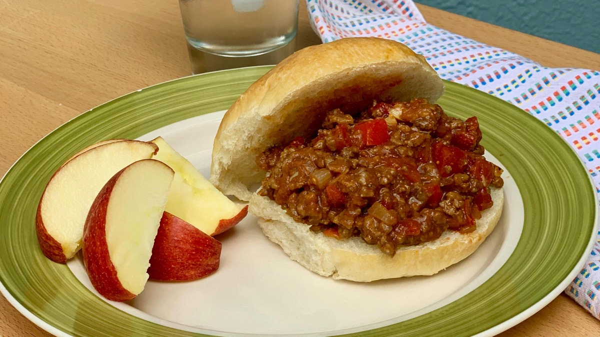
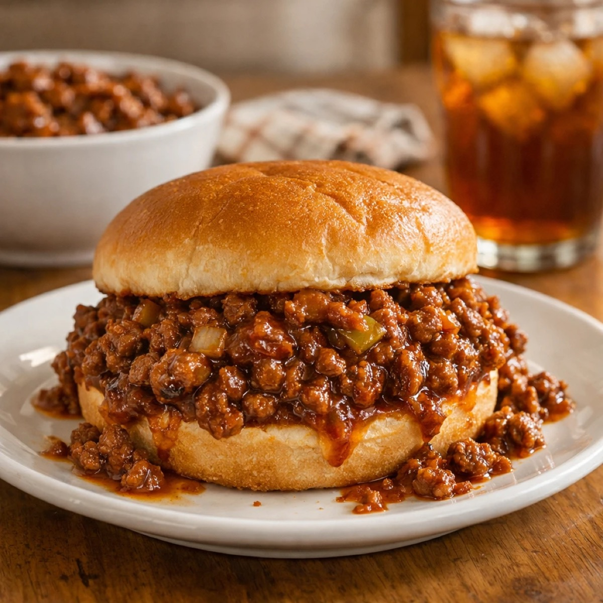
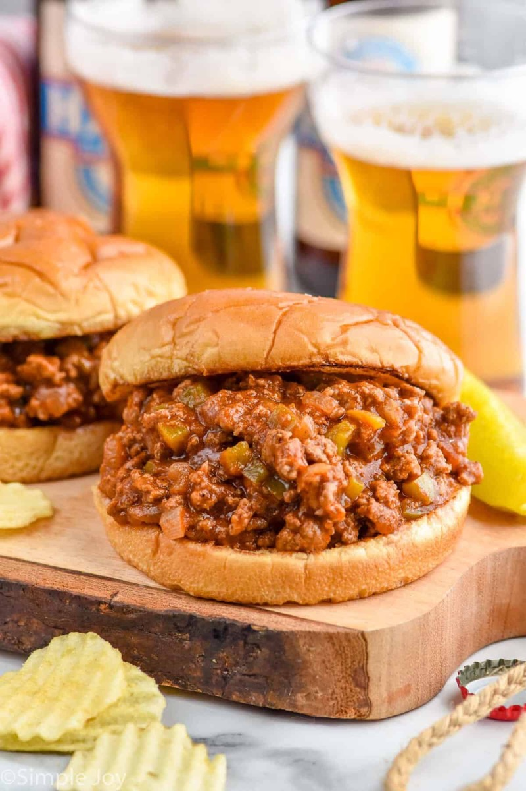
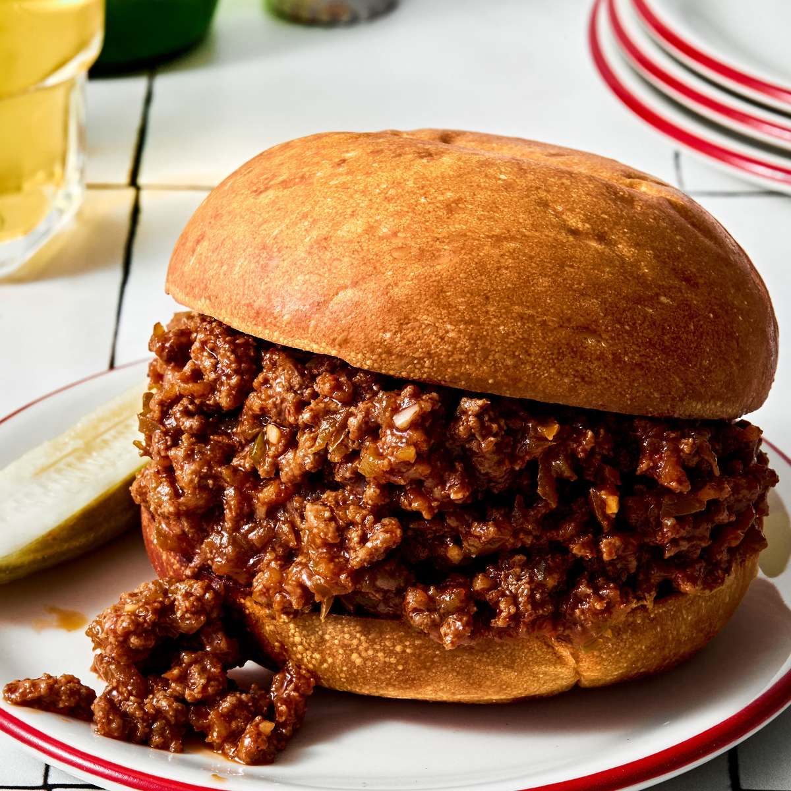

# Sloppy Joes

<table>
  <tr>
    <td>
      
    </td>
    <td>
      
    </td>
  </tr>
  <tr>
    <td>
      
    </td>
    <td>
      
    </td>
  </tr>
</table>

## Background

Sloppy Joes are an American loose-meat sandwich associated with lunch counters and family meals since the early
twentieth century. Tomato-based sweet-and-tangy sauce distinguishes them from plain ground-beef sandwiches.

## Ingredients

- 600 g ground beef
- 1 small onion and 1 bell pepper, diced
- 2 garlic cloves, minced
- 240 ml tomato sauce
- 2 tablespoons ketchup
- 1 tablespoon Worcestershire sauce
- 1 teaspoon brown sugar
- 4 hamburger buns
- Salt and pepper

## How to cook

1. Brown beef with onion and pepper; drain excess fat. Add garlic for 30 seconds.
2. Add tomato sauce, ketchup, Worcestershire, sugar, salt, and pepper. Simmer for 10 minutes.
3. Spoon onto toasted buns and serve.
