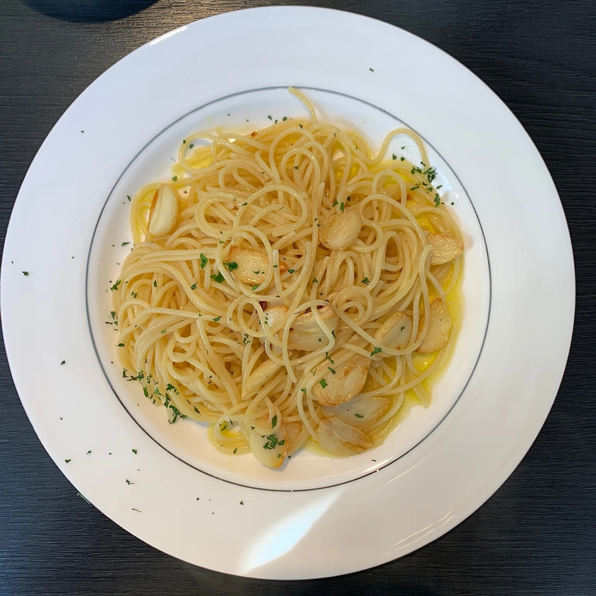
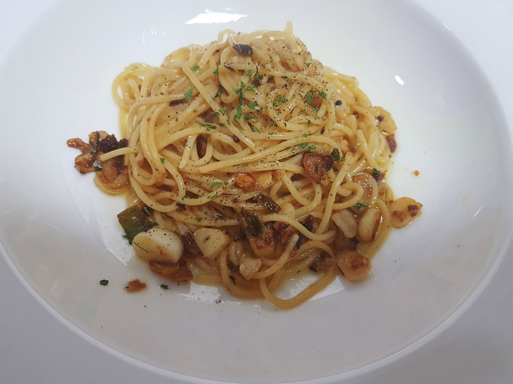
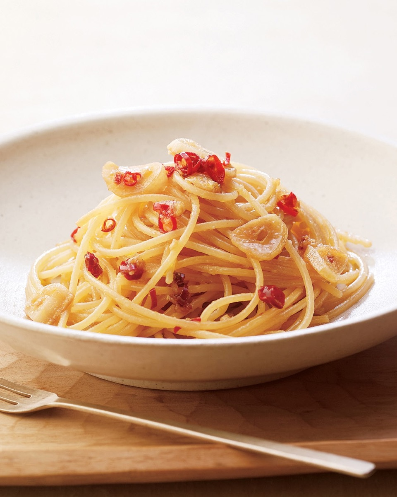
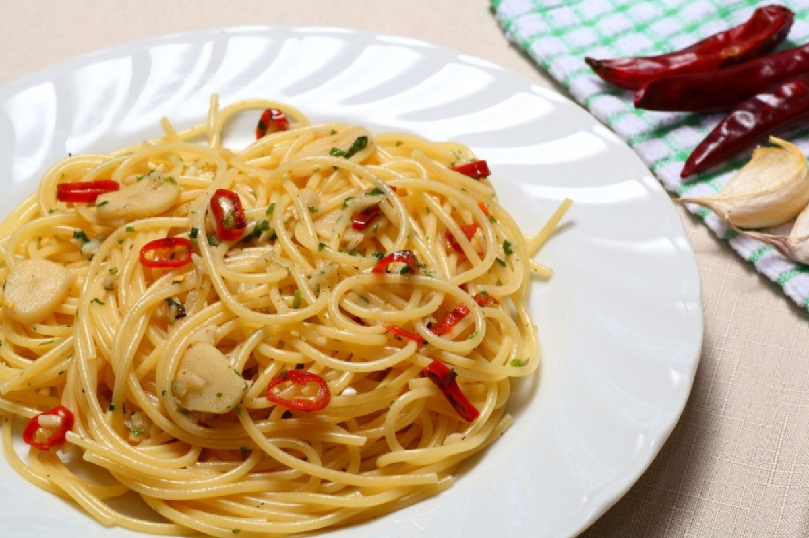

# Spaghetti Aglio e Olio

<table>
  <tr>
    <td>
      
    </td>
    <td>
      
    </td>
  </tr>
  <tr>
    <td>
      
    </td>
    <td>
      
    </td>
  </tr>
</table>

## Background

This pantry pasta from Naples relies on garlic, olive oil, and chile. Starchy pasta water emulsifies the oil
into a light sauce, making careful timing more important than a long ingredient list.

## Ingredients

- 400 g spaghetti
- 80 ml extra-virgin olive oil
- 6 garlic cloves, thinly sliced
- 1/2 teaspoon chile flakes
- 3 tablespoons chopped parsley
- Salt

## How to cook

1. Boil spaghetti in salted water until just al dente; reserve 300 ml cooking water.
2. Gently cook garlic and chile in oil until pale gold. Do not let the garlic darken.
3. Add drained pasta and 120 ml cooking water. Toss vigorously until glossy, adding more water as needed.
4. Fold in parsley and serve immediately.
