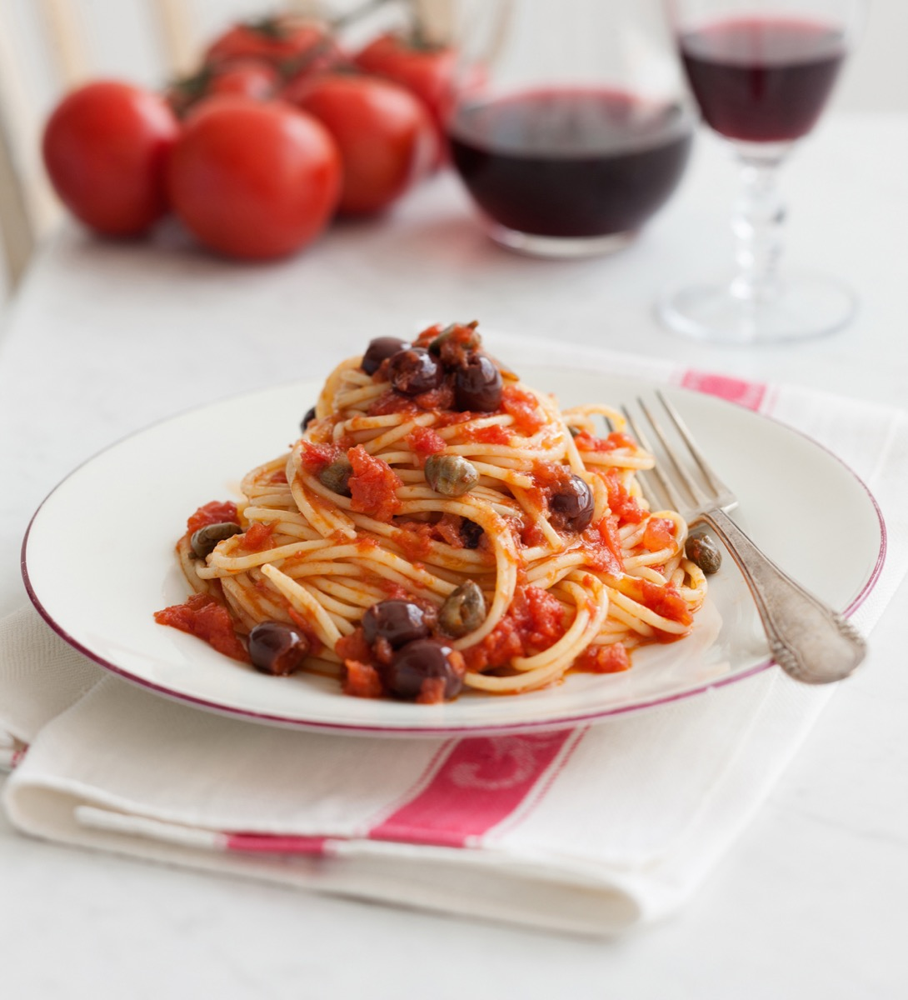
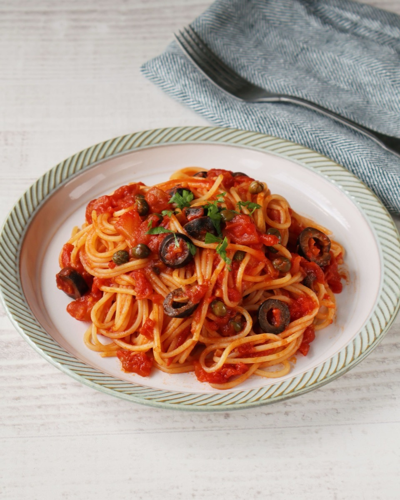
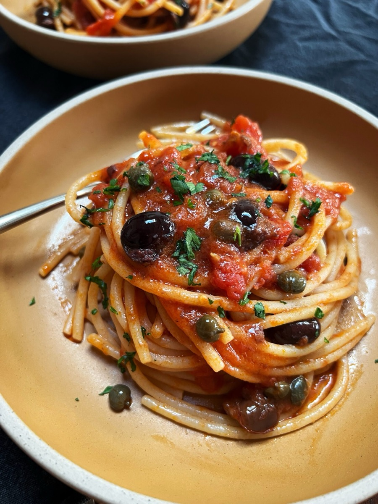
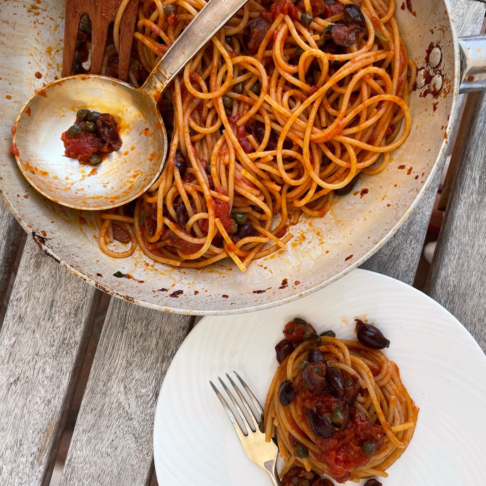

# Spaghetti alla Puttanesca

<table>
  <tr>
    <td>
      
    </td>
    <td>
      
    </td>
  </tr>
  <tr>
    <td>
      
    </td>
    <td>
      
    </td>
  </tr>
</table>

## Background

Puttanesca is a bold southern Italian sauce whose modern name and exact origin are debated. Tomatoes, olives,
capers, garlic, and anchovies create a quick sauce from preserved pantry ingredients.

## Ingredients

- 400 g spaghetti
- 3 tablespoons olive oil
- 3 garlic cloves, sliced
- 4 anchovy fillets
- 400 g canned tomatoes
- 100 g black olives, pitted
- 2 tablespoons capers
- Chile flakes and parsley

## How to cook

1. Warm oil, garlic, chile, and anchovies until the anchovies dissolve.
2. Add tomatoes, olives, and capers; simmer for 15 minutes.
3. Toss with al dente spaghetti and a little cooking water. Finish with parsley.
