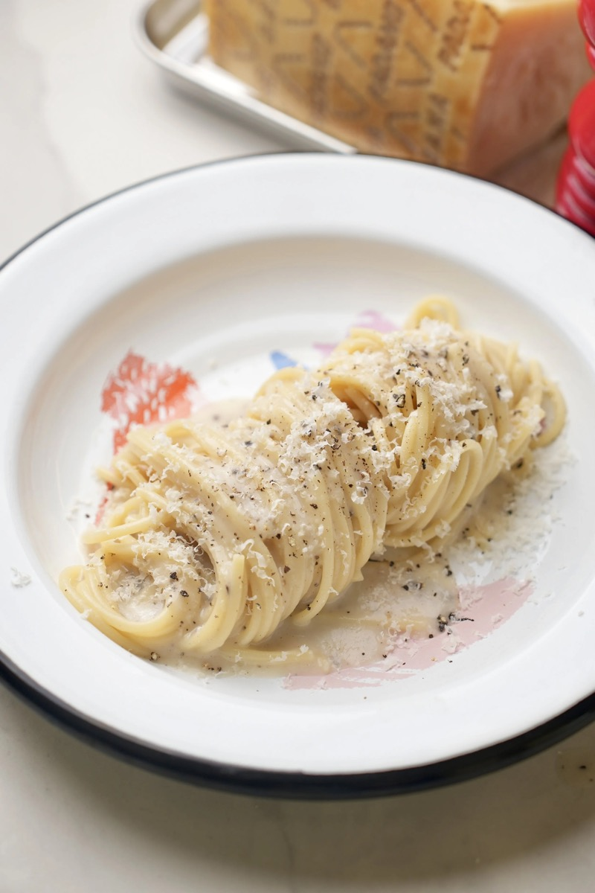
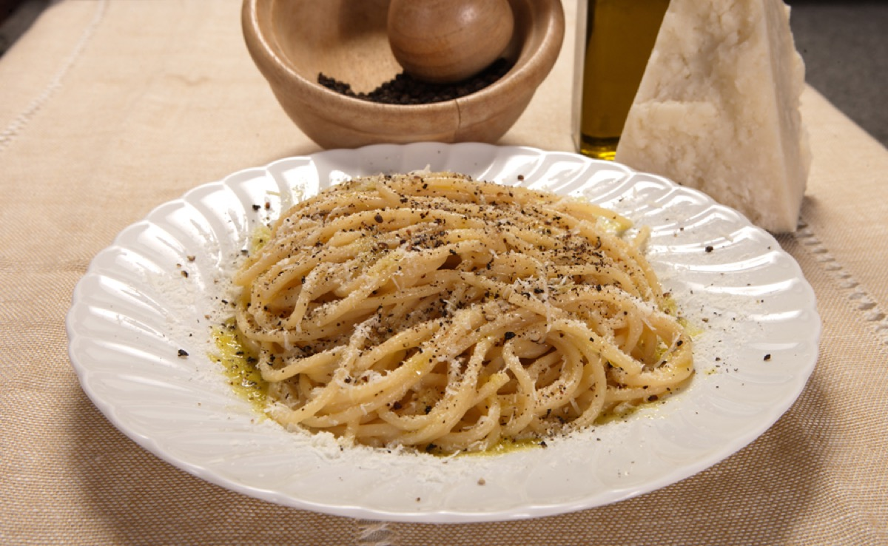
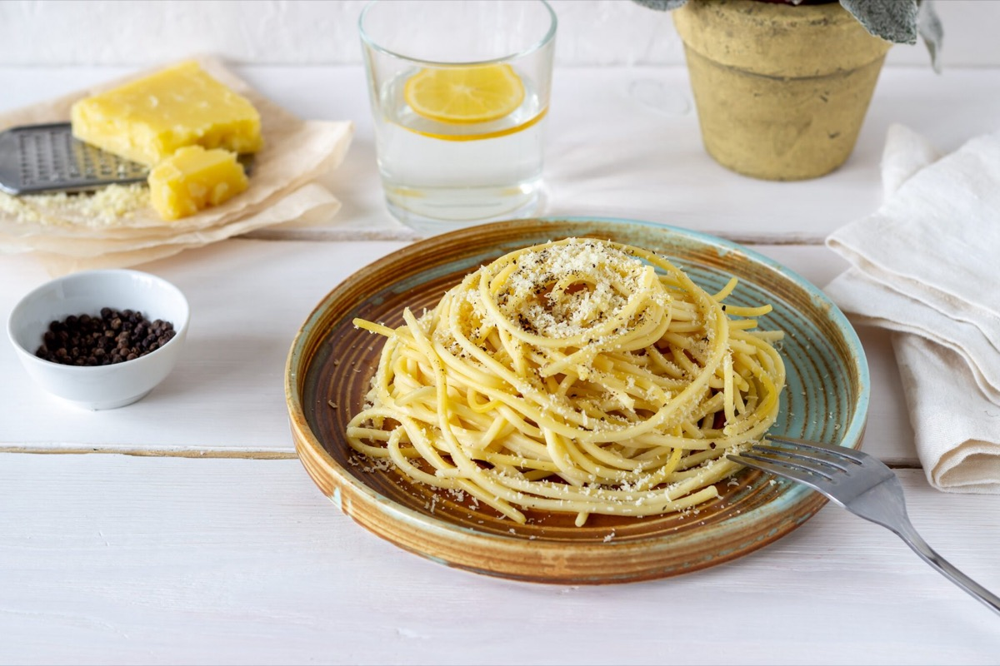
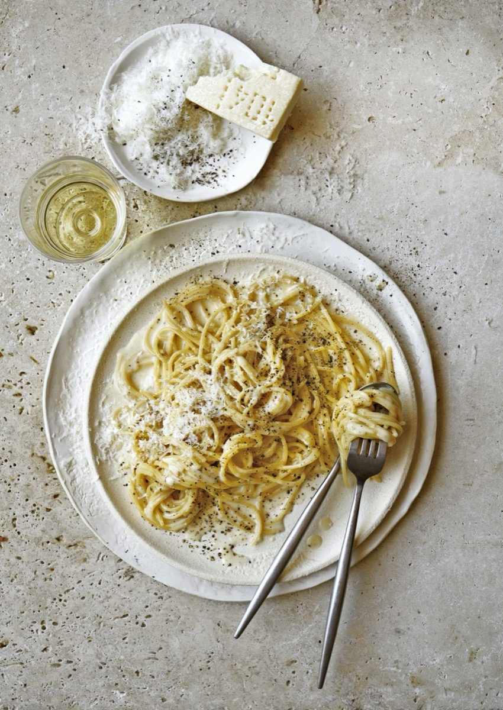

# Spaghetti Cacio e Pepe

<table>
  <tr>
    <td>
      
    </td>
    <td>
      
    </td>
  </tr>
  <tr>
    <td>
      
    </td>
    <td>
      
    </td>
  </tr>
</table>

## Background

Cacio e pepe is a Roman pasta built from Pecorino Romano and black pepper. The creamy texture comes from
emulsifying cheese with starchy water, not from cream.

## Ingredients

- 400 g spaghetti
- 160 g Pecorino Romano, very finely grated
- 2 teaspoons coarsely ground black pepper
- Salt

## How to cook

1. Boil pasta in lightly salted water. Toast pepper in a wide skillet, then add a ladle of cooking water.
2. Mix Pecorino with enough lukewarm cooking water to form a thick, smooth paste.
3. Transfer very al dente pasta to the skillet and toss. Remove from heat, cool for 30 seconds, then mix in
   cheese paste, adding water until creamy.
