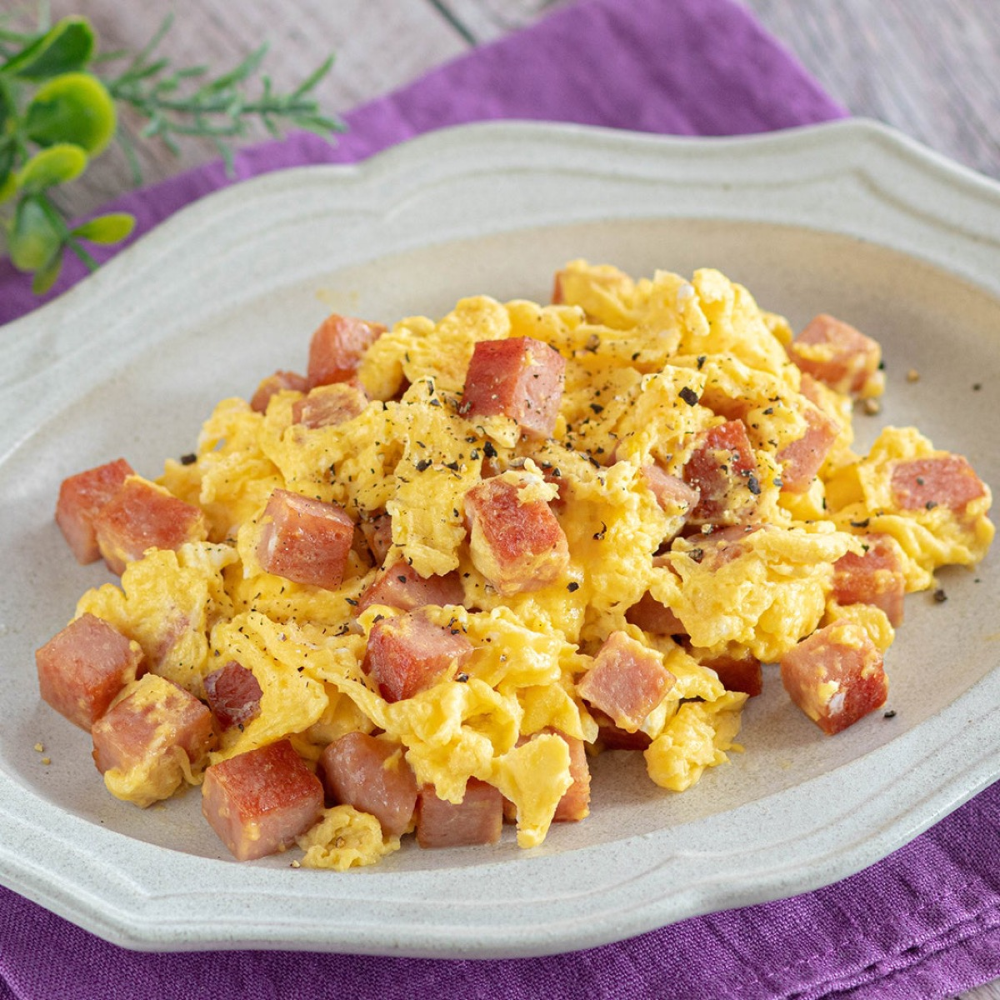
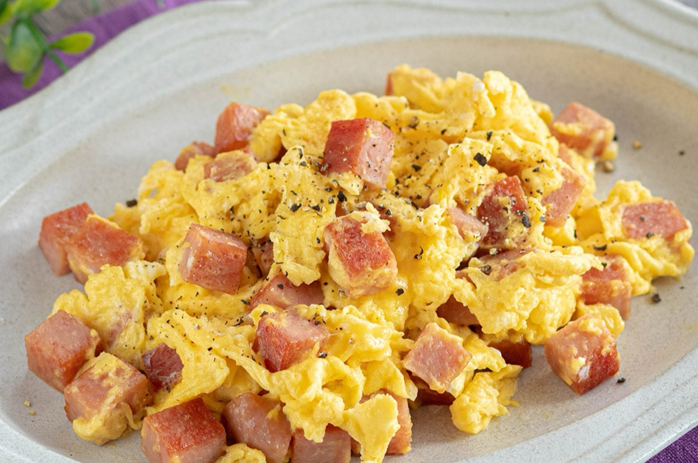
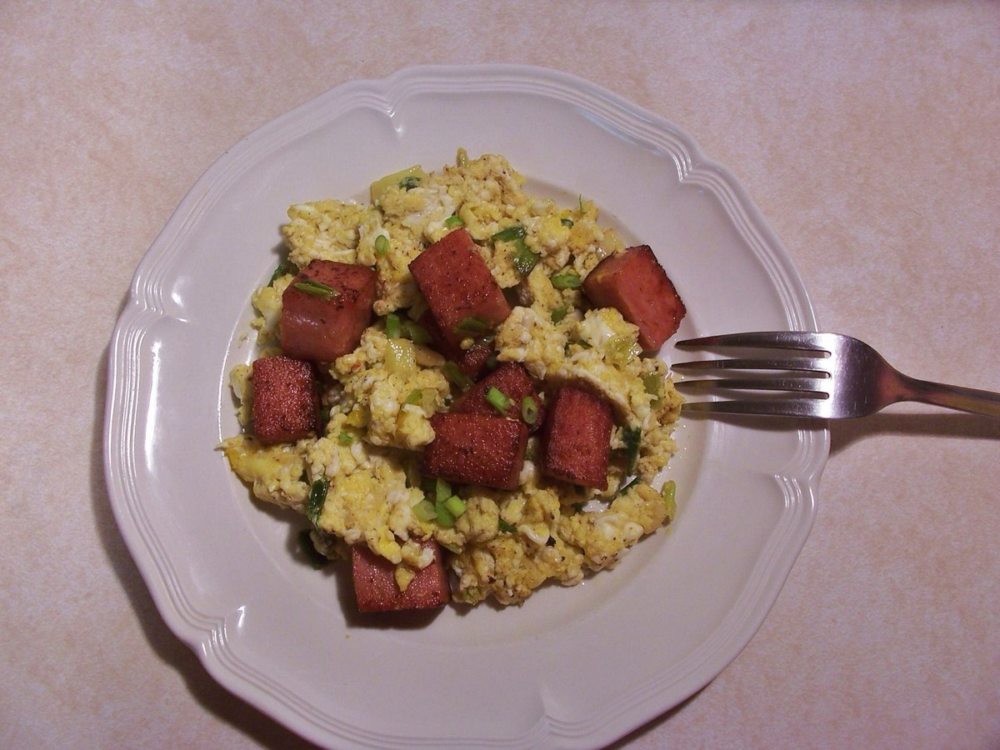
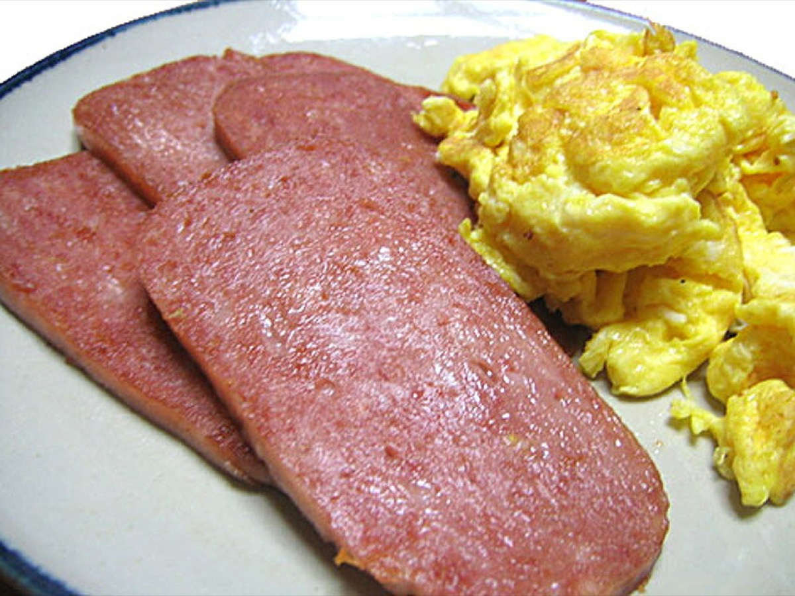

# Spam and Eggs

<table>
  <tr>
    <td>
      
    </td>
    <td>
      
    </td>
  </tr>
  <tr>
    <td>
      
    </td>
    <td>
      
    </td>
  </tr>
</table>

## Background

Spam and eggs is a quick skillet meal built around canned luncheon meat and eggs. Spam was introduced in the
United States in 1937 and became especially familiar in Hawaii and across parts of Asia after World War II.

## Ingredients

- 340 g Spam, cut into small cubes
- 8 large eggs
- 1 tablespoon olive oil
- Black pepper, to taste

## How to cook

1. Crack the eggs into a bowl and beat just until the yolks and whites are mixed.
2. Stir the cubed Spam into the eggs so it is evenly distributed.
3. Warm the olive oil in a wide skillet over medium heat.
4. Add the Spam and egg mixture. Fry lightly, stirring and folding, until the eggs are softly set and the Spam
   is hot, about 3 to 5 minutes.
5. Season with black pepper and serve immediately.
