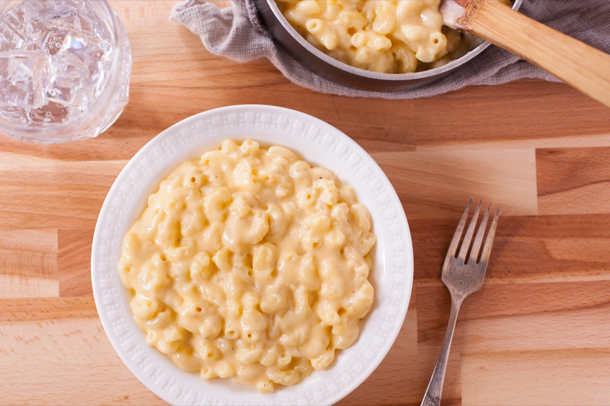
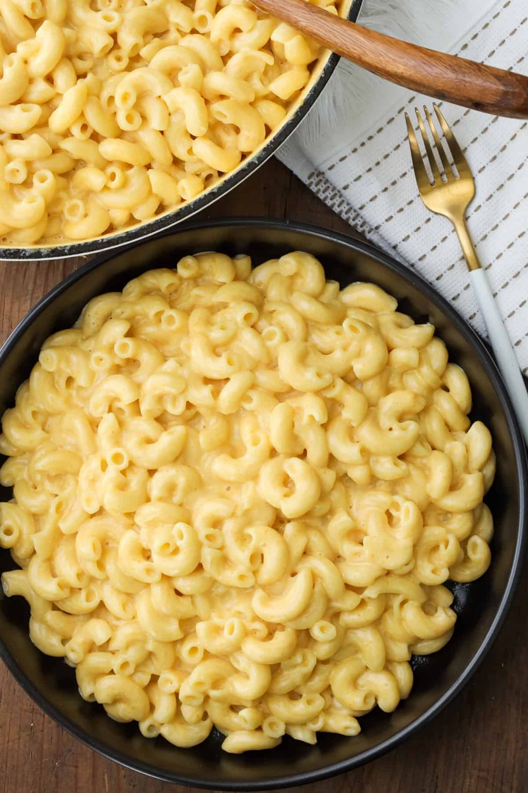
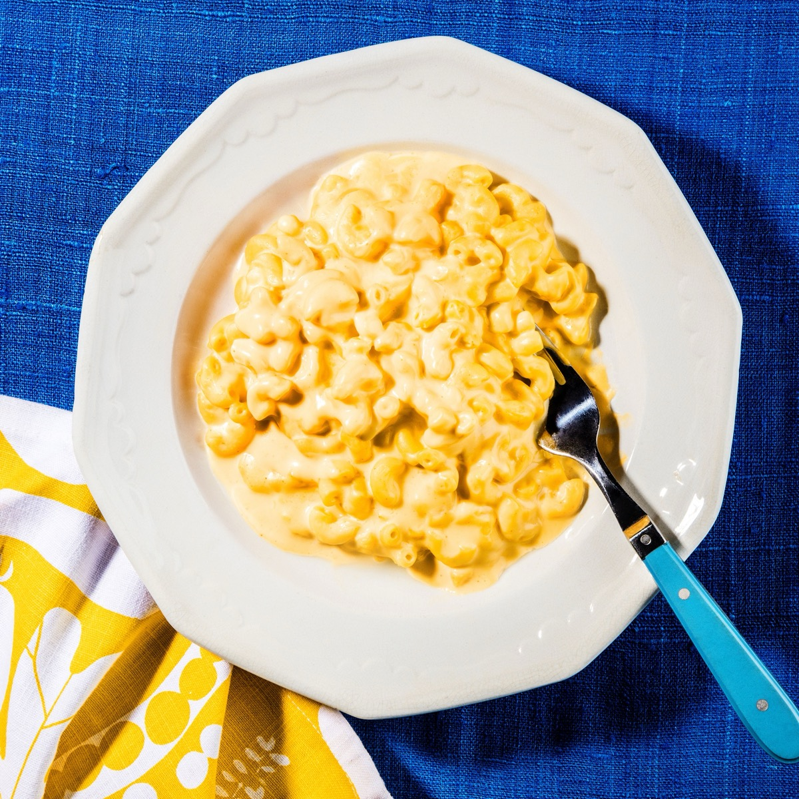
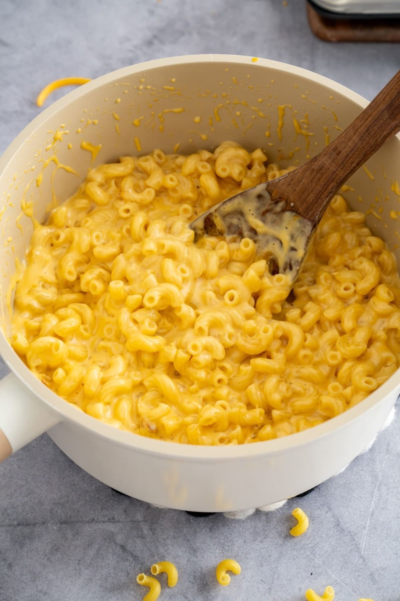

# Stovetop Macaroni and Cheese

<table>
  <tr>
    <td>
      
    </td>
    <td>
      
    </td>
  </tr>
  <tr>
    <td>
      
    </td>
    <td>
      
    </td>
  </tr>
</table>

## Background

Macaroni and cheese has European precedents but became deeply rooted in American cooking. The stovetop version
is a quick lunch that uses a simple flour-thickened cheese sauce.

## Ingredients

- 350 g elbow macaroni
- 40 g butter
- 30 g flour
- 600 ml milk
- 250 g sharp cheddar, grated
- 1 teaspoon mustard
- Salt and pepper

## How to cook

1. Boil macaroni until al dente and drain.
2. Melt butter, whisk in flour for 1 minute, then gradually whisk in milk. Simmer until thickened.
3. Remove from heat and stir in cheese and mustard. Season and fold in macaroni.
