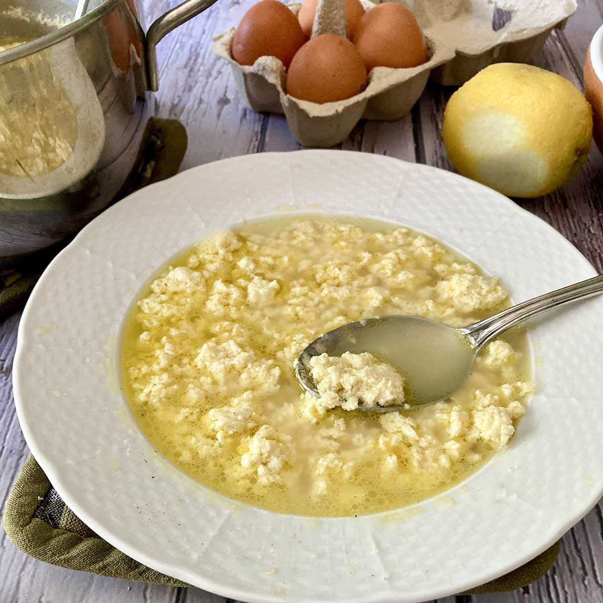
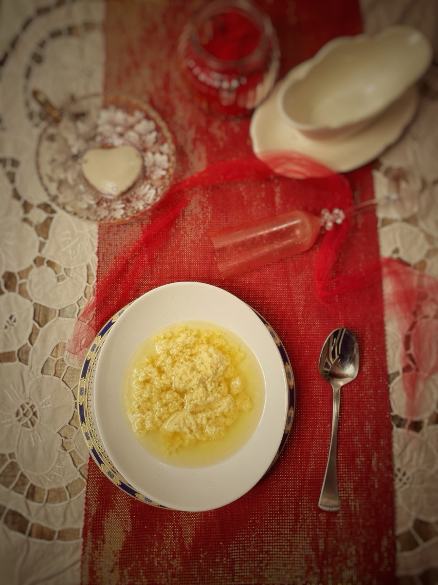
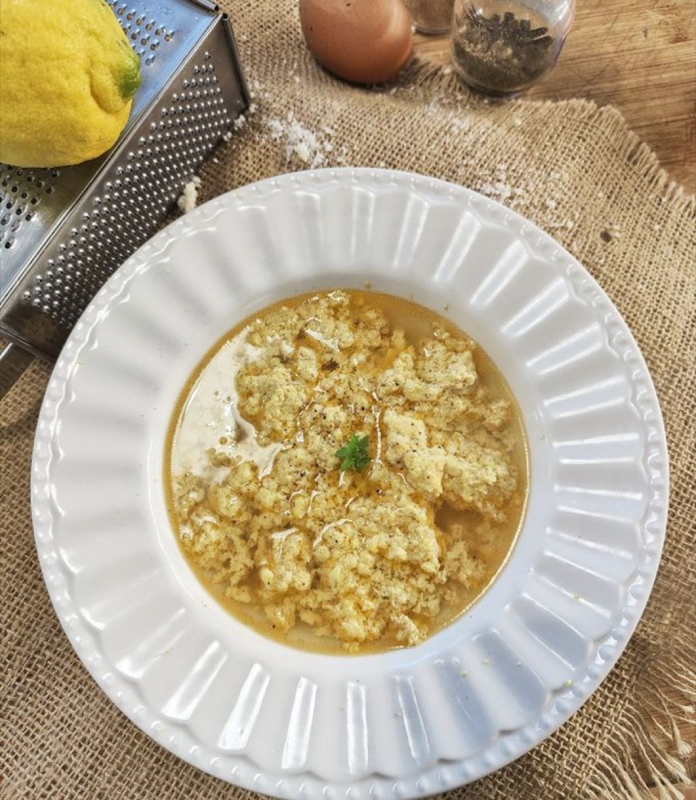
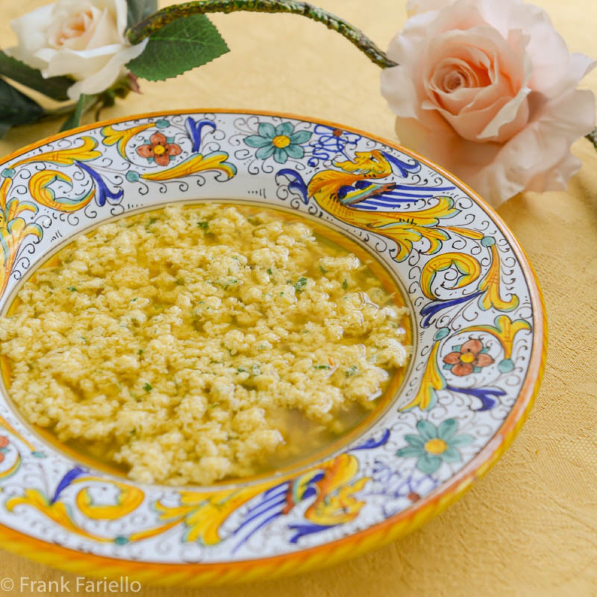

# Stracciatella alla Romana

<table>
  <tr>
    <td>
      
    </td>
    <td>
      
    </td>
  </tr>
  <tr>
    <td>
      
    </td>
    <td>
      
    </td>
  </tr>
</table>

## Background

Stracciatella is a Roman soup whose name refers to the little "rags" formed when egg and cheese meet hot broth.
It is fast, restorative, and made from basic ingredients.

## Ingredients

- 1.5 l good chicken broth
- 4 eggs
- 80 g Parmigiano-Reggiano
- 2 tablespoons fine breadcrumbs, optional
- Nutmeg, salt, and pepper
- Chopped parsley

## How to cook

1. Bring broth to a gentle simmer. Whisk eggs, cheese, breadcrumbs, nutmeg, and pepper.
2. Pour the mixture into broth while stirring slowly. Simmer for 1 to 2 minutes until soft strands form.
3. Adjust salt and serve with parsley.
