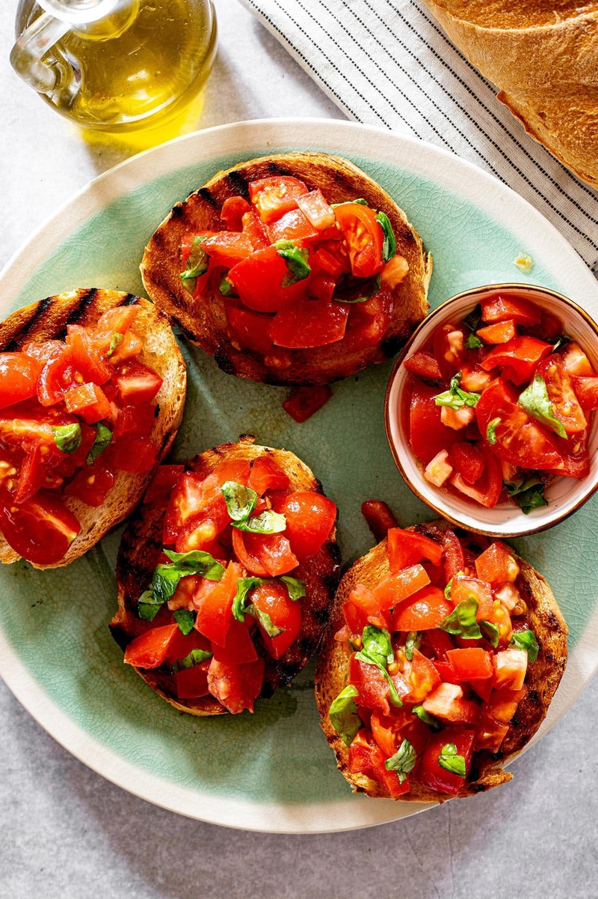
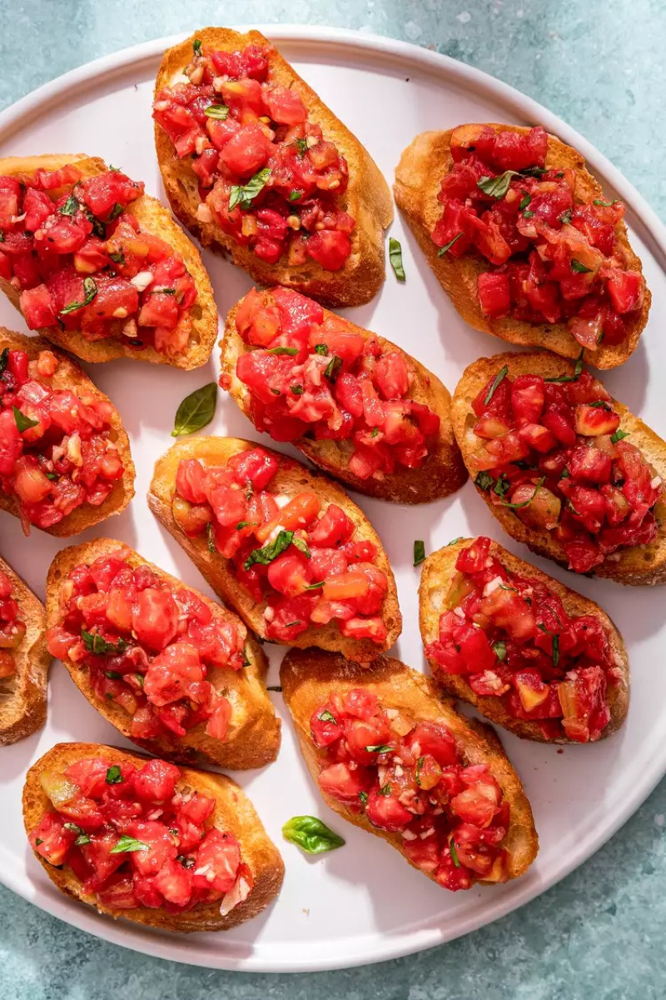
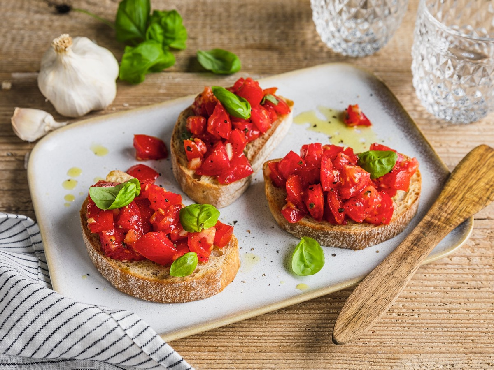
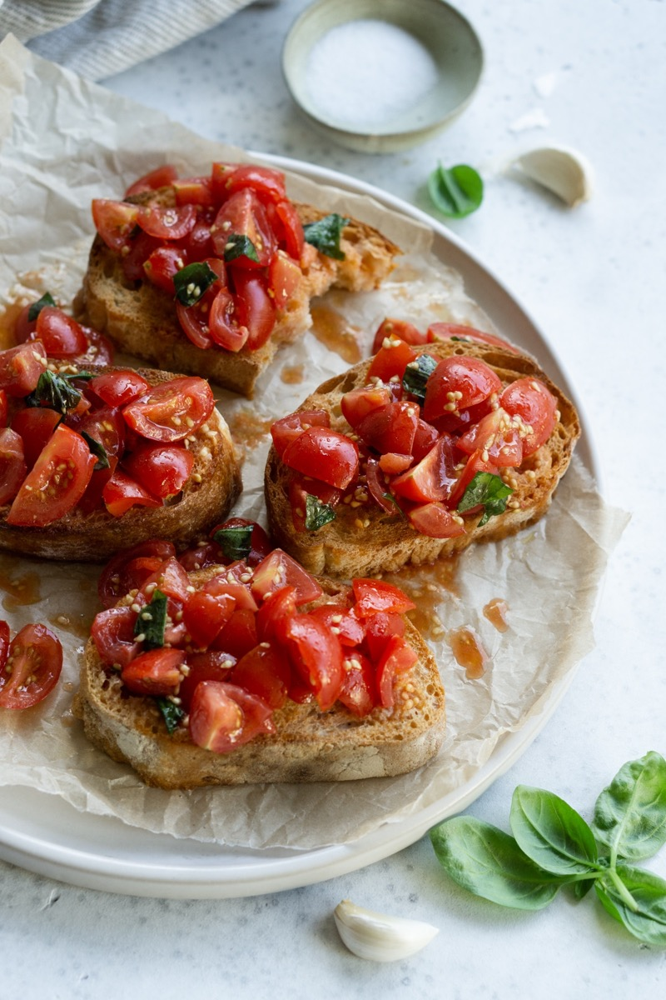

# Tomato Bruschetta

<table>
  <tr>
    <td>
      
    </td>
    <td>
      
    </td>
  </tr>
  <tr>
    <td>
      
    </td>
    <td>
      
    </td>
  </tr>
</table>

## Background

Bruschetta comes from central Italy and begins with grilled bread rubbed with garlic and dressed with olive
oil. Fresh tomato and basil are a popular topping, but the toasted bread is the defining element.

## Ingredients

- 8 thick slices country bread
- 500 g ripe tomatoes, diced
- 1 garlic clove, halved
- 3 tablespoons extra-virgin olive oil
- 12 basil leaves, torn
- Salt and pepper

## How to cook

1. Mix tomatoes with oil, basil, salt, and pepper; rest for 10 minutes.
2. Grill or toast bread until crisp at the edges. Rub one side lightly with garlic.
3. Spoon tomatoes over bread immediately before serving.
