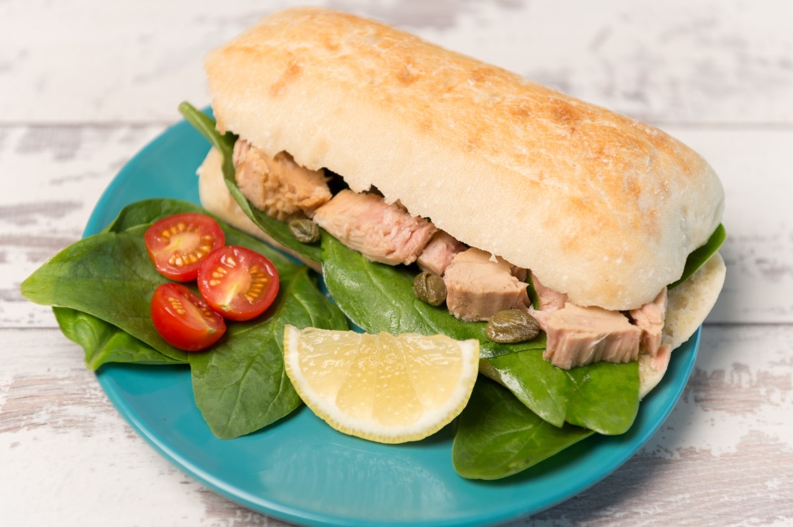
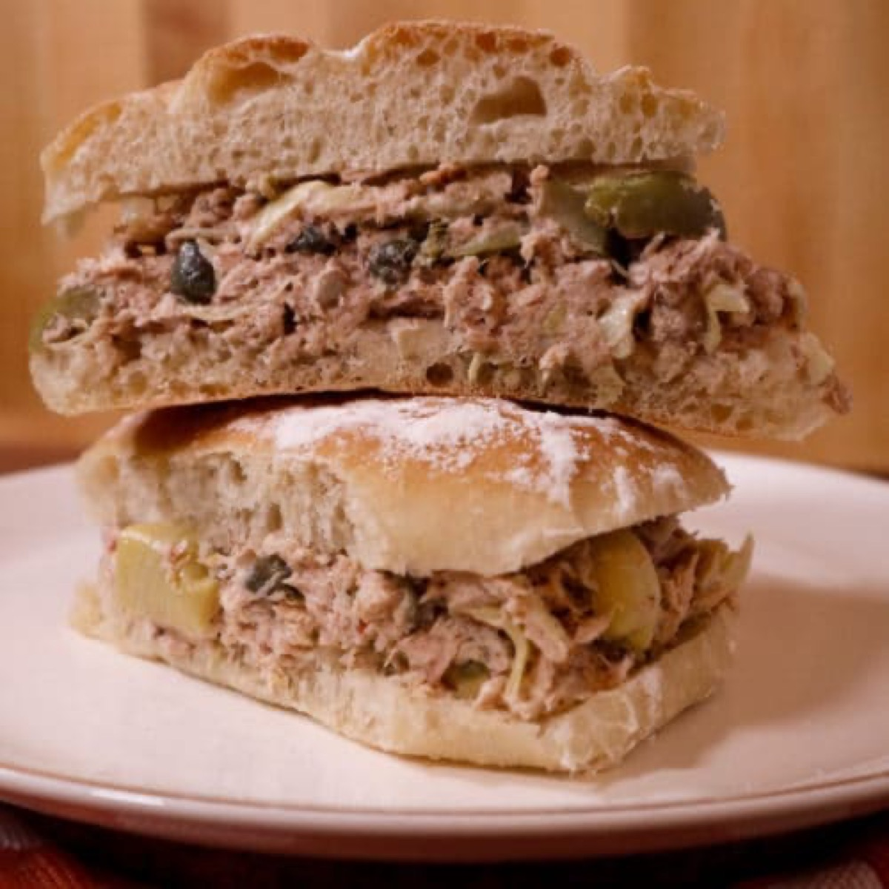
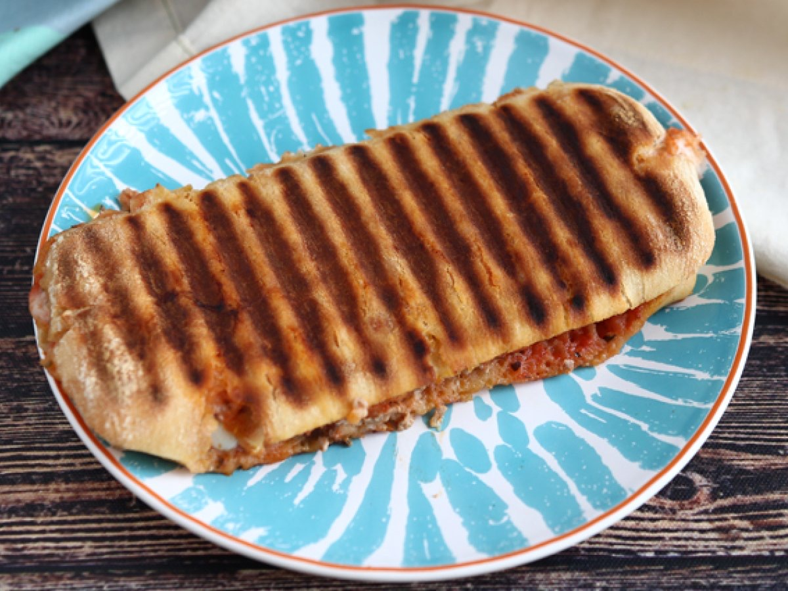

# Tuna and Caper Panino

<table>
  <tr>
    <td>
      
    </td>
    <td>
      
    </td>
  </tr>
  <tr>
    <td>
      
    </td>
    <td>
      
    </td>
  </tr>
</table>

## Background

Tuna preserved in olive oil is a common Italian pantry ingredient. Capers and lemon sharpen its rich flavor in
this simple sandwich, which is equally good pressed or served at room temperature.

## Ingredients

- 4 ciabatta rolls
- 300 g tuna in olive oil, drained
- 2 tablespoons capers, rinsed and chopped
- 2 tablespoons mayonnaise or extra-virgin olive oil
- 1 tablespoon lemon juice
- 1 tomato, sliced
- Lettuce, salt, and pepper

## How to cook

1. Flake tuna with capers, mayonnaise or oil, lemon, and pepper.
2. Fill the split rolls with lettuce, tomato, and tuna mixture. Season the tomato lightly with salt.
3. Serve immediately, or press briefly without lettuce for a warm sandwich.
