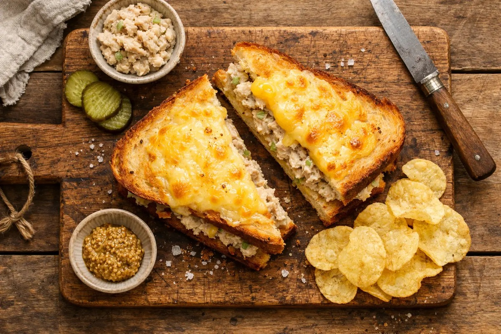
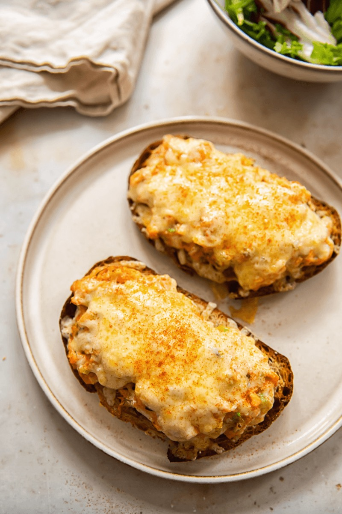
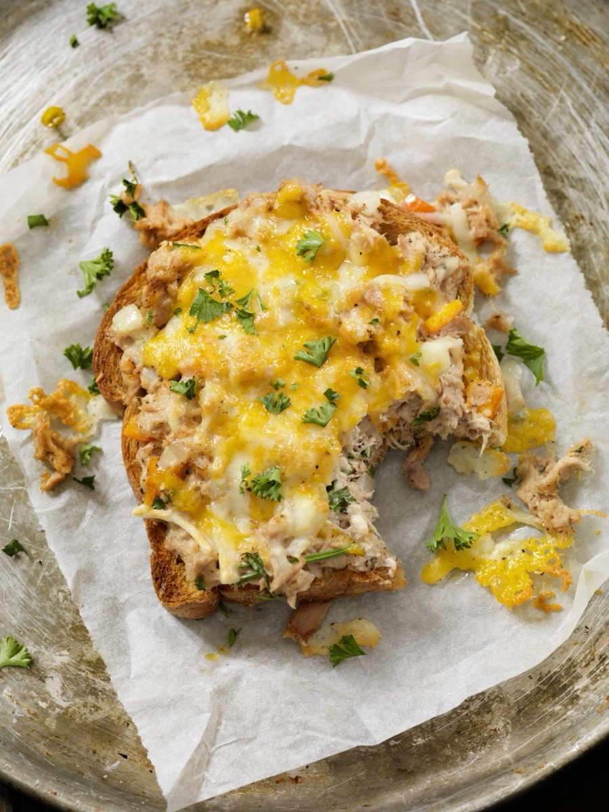
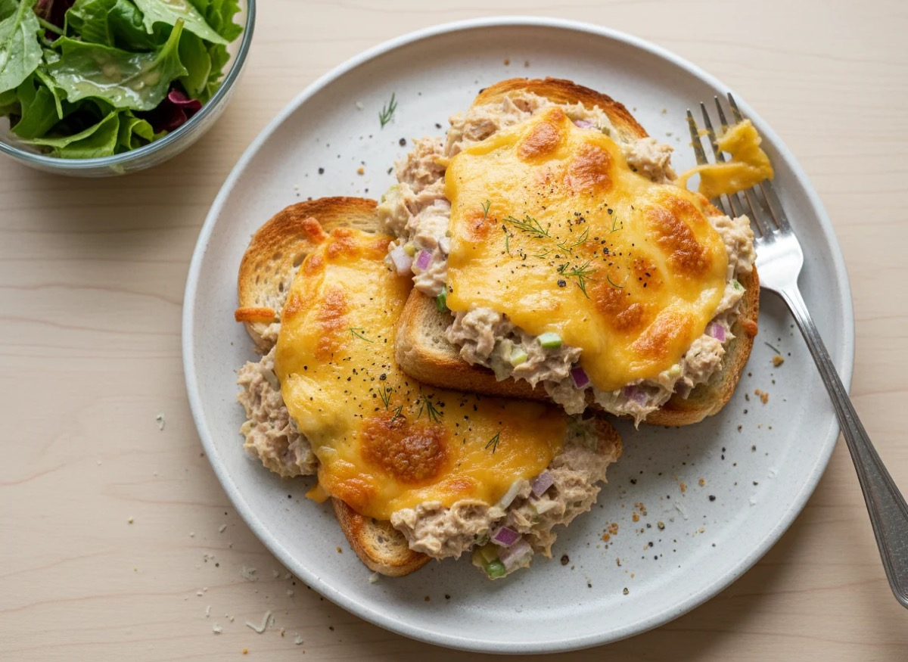

# Tuna Melt

<table>
  <tr>
    <td>
      
    </td>
    <td>
      
    </td>
  </tr>
  <tr>
    <td>
      
    </td>
    <td>
      
    </td>
  </tr>
</table>

## Background

The tuna melt is an American diner sandwich that combines tuna salad with melted cheese. Open-faced and closed
versions are both common; this skillet method gives a crisp exterior.

## Ingredients

- 2 cans tuna, drained
- 60 g mayonnaise
- 1 celery stalk, diced
- 1 tablespoon pickle relish
- 1 teaspoon mustard
- 8 slices bread
- 8 slices cheddar
- 3 tablespoons softened butter

## How to cook

1. Mix tuna, mayonnaise, celery, relish, and mustard.
2. Fill bread with tuna and cheese; butter the outsides.
3. Cook over medium-low heat for 3 to 4 minutes per side until browned and melted.
