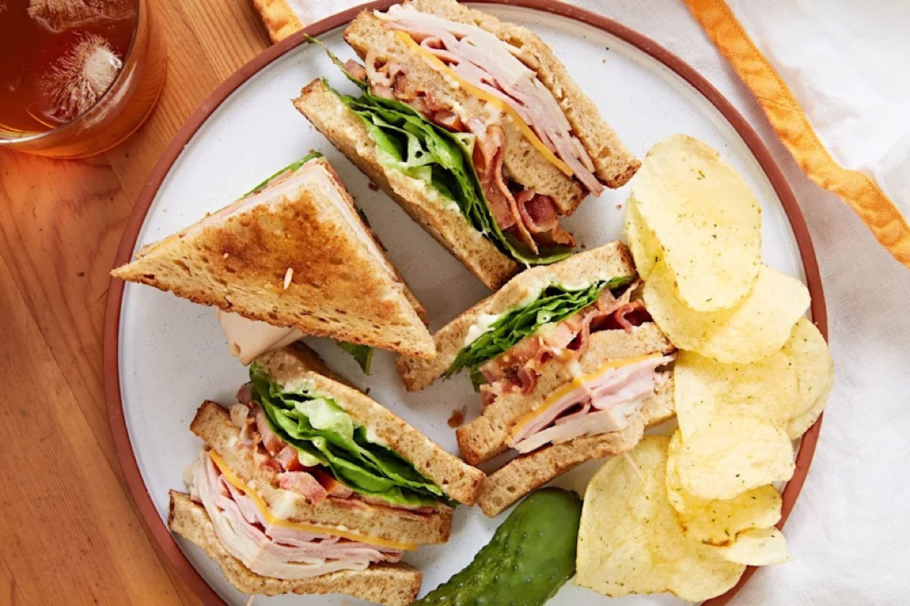
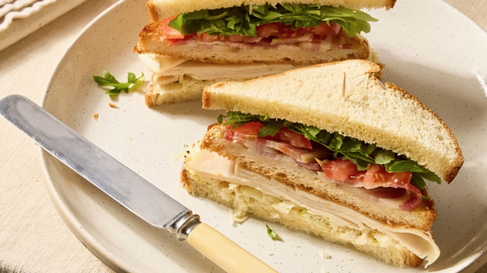
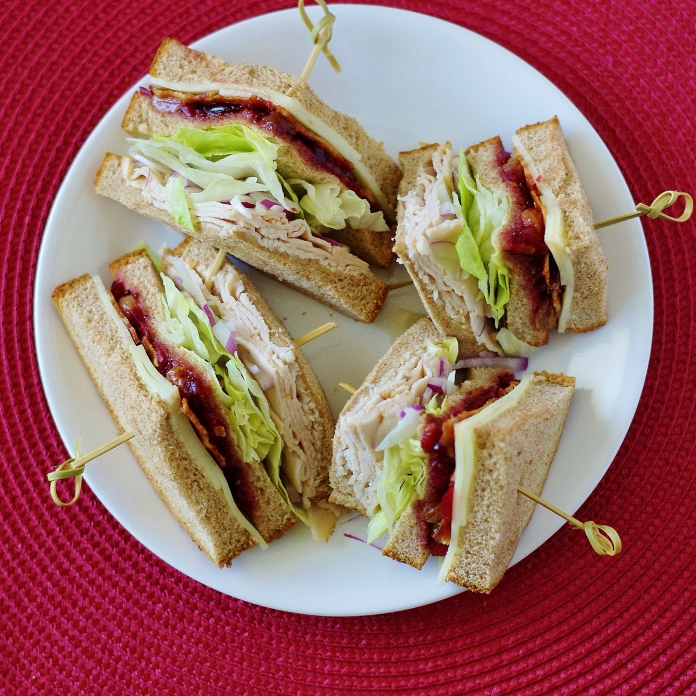
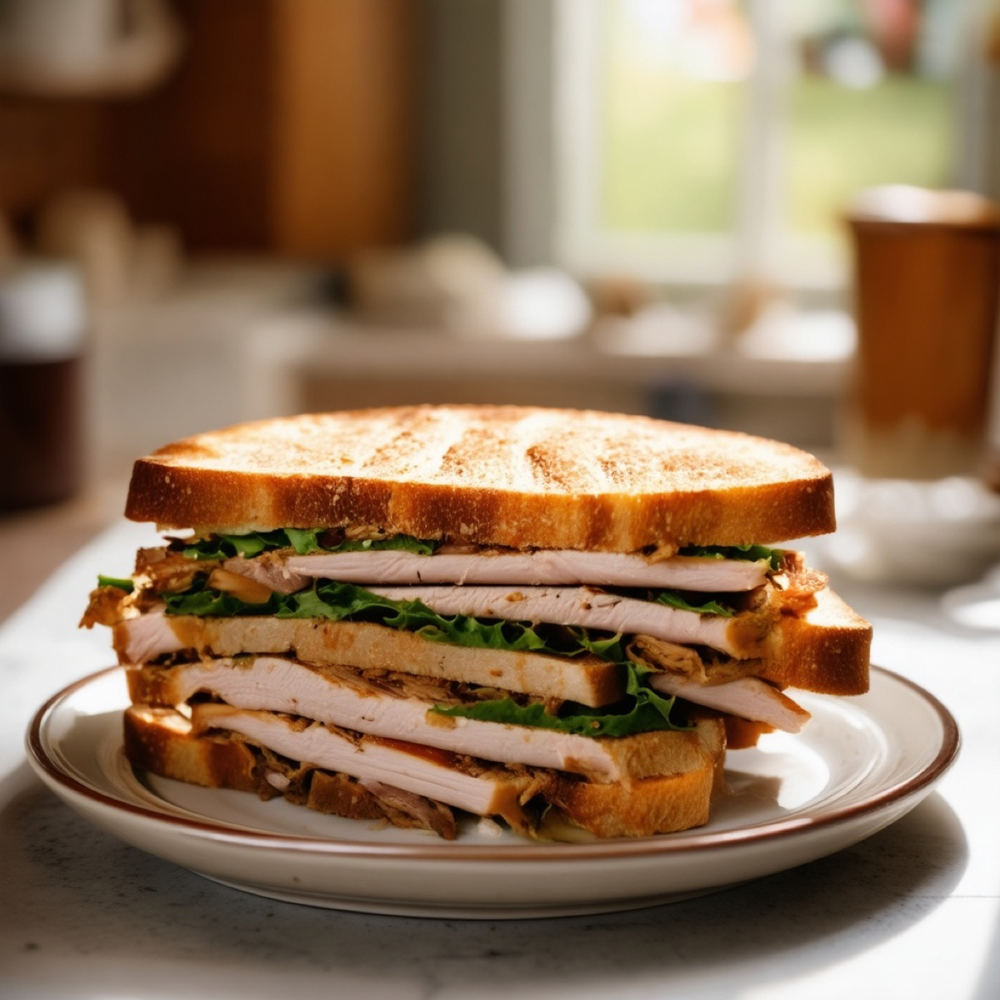

# Turkey Club Sandwich

<table>
  <tr>
    <td>
      
    </td>
    <td>
      
    </td>
  </tr>
  <tr>
    <td>
      
    </td>
    <td>
      
    </td>
  </tr>
</table>

## Background

The American club sandwich emerged around the turn of the twentieth century, likely in clubs or hotels. Its
stacked toast, poultry, bacon, lettuce, tomato, and mayonnaise became a diner classic.

## Ingredients

- 12 slices sandwich bread
- 350 g sliced cooked turkey
- 8 slices cooked bacon
- 1 tomato, sliced
- 8 lettuce leaves
- 4 tablespoons mayonnaise
- Salt and pepper

## How to cook

1. Toast the bread and spread with mayonnaise.
2. For each sandwich, layer turkey and lettuce on one slice and bacon and tomato on another.
3. Stack the layers, top with a third toast, secure with picks, and cut into quarters.
