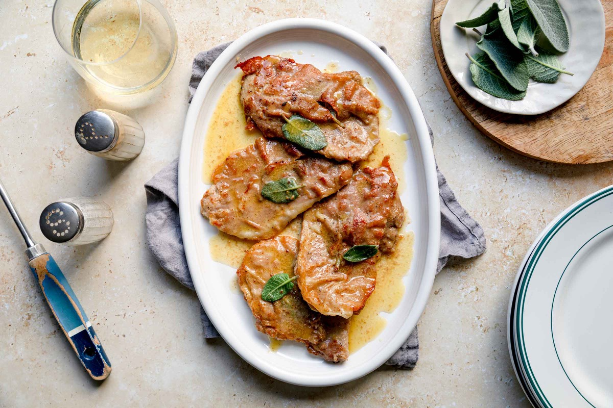
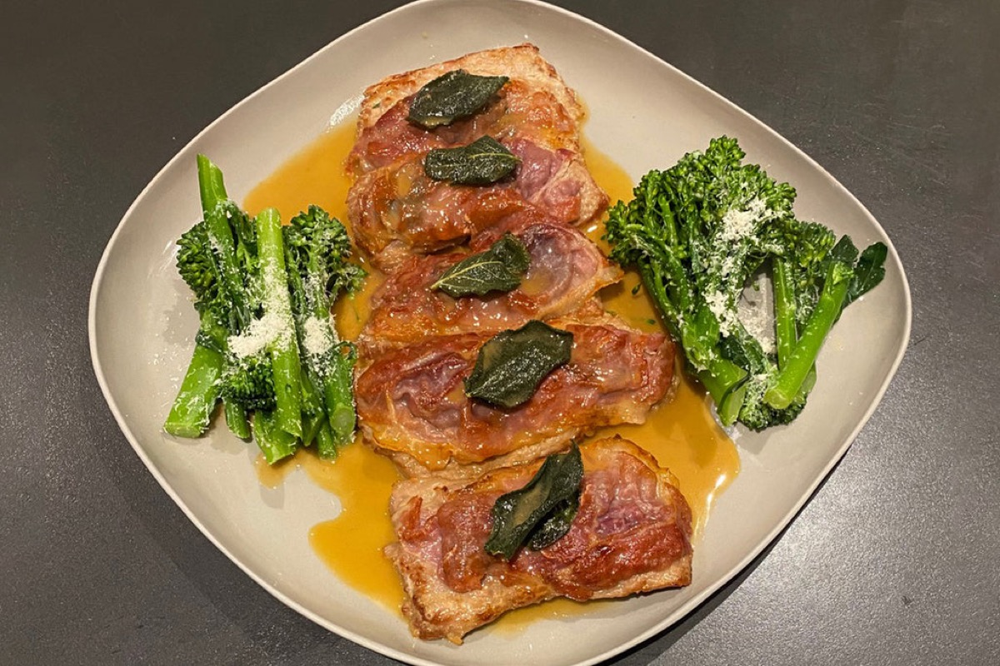
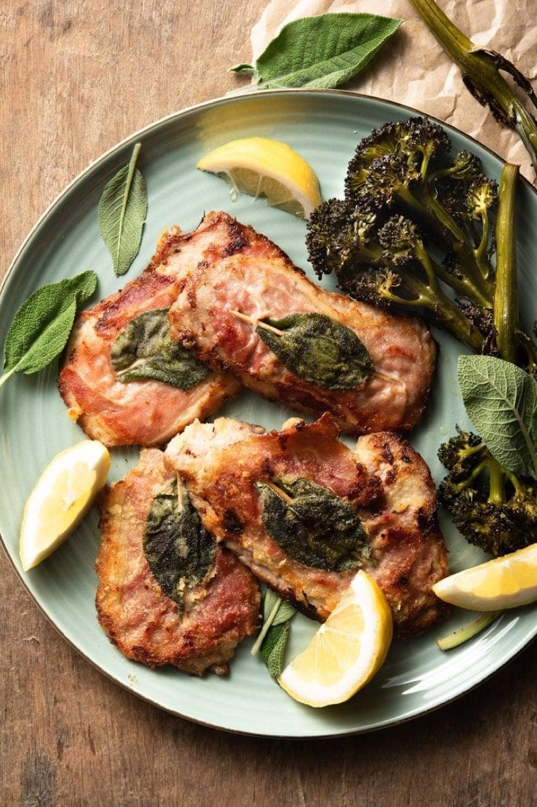
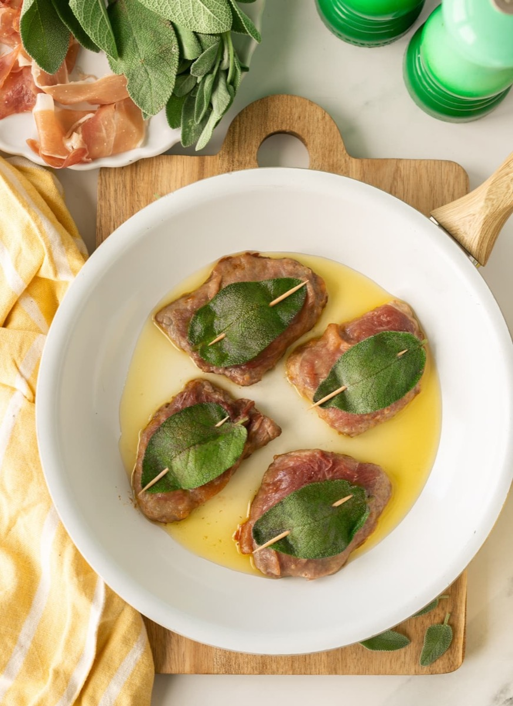

# Veal Saltimbocca

<table>
  <tr>
    <td>
      
    </td>
    <td>
      
    </td>
  </tr>
  <tr>
    <td>
      
    </td>
    <td>
      
    </td>
  </tr>
</table>

## Background

Saltimbocca, meaning "jumps in the mouth," is closely associated with Rome. Thin veal cutlets are paired with
prosciutto and sage, then quickly sautéed and finished with wine.

## Ingredients

- 8 thin veal cutlets
- 8 slices prosciutto
- 16 sage leaves
- 40 g flour
- 2 tablespoons olive oil
- 40 g butter
- 120 ml dry white wine
- Pepper

## How to cook

1. Top each cutlet with prosciutto and sage; secure with toothpicks. Dust the underside with flour.
2. Sauté in oil and half the butter for 1 to 2 minutes per side; remove.
3. Reduce wine in the pan, swirl in remaining butter, and spoon over the veal. Remove toothpicks.
