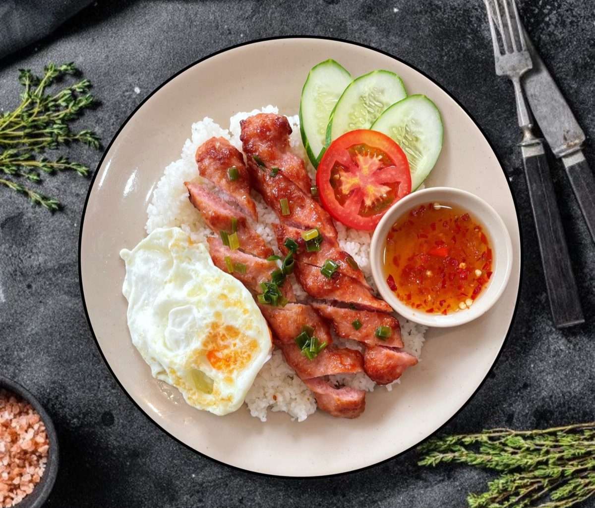
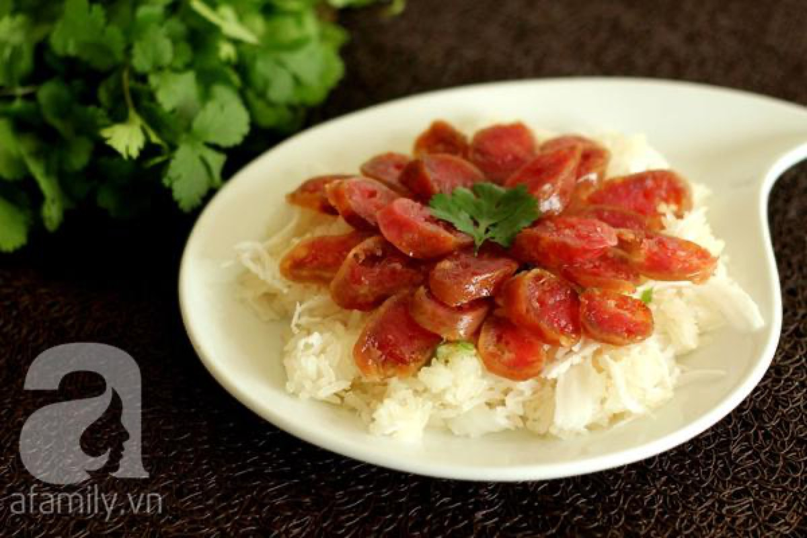
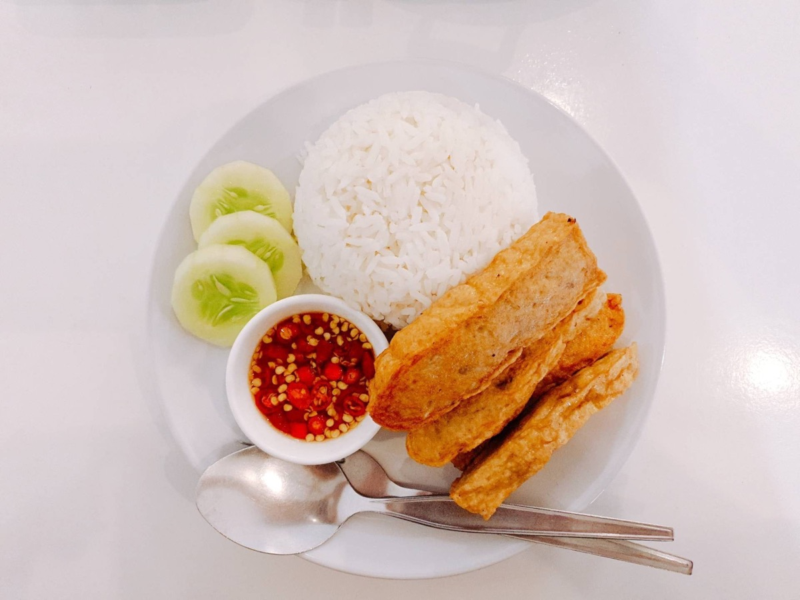
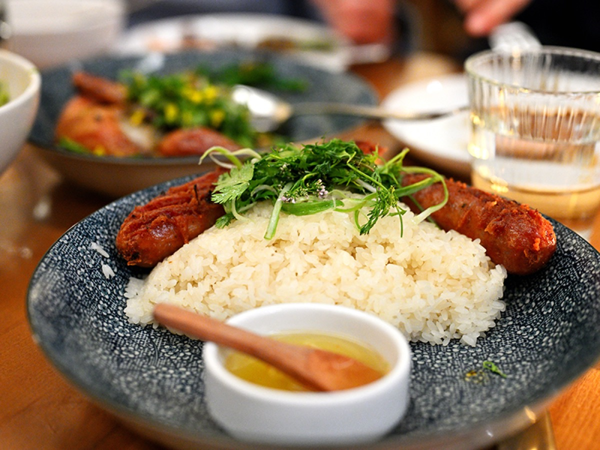

# Vietnamese Sausage and Rice

<table>
  <tr>
    <td>
      
    </td>
    <td>
      
    </td>
  </tr>
  <tr>
    <td>
      
    </td>
    <td>
      
    </td>
  </tr>
</table>

## Background

Vietnamese sausages include fresh preparations and cured lạp xưởng. This quick rice plate uses
sweet-savory lạp xưởng, whose rendered fat flavors the rice and contrasts well with cucumber and pickles.

## Ingredients

- 8 links lạp xưởng
- 600 g cooked jasmine rice
- 1 tablespoon neutral oil
- 1 cucumber, sliced
- Pickled carrot and daikon
- 3 scallions, sliced
- 2 tablespoons prepared nước chấm

## How to cook

1. Put sausages in a skillet with 60 ml water. Cover and simmer for 5 minutes.
2. Uncover and cook, turning, until the water evaporates and the sausages brown in their rendered fat. Ensure
   they are cooked according to the package directions.
3. Slice diagonally and serve over hot rice with cucumber, pickles, scallions, and nước chấm.
