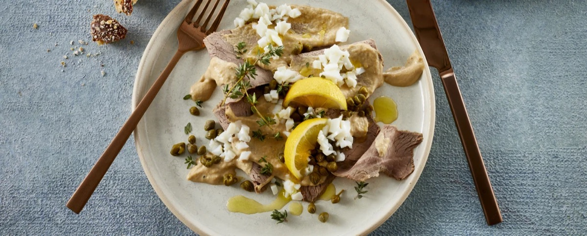
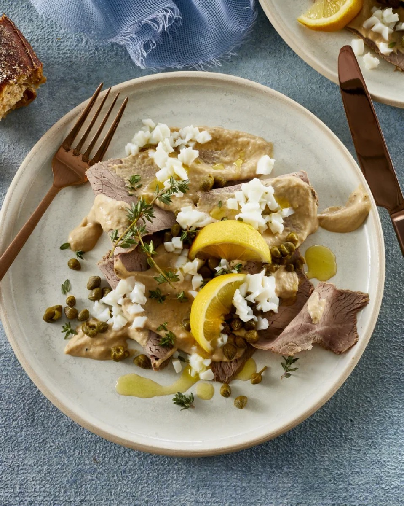
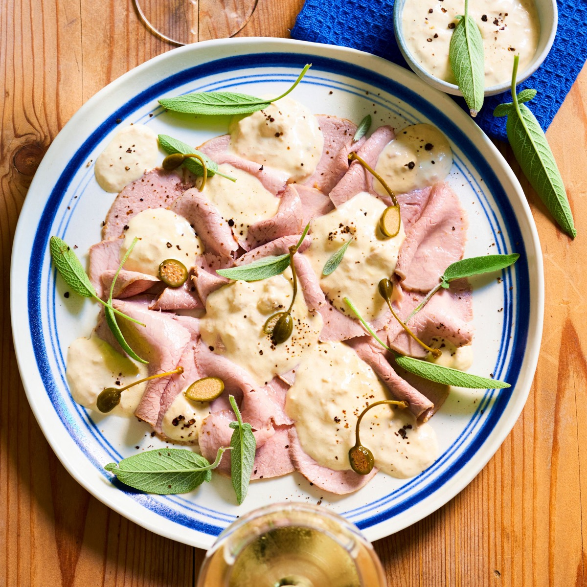
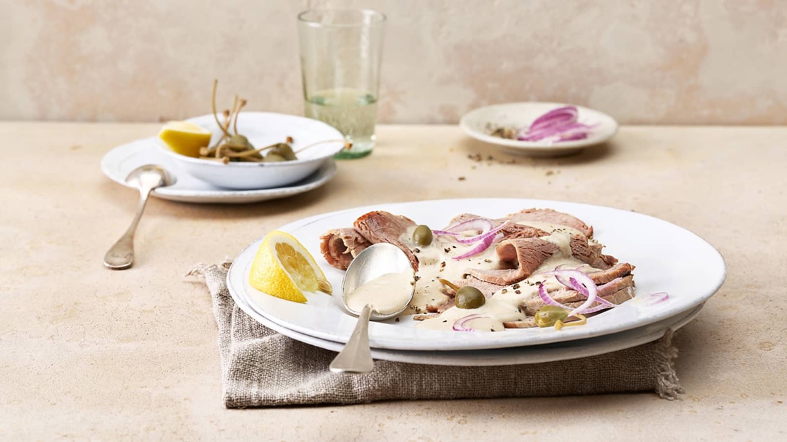

# Vitello Tonnato

<table>
  <tr>
    <td>
      
    </td>
    <td>
      
    </td>
  </tr>
  <tr>
    <td>
      
    </td>
    <td>
      
    </td>
  </tr>
</table>

## Background

Vitello tonnato is a Piedmontese dish of chilled, thinly sliced veal with a creamy tuna and caper sauce. It is
traditionally served as an antipasto or summer main course and is best prepared ahead.

## Ingredients

- 800 g veal eye round
- 250 ml dry white wine
- 1 carrot, 1 celery stalk, and 1 onion, chopped
- 1 bay leaf
- 200 g tuna in olive oil, drained
- 4 anchovy fillets
- 2 tablespoons capers, plus more to garnish
- 2 egg yolks from hard-boiled eggs
- 2 tablespoons lemon juice
- 120 ml olive oil
- Salt and pepper

## How to cook

1. Put veal, wine, vegetables, bay, salt, and enough water to cover in a pot. Poach gently until the center
   reaches 63°C. Cool in the liquid, then chill thoroughly.
2. Blend tuna, anchovies, capers, yolks, lemon, and enough oil and poaching liquid to make a smooth sauce.
3. Slice veal paper-thin, cover with sauce, and chill for at least 2 hours. Garnish with capers.
