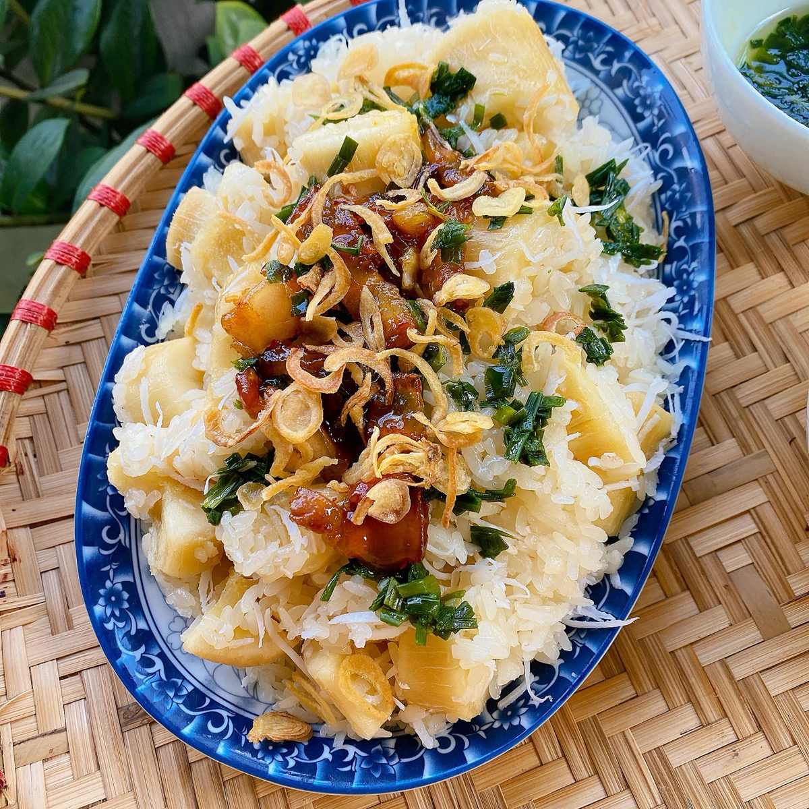
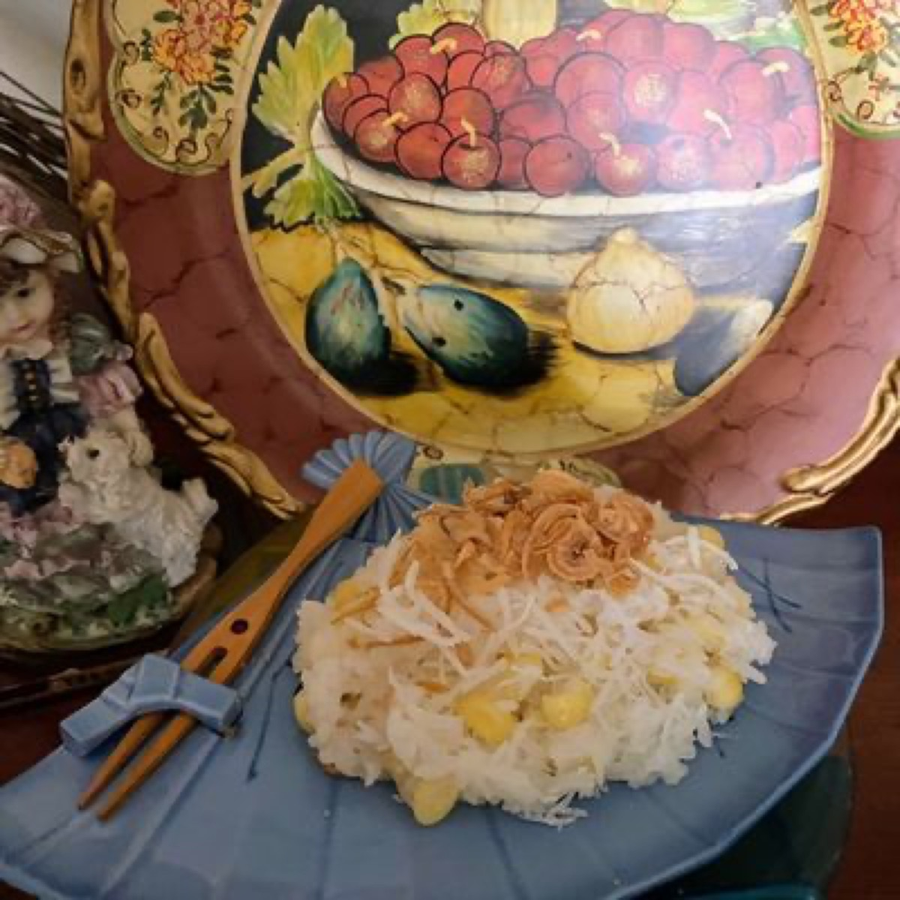
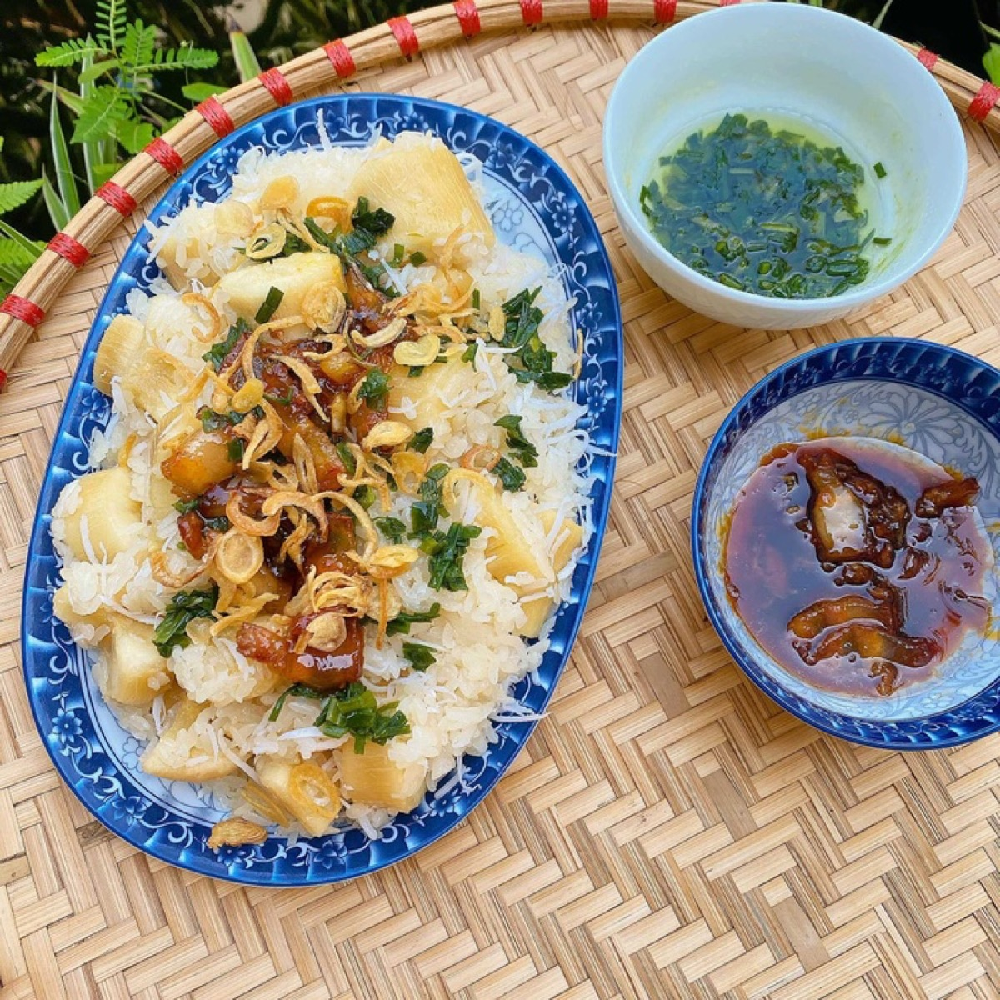
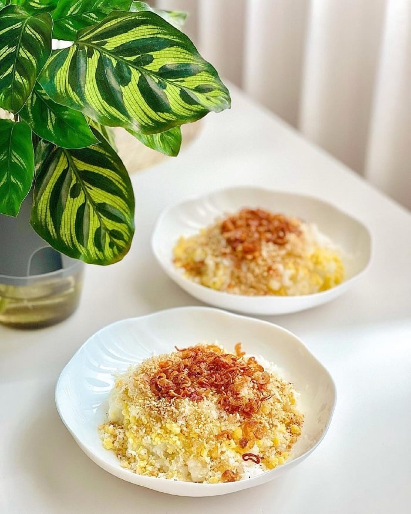

# Xôi

<table>
  <tr>
    <td>
      
    </td>
    <td>
      
    </td>
  </tr>
  <tr>
    <td>
      
    </td>
    <td>
      
    </td>
  </tr>
</table>

## Background

Xôi is Vietnamese glutinous rice, prepared in sweet and savory forms for breakfast, everyday meals, festivals,
and offerings. Steaming soaked rice gives the grains their characteristic chewy, separate texture.

## Ingredients

- 400 g glutinous rice
- 1 teaspoon salt
- 2 tablespoons coconut milk or neutral oil, optional
- Fried shallots, scallion oil, or mung beans, for serving

## How to cook

1. Rinse rice until the water is mostly clear. Cover with water and soak for at least 6 hours or overnight.
2. Drain very well and mix with salt. Spread in a cloth-lined steamer without packing it down.
3. Steam over steadily boiling water for 25 to 35 minutes, turning once, until glossy and tender.
4. Fold in coconut milk or oil if desired and serve hot with savory toppings.
