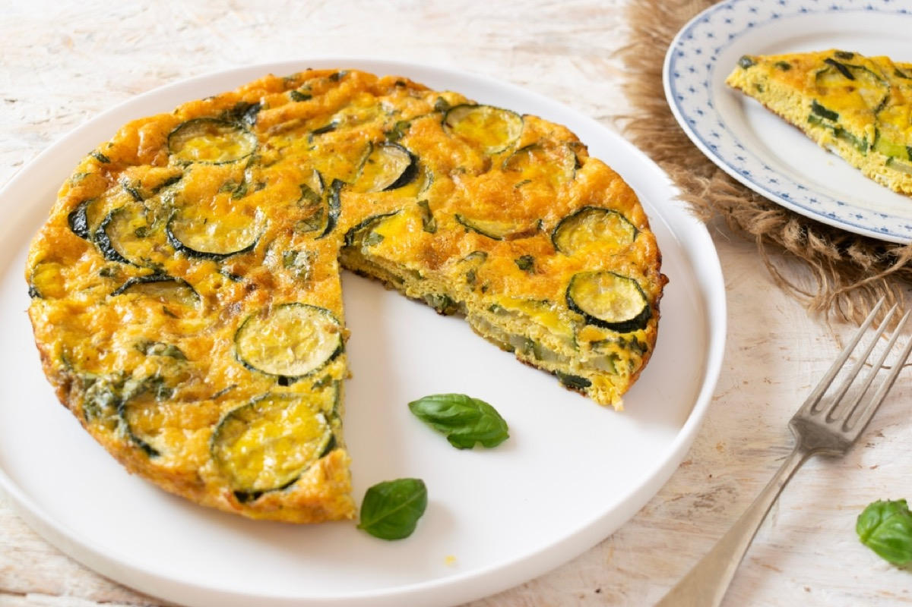
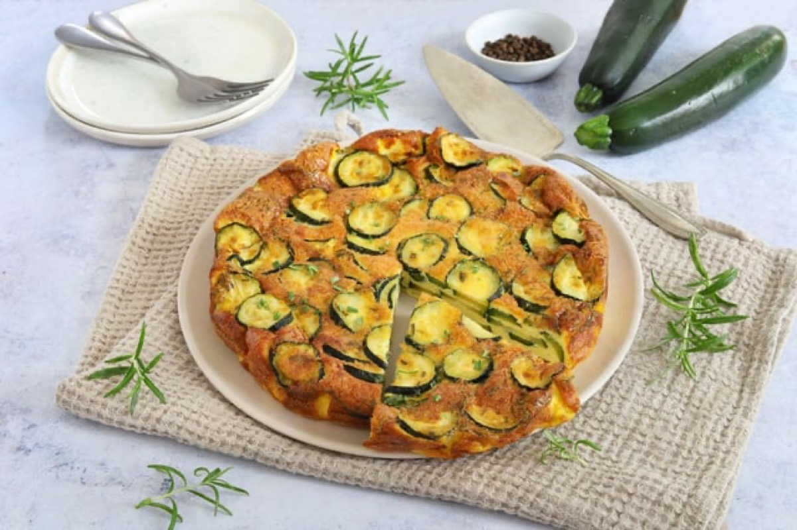
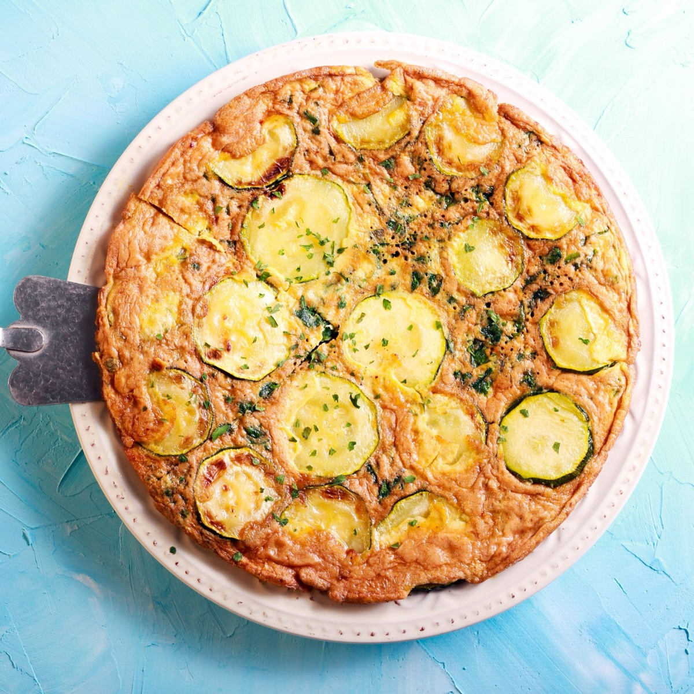

# Zucchini Frittata

<table>
  <tr>
    <td>
      
    </td>
    <td>
      
    </td>
  </tr>
  <tr>
    <td>
      
    </td>
    <td>
      
    </td>
  </tr>
</table>

## Background

The Italian frittata is a versatile egg dish cooked slowly and served hot or at room temperature. It is a
traditional way to turn vegetables, cheese, and leftovers into an easy meal.

## Ingredients

- 8 eggs
- 2 small zucchini, thinly sliced
- 1 small onion, sliced
- 50 g Parmigiano-Reggiano
- 2 tablespoons olive oil
- Salt and pepper

## How to cook

1. Soften onion and zucchini in oil in an ovenproof skillet. Season.
2. Beat eggs with Parmigiano, salt, and pepper; pour into the skillet.
3. Cook over low heat until the edges set, then broil for 2 to 4 minutes until the center is just firm.
