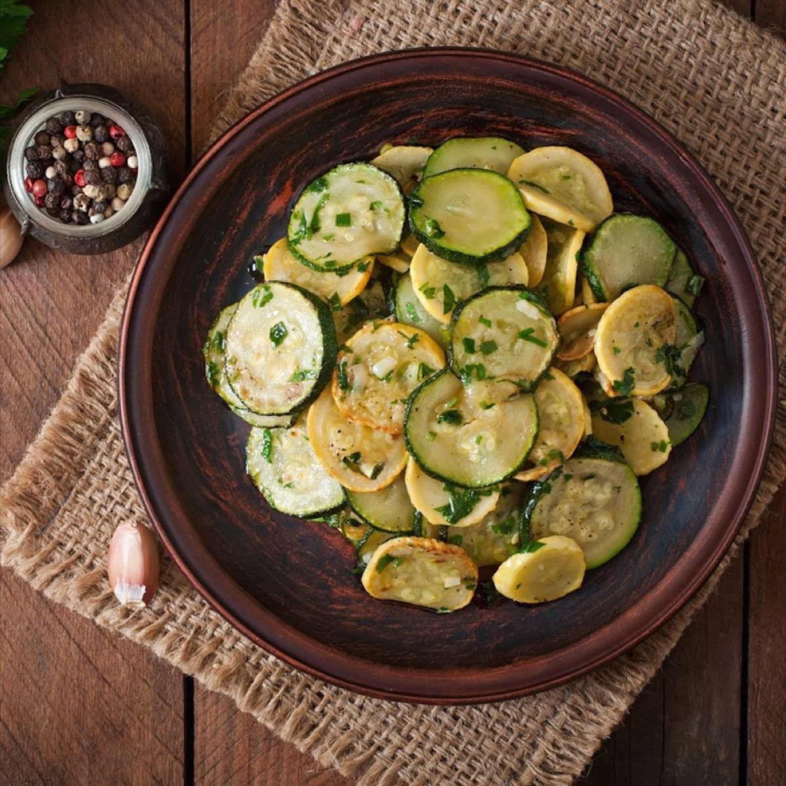
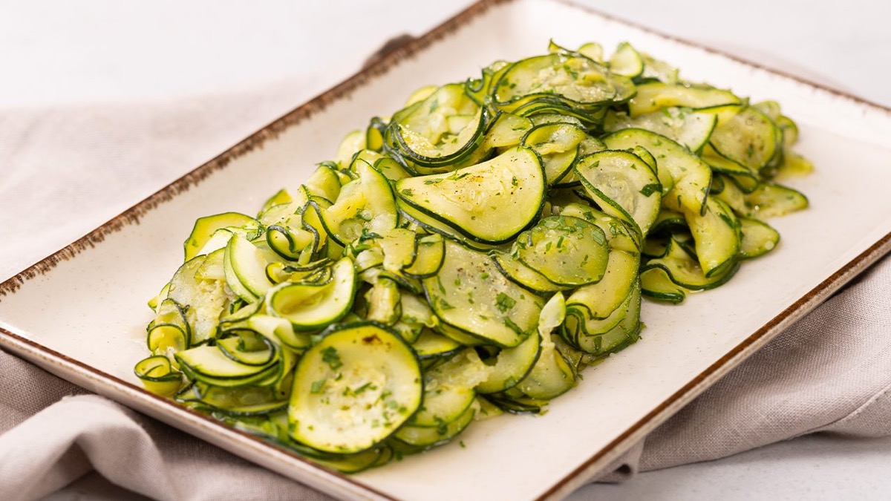
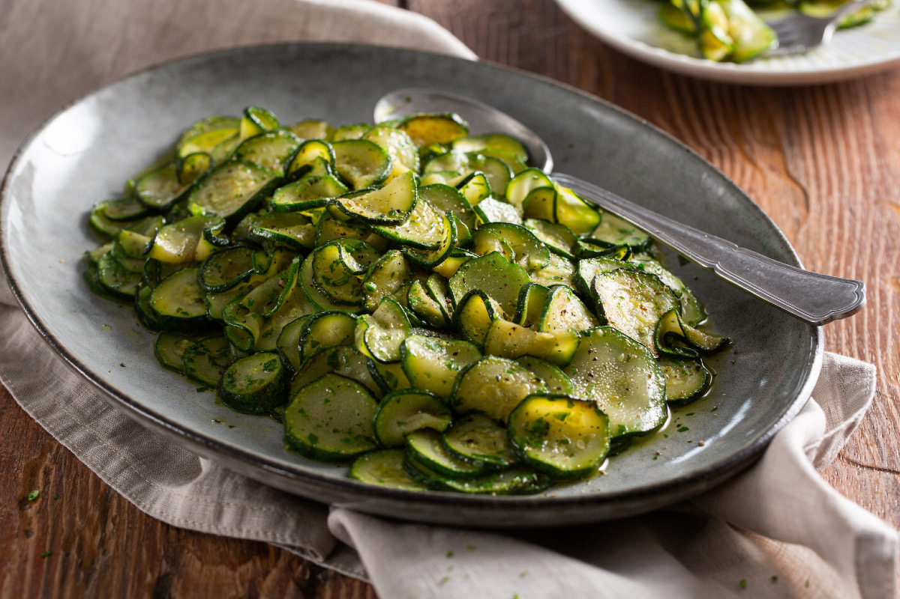
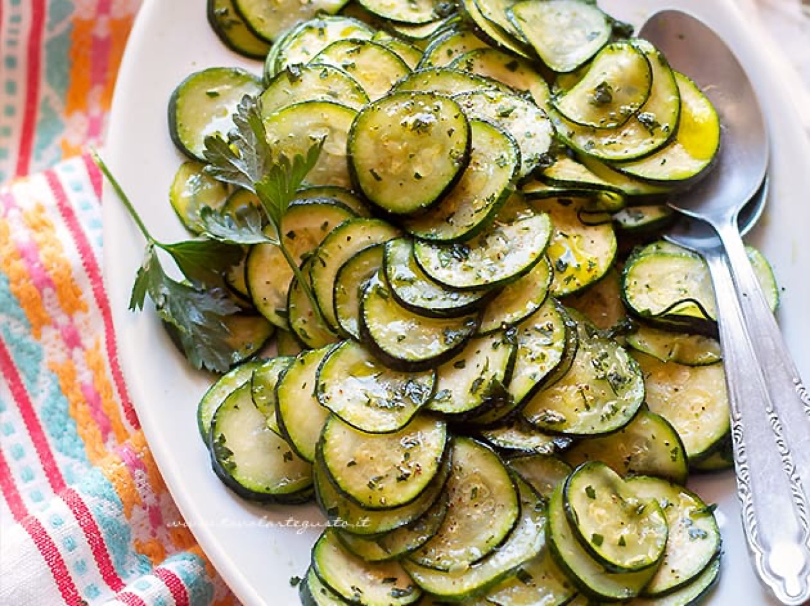

# Zucchini Trifolati

<table>
  <tr>
    <td>
      
    </td>
    <td>
      
    </td>
  </tr>
  <tr>
    <td>
      
    </td>
    <td>
      
    </td>
  </tr>
</table>

## Background

Trifolati describes an Italian preparation sautéed with garlic, olive oil, and parsley. Although especially
common with mushrooms, the method makes zucchini into a quick side dish.

## Ingredients

- 700 g zucchini, sliced
- 3 tablespoons olive oil
- 2 garlic cloves, lightly crushed
- 3 tablespoons chopped parsley
- Salt and pepper

## How to cook

1. Heat oil and garlic in a wide skillet. Add zucchini in a single layer as much as possible.
2. Cook over medium-high heat for 8 to 10 minutes, turning occasionally, until browned but not mushy.
3. Remove garlic, season, and fold in parsley.
